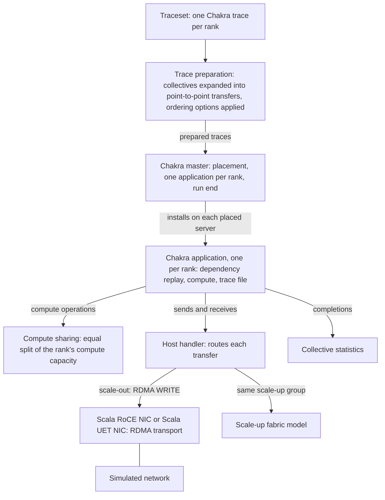

The Chakra workload replays per-rank ML training traces, turning their computation and collective communication into simulated network traffic.

Model version 4.0.3 is the version these pages describe.

## What this model simulates

The Chakra workload is an application model. It reads a traceset of Chakra execution traces, one trace per rank, and runs each rank as an application on a server in the simulated topology. Each trace is a dependency graph of compute, memory, send, and receive operations, plus the collective operations (AllReduce, AllGather, and the others) that the ranks perform together. The workload replays that graph: an operation starts when the operations it depends on have finished, compute takes the time the trace gives it, and every transfer between ranks travels through the server's NIC and the simulated network, except between ranks in the same scale-up group.

Collective operations are not replayed as single steps. Before the simulation starts, the platform expands each collective into the point-to-point transfers of the algorithm you select for that collective type, such as `ring` or `tree` for AllReduce. The traffic a simulation carries is therefore the selected algorithm's traffic, not that of the communication library the trace came from.

The results you reason about with it are how long each rank takes to finish its trace, how long each transfer and each collective takes on the simulated network, and how those times compare with an ideal time for the selected algorithm.

The Chakra workload runs on servers that all have a Scala RoCE NIC or all have a Scala UET NIC, and it is the only application in its simulation. Give the topology exactly as many servers as the traceset has ranks ([Placement](./workload-execution.md#placement)).

## Features

- **Chakra execution trace replay.** Per-rank traces in the MLCommons Chakra execution trace format are replayed as dependency graphs. An operation starts when every operation it depends on has finished, and ranks are ordered against one another only by their sends and receives. See [Dependencies](./workload-execution.md#dependencies).
- **Ten collective types with selectable algorithms.** AllReduce, Reduce, AllGather, ReduceScatter, ReduceScatterBlock, Broadcast, Gather, Scatter, AllToAll, and Barrier, each expanded into point-to-point transfers with the algorithm you select (`ring`, `tree`, `double-tree`, `halving-doubling`, `halving`, `sequential`, `interleaved`, or `direct`, as each collective type allows). See [Collectives](./workload-execution.md#collectives).
- **RDMA transfers through the NIC.** Each point-to-point send between ranks outside a shared scale-up group is an RDMA WRITE posted to the server's NIC, a Scala RoCE NIC or a Scala UET NIC. Collective traffic is therefore subject to that NIC's transport and to the network's congestion and flow control. See [Communication](./workload-execution.md#communication).
- **Shared NPU compute.** Compute operations that run at the same time on a rank share that rank's NPU (its accelerator, such as a GPU) equally, for traces whose durations assume exclusive use of the device; durations measured on real hardware run as recorded. `TraceFamily` selects which. See [Compute](./workload-execution.md#compute).
- **Process group serialization.** For traces that record the order in which collectives were issued, a rank runs at most one collective of a process group at a time, in that order. See [Ordering options](./workload-execution.md#ordering-options).
- **Collective synchronization.** Every rank of a process group waits at a zero-byte barrier before the group's collective starts, so the collective's transfers begin together. See [Ordering options](./workload-execution.md#ordering-options).
- **Scale-up fabric.** Ranks that a mapping file places in the same scale-up group exchange data over a modeled scale-up fabric, with its own bandwidth and switch and cable latencies, instead of the NIC and the network. See [Scale-up groups](./workload-execution.md#scale-up-groups).
- **Workload scaling.** Every transfer size and every duration can be multiplied by one factor between 0 and 1, which shortens a run while keeping the trace's pattern of computation and communication. See [Scaling](./workload-execution.md#scaling).
- **Profiling.** A periodic listing, for each rank, of the operations running at that moment. See [Profiling](./records.md#profiling).
- **Statistics.** Per-transfer completion times, per-rank completion statistics, a progress curve, per-collective run times and their percentiles against an ideal time, and the traces themselves annotated with each operation's start and end time. [Records](./records.md) lists them.

## Architecture

The platform prepares the traces before the simulation starts. In the simulation, a master component places one application on a server for each rank, and each application replays its rank's trace through the server's host handler.

| Component | C++ class | Responsibility | Configured by |
| --- | --- | --- | --- |
| Trace preparation | (runs before the simulation) | Expands every collective into point-to-point sends and receives with the selected algorithm, applies process group serialization and collective synchronization, and prepares the per-rank traces the simulator reads. | [Collective algorithms](./configuration.md#collective-algorithms), [Ordering and preparation](./configuration.md#ordering-and-preparation) |
| Chakra master | `ChakraMaster` | Reads the workload's settings, places each rank on a server, installs one application per rank, writes the placement records, and ends the simulation when every rank has finished. | [Ranks and placement](./configuration.md#ranks-and-placement) |
| Chakra application | `ChakraApplication` | Replays one rank's trace: starts each operation when its dependencies have finished, schedules compute, hands sends and receives to the host handler, and writes the operation times back into the rank's trace. | [Compute and scaling](./configuration.md#compute-and-scaling) |
| Compute sharing | `ComputeContentionTracker` | Divides a rank's compute capacity equally among the compute operations running on it and recomputes their completion times whenever one starts or ends. | `TraceFamily` in [Compute and scaling](./configuration.md#compute-and-scaling) |
| Host handler | `ChakraHostHandlerImpl` | Posts each scale-out send (to a rank outside the sender's scale-up group) to the NIC as an RDMA WRITE and matches completions to receives, or carries the transfer over the scale-up fabric model when both ranks are in the same scale-up group. | [Scale-up](./configuration.md#scale-up) |
| Collective statistics | `ChakraCommCollectiveStats` | Records each collective's start and end across its participants and summarizes run times against an ideal time for the selected algorithm. | `UseMaxAsCommCollectiveStartTime` in [Ordering and preparation](./configuration.md#ordering-and-preparation) |

## How to read these pages

Read them in this order:

1. [Workload execution](./workload-execution.md): how the traces are prepared, how ranks are placed on servers, and how each rank's operations are replayed, with worked examples of collective expansion and compute sharing.
2. [Records](./records.md): the records a simulation writes, what one row holds, and when each is written.
3. [Configuration](./configuration.md): every attribute a simulation configuration can set, with its type and default, how to add the workload and attach a traceset through the platform API, the rules that stop a simulation, and the settings to keep.
