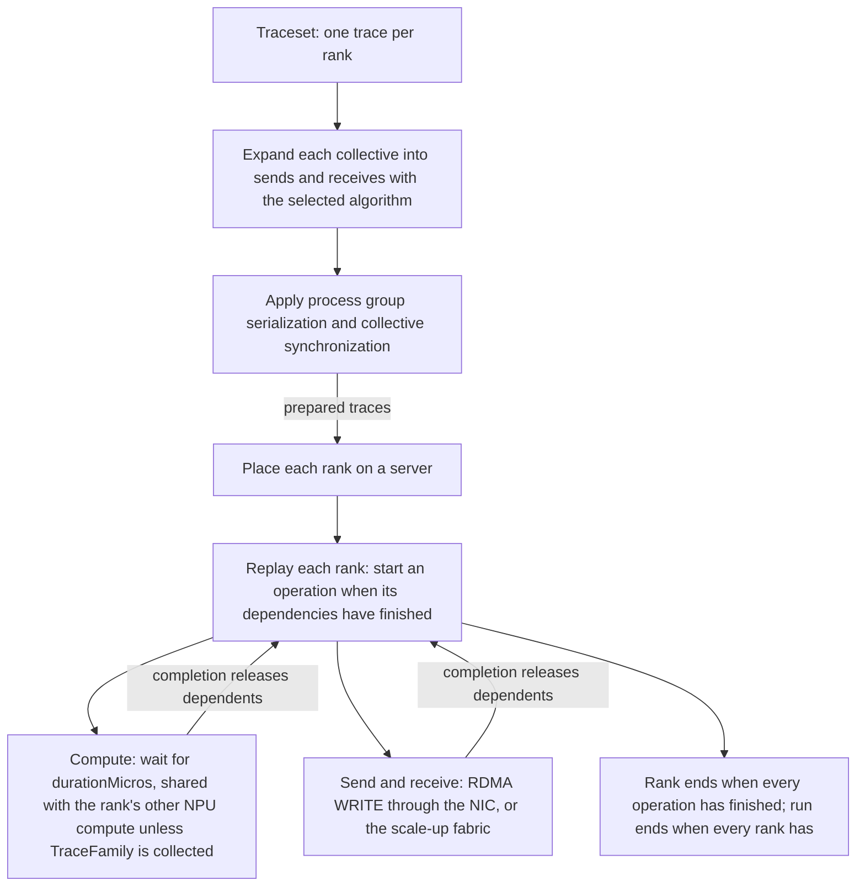

This page follows a Chakra workload from its traces to the end of the run: how traces are prepared, where ranks run, and how operations are replayed.

A traceset holds one Chakra execution trace for each rank. Before the simulation starts, the platform prepares the traces: it expands every collective into point-to-point transfers and applies the ordering options. The simulation then places each rank on a server and replays its trace. [Records](./records.md) describes what a run writes, and [Configuration](./configuration.md) lists the attributes this page refers to.

## Overview



## Traces and trace preparation

Each rank's trace is a list of operations, called nodes, with the dependencies between them. A node lists the nodes it depends on (`ctrlDeps` and `dataDeps`), and the simulator treats both lists alike. The node types the simulation replays are:

| Node type | What the simulation does |
| --- | --- |
| `COMP_NODE` | Waits for the node's `durationMicros`, in whole microseconds. Compute on the simulated NPU shares the rank's compute capacity ([Compute](#compute)). |
| `MEM_LOAD_NODE`, `MEM_STORE_NODE` | Waits for the node's `durationMicros`. |
| `COMM_SEND_NODE` | Sends the node's `comm_size` bytes to its partner rank ([Communication](#communication)). |
| `COMM_RECV_NODE` | Waits until the matching transfer from its partner rank has been received. |
| `COMM_COLL_NODE` | Replaced, before the simulation starts, by the point-to-point transfers of the selected algorithm ([Collectives](#collectives)). |
| `METADATA_NODE` | Takes no time. |

Every collective runs within a process group, a set of ranks that the trace declares, and every rank's trace declares its process groups. A process group of N ranks orders its members as the trace lists them, and the algorithms below refer to that order: "the next rank" in a ring is the next one in the list, wrapping around.

Trace preparation does three things before the simulator starts:

1. **Expansion.** Each collective node is replaced by sends and receives between the members of its process group, using the algorithm selected for that collective type ([Collectives](#collectives)). The transfers that make up one collective carry its identity, so the collective records can report on the collective as a whole.
2. **Ordering options.** Process group serialization and collective synchronization add dependencies and synchronization nodes ([Ordering options](#ordering-options)).
3. **Annotation.** Each rank's trace is written in the form the simulator reads: each send and receive node gets its partner rank, each node lists the nodes that depend on it, and the nodes that are ready to run at the start are listed alongside the trace.

If trace preparation cannot process a trace, for example because a process group is not declared or an algorithm does not fit the group, the run stops before the simulation starts ([Configuration rules that stop a simulation](./configuration.md#configuration-rules-that-stop-a-simulation)). A collective that has no type or size, or that appears in the trace of a rank outside its process group, is not expanded, and trace preparation logs a warning. With `AbortOnChakraWarning` set to `true`, a warning or an error that trace preparation logs stops the run before the simulation starts.

## Placement

The simulation runs one Chakra application for each rank, named `ChakraApp-<rank>`, on the server the rank is placed on. The number of ranks is `NumOfChakraFiles`, which the platform sets to the traceset's rank count when you attach the traceset.

- **Without a mapping file**, ranks are placed in order: rank 0 on the server with the lowest server ID (the `serverId` a mapping file names), rank 1 on the next, and so on.
- **With a mapping file**, each rank runs on the server the file names, and the file can also place ranks in scale-up groups ([Scale-up groups](#scale-up-groups)). [Chakra mapping files](../../chakra-mapping-files.md) describes the file format and how to attach one.

Give the topology exactly as many servers as the traceset has ranks, all with a Scala RoCE NIC or all with a Scala UET NIC. The Chakra workload is the only application in the simulation. The `chakra-capable-hosts` and `chakra-mapping` records show which servers took part and where each rank ran ([Records](./records.md#placement-records)).

## Dependencies

A rank starts every node that has no dependencies when the simulation starts. Each time a node finishes, every node that depends on it has that dependency removed, and a node whose last dependency is removed starts at once. Dependencies link nodes in the same rank's trace only.

Ranks are ordered against one another only through their sends and receives. A receive finishes when the transfer it matches has been received, and a transfer matches the receive with the same communication tag (`comm_tag`) between the same sender and receiver. A receive may start before or after its matching transfer arrives: a transfer that arrives first is held until its receive starts.

## Compute

A `COMP_NODE` that runs on the simulated NPU waits for its `durationMicros`. How that time passes when several of them run at once depends on `TraceFamily`:

- **`synthesized` and `compiled`** (the default is `synthesized`): the trace's durations are the time each node needs with the NPU to itself. Compute nodes running at the same time on one rank share the rank's compute capacity equally. Whenever one starts or finishes, each running node's remaining time is recomputed as its remaining work multiplied by the number of nodes now running.
- **`collected`**: the durations were measured on real hardware, where any sharing has already happened. Each compute node finishes `durationMicros` after it starts, whatever else is running.

A compute node with `is_cpu_op` set runs on the host CPU rather than the NPU. It, and every memory node, finishes its `durationMicros` after it starts, and never shares capacity with the NPU's compute nodes. Sharing is per rank: compute on one rank never slows compute on another. Compute and communication do not slow each other.

### Worked example: two compute nodes

Two `COMP_NODE`s, each with `durationMicros` 10, start together at 0 µs on one rank of a `synthesized` trace.

```text
At 0 µs:  2 nodes running; each has 10 µs of work left
          time to finish = remaining work x nodes running = 10 µs x 2 = 20 µs
At 20 µs: both nodes finish
```

Each node takes 20 µs, twice its trace duration, and the pair takes the same total NPU time as running them one after the other. With `TraceFamily` set to `collected`, both nodes finish at 10 µs.

## Communication

A `COMM_SEND_NODE` sends `comm_size` bytes to its partner rank as one RDMA WRITE, posted to the sending server's NIC. The NIC carries the transfer over the simulated network to the partner rank's server, so the transfer is subject to the NIC's transport and the network's congestion and flow control. A Scala RoCE NIC carries it with RoCEv2 over its queue pairs ([Scala RoCE NIC](../scala-roce-nic/index.md)); a Scala UET NIC carries it with Ultra Ethernet Transport (UET). Each NIC's own documentation describes its transport. A transfer of zero bytes is sent as well.

The send node finishes, and releases the nodes that depend on it, when the NIC reports that every byte has been sent. The transfer is acknowledged later, when the receiver's acknowledgment reaches the sender, and at that moment the `chakra-perf` record writes one row for the transfer, with the time from the send node's start ([Records](./records.md#transfers)). On the receiving rank, the receive node finishes when the whole transfer has been received.

Transfers between two ranks in the same scale-up group use the scale-up fabric instead ([Scale-up groups](#scale-up-groups)).

## Collectives

Trace preparation replaces each collective with the transfers of the algorithm selected for its type. In the table, N is the size of the collective's process group, S is the collective's size in the trace (`comm_size`), and C is S divided by N, rounded up to a whole byte. `halving` and `halving-doubling` need a process group whose size is a power of two.

| Collective | Algorithm | Pattern | Bytes per transfer |
| --- | --- | --- | --- |
| AllReduce | `ring` | N − 1 reduce-scatter steps, then N − 1 all-gather steps. In each step every rank sends to the next rank in the ring and receives from the previous one, after its previous step's receive. | C |
| AllReduce | `tree` | Data is reduced up a tree, then broadcast back down. The group's first rank is the root; its one child is the root of a balanced binary tree of the other ranks. One transfer each way on every edge, 2(N − 1) in all. | S |
| AllReduce | `double-tree` | Two trees, each built as in `tree`, rooted at the group's first and last ranks, each carrying half the data. | S/2, rounded up |
| AllReduce | `halving-doubling` | log2 N reduce-scatter steps that halve the data exchanged between partner ranks, then log2 N all-gather steps that double it back. | C × N/2 in the first step, halving each step, then back up |
| Reduce | `ring` | The data passes from rank to rank around the ring. | S |
| Reduce | `tree` | The reduce phase of `tree`: each rank sends to its parent in the tree. | S |
| AllGather | `ring` | N − 1 steps; each rank sends to the next rank in the ring. | S |
| ReduceScatter | `ring` | N − 1 steps; each rank sends to the next rank in the ring. | C |
| ReduceScatter | `halving` | log2 N steps between partner ranks, halving the data each step. | C × N/2 in the first step, halving each step |
| ReduceScatterBlock | `ring` | As ReduceScatter `ring`. | C |
| Broadcast | `sequential` | The root sends to each other rank, one transfer after another. | S |
| Broadcast | `interleaved` | The root sends to every other rank at once. | S |
| Gather | `direct` | Each rank other than the root sends to the root, all at once. | S |
| Scatter | `direct` | The root sends to each other rank, all at once. | C |
| AllToAll | `sequential` | N − 1 steps; in step s each rank sends to the rank s places after it in the group and receives from the rank s places before it. Each rank's sends go one after another; its receives are not ordered. | C |
| AllToAll | `interleaved` | The same transfers, all at once. | C |
| Barrier | `ring`, `tree`, `double-tree`, `halving-doubling` | The pattern of AllReduce with the same algorithm. | 0 |

The root of a Broadcast, Gather, or Scatter is the collective's root rank, or the group's first rank when the trace names none. The sizes in the table show what `comm_size` stands for in each collective: AllGather and Gather send S from every rank, while AllReduce `ring` and `halving-doubling`, ReduceScatter, Scatter, and AllToAll divide S among the group.

### Worked example: one AllReduce, three algorithms

One AllReduce of S = 1,000 bytes over a process group of N = 8 ranks. C = 1,000 / 8 = 125 bytes.

```text
ring:              each rank sends 2 x (8 - 1) = 14 transfers of 125 B, in 14 steps
                   8 ranks x 14 = 112 transfers; 112 x 125 B = 14,000 B
tree:              7 tree edges, one transfer up and one down on each, of 1,000 B
                   2 x (8 - 1) = 14 transfers; 14 x 1,000 B = 14,000 B
halving-doubling:  log2 8 = 3 reduce-scatter steps of 500, 250, 125 B,
                   then 3 all-gather steps of 125, 250, 500 B
                   each rank sends 6 transfers, 500 + 250 + 125 + 125 + 250 + 500 = 1,750 B
                   8 ranks x 6 = 48 transfers; 8 x 1,750 B = 14,000 B
```

All three move 14,000 bytes across the network. They differ in how many transfers carry it, how large each is, and how many steps each rank waits through: `ring` sends many small transfers in a long chain, `tree` sends a few full-size transfers, and `halving-doubling` sits between them.

## Ordering options

Two options, both on by default, add ordering to the traces during trace preparation.

**Process group serialization** (`ProcessGroupSerialization`). Where the trace records the order in which a rank issued its collectives, each collective of a process group depends on the previous collective of the same group on that rank, so the group runs one collective at a time, in that order. Where the trace records an issue order for the group's point-to-point sends as well, those sends are ordered with its collectives. Receives are never ordered this way.

**Collective synchronization** (`CommCollectiveSynchronization`). Before each collective, every rank of its process group passes a barrier: zero-byte transfers in the `tree` pattern, 2(N − 1) of them, whatever `BarrierAlgorithm` is. The collective's own transfers start only after the barrier, so they start together on every rank, as if the ranks had waited for one another. The barrier's transfers are not counted in the collective records or in the completion counters; `chakra-perf` lists them with `is_added_synchronization_flow` set to `true`. With synchronization off, each rank starts its part of a collective as soon as its own dependencies have finished.

## Scale-up groups

A mapping file can place ranks in scale-up groups, and in subgroups within a group, and give each group a bandwidth, a per-hop switch latency, and an NPU cable latency ([Chakra mapping files](../../chakra-mapping-files.md)). A transfer between two ranks of the same group uses a modeled scale-up fabric instead of the NIC and the simulated network. Transfers to any other rank use the NIC as usual. Without a mapping file there are no scale-up groups.

The scale-up fabric carries a transfer as packets:

1. **Packets.** The transfer is cut into packets of at most `ScaleUpMaxPayloadSize` bytes of data, and each packet also carries `ScaleUpHeaderSize` bytes of header.
2. **Sending.** The sending rank keeps one queue for each receiver and takes packets from those queues in turn. A packet takes its size (data plus header) at the group's bandwidth to send, multiplied by the number of receivers the rank is sending to at that moment, so the rank's bandwidth is shared equally among them.
3. **Crossing the fabric.** Between two ranks of the same subgroup, a packet crosses one switch hop and two cable segments. Between subgroups of the same group, it crosses three switch hops and four cable segments.
4. **Receiving.** The receiving rank keeps one queue for each sender, and each packet again takes its size at the group's bandwidth multiplied by the number of senders the rank is receiving from. The receive node finishes when every byte of the transfer has arrived.

The send node finishes when its last packet has been sent. The scale-up fabric has no acknowledgment packets: the transfer counts as acknowledged one round trip of switch and cable latency later, and that is when its `chakra-perf` row is written. Scale-up traffic does not appear in the network's records; the Chakra records count it with the other transfers, and `ScaleUpStatsEnabled` adds rows for it to `nd-stats` ([Records](./records.md#scale-up-records)).

## Scaling

With `Scaling` set to `true`, every node's `comm_size` and `durationMicros` is multiplied by `ScalingFactor` (0.0 to 1.0) as the node is read, and the result is truncated to a whole byte or microsecond. A factor of 0.5 halves every transfer and every duration, and a 1 µs node becomes 0 µs. At 0.0 every transfer has zero bytes and every node takes no time. The trace's dependencies are unchanged, so the run keeps the trace's pattern of computation and communication at a coarser granularity. With `Scaling` set to `false`, `ScalingFactor` has no effect.

## How a run ends

A rank ends when every node in its trace has finished and every transfer it sent has been acknowledged. For each transfer it received through the NIC, it also waits until the sender has received that transfer's acknowledgment. A rank ends at once if its trace has no node that is ready at the start. When every rank has ended, the simulation stops one `BeaconReportInterval` later.

The simulation also stops at its stop time, whether or not the ranks have finished. Every rank starts at `StartTime`, and the stop time is `StartTime` + `WarmUp` + `RunTime` + `CoolDown`, all global simulation parameters set with `PATCH /api/v1/configurations/{config_id}/parameters`. Set `RunTime` long enough for the traces to finish. A rank that is still running at the stop writes its completion row and its trace file with what it completed ([Records](./records.md)).
