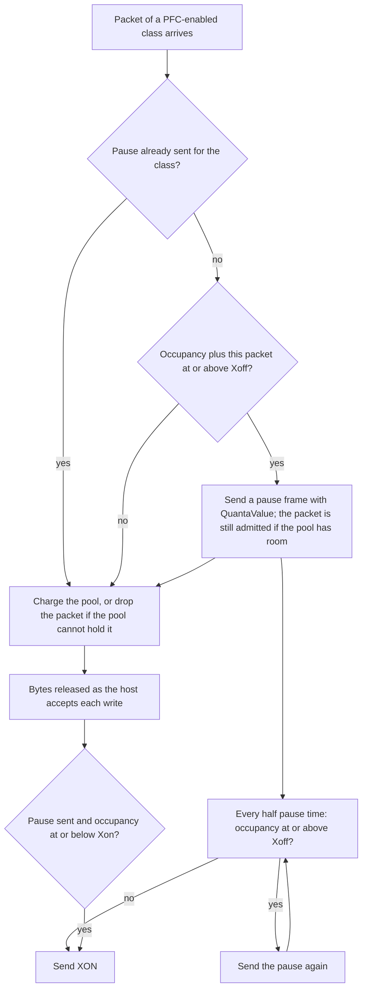

The Scala RoCE NIC holds the packets it sends and receives in per-class buffer pools, schedules transmission across classes, and sends and honors PFC.

This page covers the NIC's transmit and receive buffers and its priority flow control. [Transport](./transport.md) follows a message through the rest of the NIC, and [Configuration](./configuration.md#ingressbuffermanager) lists each attribute's type and default.

## Overview

The NIC has two buffers, each divided into pools, one pool per traffic class:

- **The egress buffer** holds what the NIC sends. Space for each data packet is reserved before its payload is fetched from the host and released when the packet has been serialized onto the link, so the egress pools bound the data the NIC has fetched and not yet sent. Its size is the `EgressBufferManager` `TotalBufferSize`, 256 KB by default.
- **The ingress buffer** holds what the NIC has received and not yet handed to the host. Its pools are what the PFC thresholds are compared with. Its size is the `IngressBufferManager` `TotalBufferSize`, 4 MB by default.

Two behaviors are worth knowing before anything else:

- **The egress buffer never drops.** When a pool is full, the NIC stops generating packets until the pool drains, so a full transmit pool holds the sender back rather than losing data. Each class a queue pair sends on needs a transmit pool large enough for its packets ([Egress buffer](#egress-buffer)).
- **The ingress buffer drops what does not fit.** A received packet whose pool cannot hold it is dropped. PFC, enabled per class, pauses the rack switch before that happens, provided the pool's headroom absorbs what is already on its way ([Sizing the headroom](#sizing-the-headroom)).

## Key concepts

| Term | Meaning |
| --- | --- |
| Traffic class (TC) | One of eight priority levels, TC0 to TC7. A packet the NIC sends carries its class in its DSCP field as the class times 8; a packet it receives is classified by its DSCP divided by 8. |
| Pool | The bytes of one buffer set aside for one traffic class. The buffer's `PoolAllocationVector` sets which classes have one ([Buffer pools](#buffer-pools)). |
| Egress reservation | The space a data packet holds in its egress pool, its full size on the wire, from before its payload is fetched until it has been serialized. |
| Ingress occupancy | The bytes a receive pool holds: packets received and not yet accepted by the PCIe link to the host. |
| Xoff threshold | The fraction of a receive pool at which the NIC sends a PFC pause frame to the rack switch. |
| Xon threshold | The fraction of a receive pool at or below which the NIC sends a PFC resume (XON) frame. |
| Headroom | The part of a receive pool above the Xoff threshold, which absorbs what arrives after a pause is sent. |
| Pause time | The time a pause frame stops the receiver of the frame: 512 bit times per quantum at the link rate, plus the link's propagation delay. |

## Buffer pools

Each buffer is divided into pools when the simulation starts, in the same way for both. The non-zero entries of the buffer's `PoolAllocationVector` must come first: they start at class 0 and run without a `0` between them. `[0.9, 0.1, 0, 0, 0, 0, 0, 0]` and `[0.5, 0.3, 0.2, 0, 0, 0, 0, 0]` follow this rule; `[0, 0.5, 0.5, 0, 0, 0, 0, 0]` does not. With the entries in that shape, each class up to the last non-zero entry gets a pool:

```text
pool for class c = PoolAllocationVector[c] × TotalBufferSize
```

The classes after the last non-zero entry have no pool in that buffer. The buffer's other per-class lists, such as `PFCEnableVector` and `WRRQueueWeights`, use the same index. The pools are sized independently: entries that sum to less than 1 leave the rest of the buffer unused, and entries that sum to more than 1 give pools that together exceed `TotalBufferSize`. The two buffers have their own `PoolAllocationVector`, so a class can have a different share of each.

Every byte is accounted for in the pool of the packet's traffic class. Data packets use the class of their queue pair's data traffic, and ACKs and NAKs the class of its control traffic ([Queue pairs and messages](./transport.md#queue-pairs-and-messages)). PFC frames are not charged to any pool, and the congestion notification packets the NIC sends are not charged to an egress pool.

## Egress buffer

For each data packet, the NIC reserves the packet's size on the wire, its payload plus 58 bytes, in the egress pool of its class before it fetches the payload over PCIe ([Segmentation](./transport.md#segmentation)). The reservation is released when the packet's serialization onto the link ends.

- **When the pool has room,** the payload is fetched, numbered, and queued for its class.
- **When the pool has no room,** the NIC stops generating packets. Generation restarts at the latest when transmission drains that pool to half its size or less.
- **Nothing is dropped.** The egress queues hold every packet that has been reserved, so a congested or paused class holds the sender back through its pool rather than losing packets.

Each queue pair needs an egress pool for both classes it sends on. The pool of its data class must hold at least one full packet, `MSS` plus 58 bytes (4,154 bytes at the default `MSS`). If it cannot, the NIC can stop sending data for all its queue pairs. If the control class has no egress pool, the NIC stops sending ACKs and NAKs. The default pools, 230,400 bytes for class 0 and 25,600 bytes for class 1, meet both rules.

The egress pool of a class is therefore the most data of that class the NIC has fetched from the host and not yet sent. A larger pool lets more data wait in the NIC, for example while PFC pauses the class; a smaller one makes the NIC fetch closer to the moment it sends.

## Transmit scheduling

Each time the network port can send, it takes the next frame in this order:

1. **PFC frames and congestion notification packets first,** from a dedicated queue ahead of all traffic classes. This queue is never paused and sends its frames in the order they were queued, so a new pause, resume, or congestion notification waits for the frame being transmitted and for every PFC frame or congestion notification packet queued ahead of it.
2. **One traffic class,** chosen by the `EgressBufferManager` `QueueSchedulingType` among the classes that have an egress pool, skipping any class whose queue is empty and any class the rack switch has paused with PFC ([Receiving a pause](#receiving-a-pause)).

| `QueueSchedulingType` | Which class sends next |
| --- | --- |
| `StrictPriority` (default) | The highest-numbered class with a packet waiting. |
| `RoundRobin` | One packet from each class in turn, starting after the class served last. |
| `WeightedRoundRobin` | Up to `WRRQueueWeights[c]` packets from class c, then the next class's turn. Turns start at the highest-numbered class and continue from class 0 upward, wrapping around; a class with nothing to send, or paused, gives up its turn. |

With the default `StrictPriority`, and the default data class 0 and control class 1, ACKs and NAKs are sent ahead of waiting data. `WRRQueueWeights` applies only with `WeightedRoundRobin`: with the default weights `[1, 3, 0, 0, 0, 0, 0, 0]`, class 1 sends up to three packets for each packet of class 0.

## Receive buffer

Each packet the NIC receives is charged to the ingress pool of its traffic class, taken from the packet's DSCP. It stays charged until the NIC has handed it to the host interface, that is, until the PCIe transmit buffer accepts the write of its payload to host memory. Pool occupancy is therefore the received data the NIC holds for the host. It grows when the network delivers faster than the PCIe link can write, and it is what the PFC thresholds are compared with ([PFC](#pfc)). A packet that arrives when its pool cannot hold it is dropped and counted in `rx_drops`.

Received packets are written to the host in the order they arrive, whatever their traffic class. The ingress `QueueSchedulingType` and `WRRQueueWeights` don't change that order. The order in which traffic classes leave the NIC is set by the egress buffer's scheduling ([Transmit scheduling](#transmit-scheduling)).

A packet is charged its size without the Ethernet header and frame check sequence: 4,136 bytes for a data packet at `MSS` 4096. Received ACKs, NAKs, and congestion notification packets are charged on arrival and released as soon as the NIC has processed them. PFC frames are never charged.

## PFC

The NIC takes part in priority flow control in both directions: it pauses the rack switch when a receive pool fills, and it holds a class's transmission when the switch pauses it. `PFCEnableVector` governs only the first. PFC is per traffic class, and its thresholds are fractions of each class's own receive pool.



### Sending a pause

For each traffic class whose `PFCEnableVector` entry is `1`, the NIC checks every packet of that class it receives. When no pause is outstanding for the class and the pool's occupancy, with the arriving packet added, is at or above the class's Xoff threshold, the NIC sends one PFC pause frame for the class, requesting `QuantaValue[c]` quanta. The frame goes out through the dedicated queue ahead of all traffic. The arriving packet is still admitted if the pool has room for it.

The thresholds are fractions of the class's receive pool, not of `TotalBufferSize`:

```text
Xoff for class c = PfcStaticXoffThreshold[c] × pool for class c
Xon  for class c = PfcXonResumeThreshold[c]  × pool for class c
```

### Resuming

Once it has sent a pause for a class, the NIC resumes the switch in one of two ways, whichever comes first:

1. **At the refresh.** Every half pause time after a pause frame, the NIC checks the class's pool. If occupancy is still at or above Xoff, it sends the pause again and checks again half a pause time later. Otherwise it sends XON (a frame with quanta 0), even if occupancy is still above Xon.
2. **On a release at or below Xon.** Each time received bytes of the class are released to the host, the NIC checks occupancy. When it is at or below Xon, it sends XON at once and stops refreshing.

The refresh interval comes from the NIC's own settings: half the pause time computed from `QuantaValue[c]`, `DataRate`, and `Delay`. Under sustained load, then, the switch is resumed at the first refresh that finds occupancy below Xoff, and Xon decides how soon before that a draining pool resumes it. With Xon at or above Xoff, the first release after a pause already meets the resume condition, so the NIC resumes the switch almost at once and the next arrival at Xoff can pause it again.

### Receiving a pause

A PFC frame received from the rack switch pauses or resumes the traffic class it names, for every class, whatever `PFCEnableVector` says. A frame with a non-zero quanta pauses the class for its pause time, computed from the frame's quanta, the NIC's `DataRate`, and the link's `Delay`; a fresh pause frame restarts that time in full. A frame with quanta 0, or the end of the pause time, resumes the class and restarts transmission at once.

While a class is paused, the scheduler skips it and its packets wait in its egress queue. Its egress pool keeps filling as packets already fetched join the queue, and packet generation stops once the next packet cannot be reserved ([Egress buffer](#egress-buffer)). A received PFC frame is consumed by the NIC and never charged to a pool.

### Sizing the headroom

After the NIC sends a pause, the switch keeps sending until the pause reaches it and it finishes the frame it is transmitting, and what is already on the link still arrives. All of it is charged to the receive pool above Xoff, so the headroom, `(1 − PfcStaticXoffThreshold[c]) × pool`, has to hold it or packets of the class are dropped. As guidance, size the headroom to at least:

```text
2 × DataRate × Delay ÷ 8  +  2 × MTU
```

The first term is the bytes on the link while the pause travels to the switch and the switch's last bytes travel back; the second is a frame in progress at each end, where MTU is the largest frame the link carries. If headroom is smaller, the NIC drops packets of a lossless class each time it pauses the switch; `rx_drops` that coincide with pause frames point here.

## Worked example: the default configuration

A NIC with every attribute at its default: `DataRate` 400 Gbps, `Delay` 100 ns, `MSS` 4096 B, and the platform's 4,184-byte `Mtu`.

**Egress pools.**

```text
EgressBufferManager TotalBufferSize          256,000 B   (256KB)
class 0   0.9 × 256,000                      230,400 B   = 55 data packets of 4,154 B
class 1   0.1 × 256,000                       25,600 B
restart point for class 0, half the pool     115,200 B
```

Class 0 carries data and class 1 carries ACKs and NAKs. Up to 55 full-size packets of class 0 can be fetched and waiting to be sent at once.

**Ingress pools and PFC thresholds.**

| Class | Pool | Xoff (0.8) | Xon (0.4) | Headroom above Xoff |
| --- | --- | --- | --- | --- |
| 0 | 0.9 × 4,000,000 = 3,600,000 B | 2,880,000 B | 1,440,000 B | 720,000 B |
| 1 | 0.1 × 4,000,000 = 400,000 B | 320,000 B | 160,000 B | 80,000 B |

PFC is enabled on both classes, and on no other.

**Pause time.**

```text
65,535 quanta × 512 bits ÷ 400 Gbps        = 83.885 µs
+ Delay                                    =  0.100 µs
pause time                                 = 83.985 µs
refresh interval, half the pause time      = 41.99 µs
```

**Headroom against the guidance.**

```text
2 × 400 Gbps × 100 ns ÷ 8                  = 10,000 B
2 × 4,184 B                                =  8,368 B
guidance                                   = 18,368 B
```

Both classes' headroom, 720,000 B and 80,000 B, is well above that. Class 0's headroom alone holds 720,000 × 8 ÷ 400 Gbps = 14.4 µs of arrivals at line rate.

**When a pause is sent.** A class-0 data packet is charged 4,136 B. The NIC pauses the switch on the first class-0 packet that arrives with the pool holding 2,880,000 − 4,136 = 2,875,864 B or more. The switch is resumed at the first refresh, every 41.99 µs, that finds the pool below 2,880,000 B, or as soon as the pool drains to 1,440,000 B, whichever comes first.

**Why the defaults rarely pause.** The receive pools fill only when received data arrives faster than the PCIe link writes it to the host. At the defaults the PCIe link carries 462.5 Gbps or more of payload toward the host, against the network port's 394.4 Gbps ([Worked example: PCIe and network payload rates](./transport.md#worked-example-pcie-and-network-payload-rates)), so the pools hold little and the NIC seldom reaches Xoff. With a slower host link, such as 16 lanes at the PCIe 3.0 rate, received data backs up into the pools, and PFC pauses the switch as described above.

## Records the buffers and PFC write

With the defaults, a simulation writes these records for every Scala RoCE NIC. [Simulation output files](../../simulation-output-files.md) lists their columns.

| Record | One row for | What a row holds | Spacing |
| --- | --- | --- | --- |
| `nd-stats` | The NIC's network port, each interval | Packets sent and received, cumulative; bytes sent and received, cumulative and in the interval; send and receive rates; link utilization; transmit and receive drops | `NDStatsReportInterval` |
| `ecn-pfc-stats` | The NIC's port and each traffic class with a receive pool, each interval | PFC frames sent and received for the class, and the time the NIC's transmission of the class was paused | `NDStatsReportInterval` |

On this NIC:

- **`nd-stats` counts every frame on the port**, PFC frames included, and its byte counts include the Ethernet header and frame check sequence.
- **`nd-stats` `rx_drops` counts the packets dropped because their receive pool was full**, and nothing else. `tx_drops` does not count egress buffer drops, since the egress buffer never drops. Packets the transport discards, such as those behind a gap, are counted in `roce-transport-stats` ([Records the transport writes](./transport.md#records-the-transport-writes)).
- **`ecn-pfc-stats` has a row for each class with a non-zero ingress `PoolAllocationVector` entry**, classes 0 and 1 by default, and skips a row whose counters are all 0. `pfcxoff_tx` counts the pause frames the NIC sends, including each repeat at a refresh; `pfcxon_tx` the XON frames it sends; `pfcxoff_rx` and `pfcxon_rx` the frames it receives from the switch; and `pfc_time_paused_usec` the time the NIC held the class's transmission because of pauses it received.

`NDStatsReportInterval` is a global simulation parameter, not an attribute of this model: a `double` in seconds (default `0.001`) in the configuration's `SimulationParameters`, changed with `PATCH /api/v1/configurations/{config_id}/parameters`.

With `EnableBufferStats` set to `true`, and the global `EnableNetworkBufferStatsReporting` (default `false`) also set to `true` in the configuration's `SimulationParameters`, the NIC's receive and transmit pools, one buffer for each class with a pool, also take part in the network buffer statistics record, `net-buff-stats`, written every `NetworkBufferStatsReportingInterval` (a `double` in seconds, default `0.001`).
