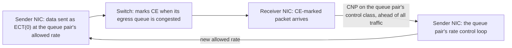
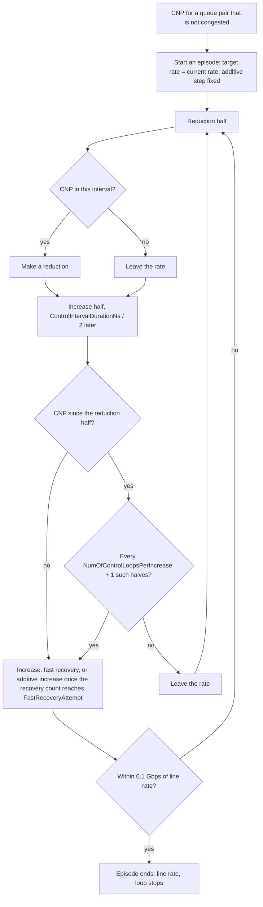

The Scala RoCE NIC slows each queue pair down when switches mark its packets with ECN, and raises the rate again as the marks stop, in a DCQCN-style loop.

This page follows a congestion signal from the switch that marks a packet to the sender's rate. The transport that carries the packets is on [Transport](./transport.md), PFC is on [Buffers and PFC](./buffers-and-pfc.md), and every `ECNHandler` attribute's type and default is on [Configuration](./configuration.md#ecnhandler).

## Overview

Congestion control involves three parties, as in DCQCN:

1. **The sender's NIC** sends its data packets as ECN-capable.
2. **A switch** with a congested egress queue marks those packets Congestion Experienced (CE). The NIC itself never marks a packet; marking is the switch's job ([ECN marking](../scala-switch/packet-handling.md#ecn-marking) explains how the Scala Switch decides).
3. **The receiver's NIC**, on a CE-marked packet, sends a congestion notification packet (CNP) to the sending queue pair. The sender's NIC reacts to CNPs by lowering that queue pair's rate, and raises it again in steps once CNPs stop.



Each queue pair has its own rate and its own loop. A queue pair starts at line rate, the NIC's `DataRate`, and stays there until its first CNP.

## Key concepts

| Term | Meaning |
| --- | --- |
| Line rate | The NIC's `DataRate`. A queue pair that is not congested sends at line rate. |
| Current rate | The rate a queue pair's data packets are sent at. The reduction that begins an episode, and each reduction made during fast recovery, cut it; each reduction made during additive increase, and every increase, move it halfway toward the target rate. |
| Target rate | The rate an increase moves the current rate toward. It is set when an episode begins; during additive increase, an increase raises it by the additive step and a reduction lowers it by one additive step. |
| Episode | The time a queue pair is congested: from the CNP that finds it not congested until an increase brings it back within 0.1 Gbps of line rate. |
| Control interval | `ControlIntervalDurationNs`, 45 µs by default. Each interval holds one reduction half and one increase half. |
| Congestion estimate | A moving average of how strongly the queue pair's traffic is being marked, from the CNPs it receives and the packets it sends. It sets how deep a reduction is at the start of an episode and during fast recovery. |
| Recovery count | A count each queue pair keeps. The reduction that begins an episode, and each reduction made during fast recovery, set it to 0; each increase adds one; each reduction made during additive increase takes one off. |
| Fast recovery | The phase in which the recovery count is below `FastRecoveryAttempt`. Each increase in it moves the current rate halfway toward the target rate. |
| Additive increase | The phase in which the recovery count has reached `FastRecoveryAttempt`. Each increase in it raises the target rate by the additive step, up to line rate, and then moves the current rate halfway toward it. |
| Additive step | The amount additive increase adds to the target rate, fixed when the episode begins. |
| Floor | `MinimumRatePercentage` × `DataRate`. A congested queue pair never sends below it. |

## ECN on the wire

`EnableECN` decides whether the NIC takes part as a sender:

| `EnableECN` | Data packets the NIC sends | CNPs it receives | Rate of its queue pairs |
| --- | --- | --- | --- |
| `true` (default) | ECT(0), so switches can mark them | Drive the rate control loop | The allowed rate the loop sets, between the floor and line rate |
| `false` | Not-ECT, so switches never mark them | Ignored | Always line rate |

ACKs and NAKs are always sent Not-ECT, and run at line rate.

## Congestion notification

When a packet arrives with its IP ECN field set to CE, the receiving NIC sends a CNP to the queue pair that sent it, whatever the receiving NIC's own `EnableECN`. The CNP is 122 bytes on the wire ([Packets on the wire](./transport.md#packets-on-the-wire)). It carries the queue pair's control class in its DSCP, but it is sent through the NIC's dedicated queue for PFC and congestion notification frames: ahead of all traffic classes, never paused by PFC, and not charged to an egress pool ([Transmit scheduling](./buffers-and-pfc.md#transmit-scheduling)).

The sender counts the CNPs each queue pair receives, and the data packets each queue pair sends, for the rate control loop.

## The rate control loop

The loop runs per queue pair while that queue pair is congested. It has these stages:

1. **CNP reception starts an episode.** When a CNP arrives for a queue pair that is not congested, the loop runs at once, starting with a reduction. The queue pair is congested from then on, and its target rate is set to the rate it had when the episode began.
2. **The control interval.** The loop then runs every half `ControlIntervalDurationNs`, alternating a reduction half and an increase half, so each control interval of 45 µs by default holds one of each. The CNP and packet counts are cleared after each reduction half, so each interval counts afresh.
3. **The congestion estimate.** Every run of the loop updates the queue pair's congestion estimate, a moving average of how strongly the queue pair's traffic is being marked, taken from the CNPs it received and the packets it sent in the current interval. `CongestionProbabilityWeight` is the weight each new interval carries in the average: a higher weight makes the estimate rise faster and forget earlier congestion sooner.
4. **Reduction.** In a reduction half that saw at least one CNP, the queue pair makes a reduction. On the reduction that begins an episode, and during fast recovery, the current rate is cut by a fraction set by the congestion estimate, at most half, and the recovery count goes back to 0. Once the queue pair has moved on to additive increase, a reduction instead first lowers the target rate by one additive step, then moves the current rate halfway toward the new target rate, and takes one off the recovery count. When the count falls below `FastRecoveryAttempt`, the queue pair is back in fast recovery: its next increase leaves the target rate alone, and a reduction that comes before increases bring the count back to `FastRecoveryAttempt` is a fast recovery reduction. A reduction half with no CNP leaves the rate alone.
5. **Increase.** An increase half that has seen no CNP since the last reduction half makes an increase. An increase half that did see CNPs makes one only on every (`NumOfControlLoopsPerIncrease` + 1)-th such half, every sixth at the default 5.
6. **Fast recovery.** While the recovery count is below `FastRecoveryAttempt`, each increase moves the current rate halfway toward the target rate, without changing the target, and adds one to the count. Each halves the gap between them.
7. **Additive increase.** Once the recovery count reaches `FastRecoveryAttempt`, each further increase first raises the target rate by the additive step, up to line rate, and then moves the current rate halfway toward it. The step is fixed when the episode begins:

   ```text
   additive step = target rate at the start of the episode × (1 − InitialTargetRatePercentage) ÷ NumberActiveIncreaseSteps
   ```

8. **The floor.** While a queue pair is congested, its rate never goes below `MinimumRatePercentage` × `DataRate`, whatever the reductions would give.
9. **The return to line rate.** When an increase brings the current rate within 0.1 Gbps of line rate, the episode ends: the queue pair runs at line rate again, the loop stops, and the next CNP starts a new episode.

There is no hyper-increase stage and no byte counter: every increase is driven by the timer of the control interval.



### How the rate is applied

The allowed rate applies to the queue pair's data packets: the network port sends each of them at the queue pair's current rate, or at the floor if that is higher, rather than at `DataRate`. Its ACKs and NAKs, CNPs, and PFC frames are sent at line rate. Each queue pair's rate is independent of the others', so two queue pairs on the same NIC can be slowed by different amounts.

## How each attribute shapes the loop

All of these sit in the `ECNHandler` component and apply to every queue pair on the NIC.

| Attribute | Default | Role in the loop |
| --- | --- | --- |
| `EnableECN` | `true` | Turns the NIC's part as a sender on: data is sent ECT(0), and CNPs drive the loop. With `false`, data is sent Not-ECT, CNPs are ignored, and every queue pair runs at line rate. |
| `ControlIntervalDurationNs` | `45000` | Length of the control interval in nanoseconds. The loop runs every half interval, alternating reduction and increase, and the CNP and packet counts cover one interval. |
| `CongestionProbabilityWeight` | `0.5` | Weight of each new interval in the congestion estimate's moving average. A higher weight makes the estimate, and so the cut at the start of an episode and each cut during fast recovery, respond faster to marks, and forget them sooner. |
| `FastRecoveryAttempt` | `3` | Recovery count at which fast recovery gives way to additive increase: the number of fast-recovery increases after a reduction that sets the count to 0. |
| `InitialTargetRatePercentage` | `0.90` | Sizes the additive step: the step is `(1 − InitialTargetRatePercentage)` of the target rate at the start of the episode, divided by `NumberActiveIncreaseSteps`. It does not set a starting rate: the episode's first target is the rate the queue pair had when it began. |
| `NumberActiveIncreaseSteps` | `10` | Divisor of the additive step. More steps mean a smaller step: the most each increase during additive increase raises the target rate, and the amount each reduction during additive increase lowers the target rate. |
| `NumOfControlLoopsPerIncrease` | `5` | While CNPs keep arriving, an increase is made only on every (this value + 1)-th increase half that saw CNPs. |
| `MinimumRatePercentage` | `0.10` | Floor of the rate while congested, as a fraction of `DataRate`. |

## Worked example: the loop's timing and steps at the defaults

A queue pair on a NIC with `DataRate` 400 Gbps and every `ECNHandler` attribute at its default, whose episode begins while it runs at line rate:

```text
control interval               ControlIntervalDurationNs            = 45 µs
loop period                    45 µs ÷ 2                            = 22.5 µs, alternating reduction and increase
target rate at the start       the rate when the episode begins     = 400 Gbps
additive step                  400 Gbps × (1 − 0.90) ÷ 10           = 4 Gbps
floor                          400 Gbps × 0.10                      = 40 Gbps
increase while CNPs continue   every (5 + 1)th increase half        = at most once every 6 × 45 µs = 270 µs
end of the episode             current rate within 0.1 Gbps of 400 Gbps
```

After the reduction that begins the episode, the first three increases are fast recovery. Each halves the gap between the current rate and the 400 Gbps target, so after three of them the queue pair has recovered seven eighths of what the reduction took. From the fourth increase on, additive increase adds the 4 Gbps step to the target. Here the target is already line rate, 400 Gbps, so it stays there, and each increase keeps halving the gap toward it. With no further CNPs, an increase comes every 45 µs, and the episode ends once the gap has fallen below 0.1 Gbps.

## What congestion control records

| Record and columns | What they show |
| --- | --- |
| `roce-transport-stats` `num_cnp_sent` | CNPs this NIC sent as a receiver of CE-marked packets |
| `roce-transport-stats` `num_cnp_recvd` | CNPs this NIC received as a sender, each counted toward its queue pair's loop |
| `ecn-pfc-stats` `pkts_ecn_marked`, on the switches | Packets each switch port marked, per traffic class ([Records a simulation writes](../scala-switch/packet-handling.md#records-a-simulation-writes)) |
| `nd-stats` `tx_rate_Gbps`, for the NIC | The NIC port's send rate in each interval, which falls while its queue pairs are slowed |

No record holds a queue pair's allowed rate. [Records the transport writes](./transport.md#records-the-transport-writes) describes the rest of `roce-transport-stats`.
