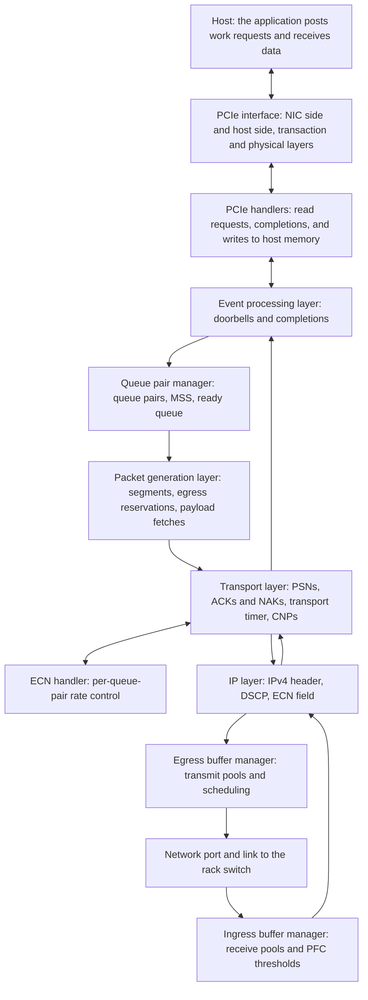

The Scala RoCE NIC models an RDMA over Converged Ethernet (RoCEv2) network interface card with PFC, ECN-driven rate control, and a PCIe host link.

Model version 4.6.0 is the version these pages describe.

## What this model simulates

The Scala RoCE NIC is a generic RoCEv2 NIC. A simulation configuration places one on a server, where it serves that one host: it fetches the data the host's application sends from host memory over a PCIe link, carries it across one Ethernet port to the rack switch as RoCEv2 packets, and writes the data it receives back to host memory. Rather than modeling a specific vendor's adapter, it models the mechanisms such adapters share: reliable connected queue pairs, packet sequence numbers and acknowledgements, retransmission, per-traffic-class buffers with priority flow control, and congestion control driven by ECN marks.

The workloads that run over it on the platform are the [Chakra workload](../chakra-workload/index.md) and the Scala RDMA application.

The results you reason about with it are transfer completion times, acknowledgements and retransmissions, congestion notifications and the rate changes they cause, PFC pause and resume frames, receive-buffer drops, and how much of the network link and the PCIe link a workload uses.

Simulations on the platform carry IPv4 traffic.

### What is and is not modeled

- **Verbs.** RDMA SEND and RDMA WRITE. READ and ATOMIC operations are not modeled.
- **One message at a time per queue pair.** A queue pair starts its next message only after every packet of the current one is acknowledged ([Queue pairs and messages](./transport.md#queue-pairs-and-messages)).
- **Go-back-N recovery.** The receiver keeps no reorder buffer and sends no selective acknowledgements. A gap in the sequence is answered with one negative acknowledgement, and the sender resends from the first missing packet ([Loss recovery](./transport.md#loss-recovery)).
- **Retransmission without a retry limit.** The transport timer has no retry counter and no error state: a queue pair retries until its packets are acknowledged. `RetransmitTimeout` accepts any time value rather than the InfiniBand `4.096 µs × 2^n` grid ([Retransmission timer](./transport.md#retransmission-timer)).
- **Wire framing.** Packets carry Ethernet, IPv4, UDP, and the RoCEv2 base transport header, with no invariant CRC. The preamble and interframe gap a physical link spends on each frame are not modeled ([Packets on the wire](./transport.md#packets-on-the-wire)).
- **Host memory.** The host answers each PCIe read at once; host memory latency is not modeled ([Fetching the payload over PCIe](./transport.md#fetching-the-payload-over-pcie)).

## Features

- **RoCEv2 reliable connected transport, InfiniBand Architecture Specification Annex A17.** Messages are cut into packets of at most `MSS` bytes, numbered with packet sequence numbers, and acknowledged cumulatively. Acknowledgements can be coalesced by count and by time, and the last packet of each message is acknowledged at once. [Transport](./transport.md) explains it.
- **Loss recovery and a per-queue-pair transport timer.** A gap at the receiver draws one negative acknowledgement, and the sender goes back to the first missing packet. Each queue pair has one transport timer, which restarts on every acknowledgement that retires packets and resends from the oldest unacknowledged packet when it expires.
- **PCIe host interface.** Each packet's payload is fetched from host memory with a PCIe read, and received data is written to host memory with PCIe writes. The lane rate, the lane count, and the transaction-layer buffers are configurable on both ends of the link, so the link can represent any PCIe generation.
- **Traffic classes from DSCP, RFC 2474.** Eight classes, numbered 0 to 7. The NIC writes DSCP as the traffic class times 8, and classifies a received packet by its DSCP divided by 8.
- **Ingress and egress buffer pools.** A receive buffer and a transmit buffer, each divided into per-traffic-class pools. [Buffers and PFC](./buffers-and-pfc.md) explains them.
- **Transmit scheduling.** Strict priority, round robin, or weighted round robin across traffic classes, with PFC and congestion-notification frames sent ahead of all data.
- **Priority Flow Control (PFC), IEEE 802.1Qbb.** The NIC pauses its rack switch per traffic class when a receive pool passes its Xoff threshold, re-checks every half pause time, and resumes it by sending an XON frame. It honors the pause frames it receives by holding that class's transmission.
- **Explicit Congestion Notification (ECN), RFC 3168.** The NIC sends its data as ECN-capable, and the switches mark congested packets. A NIC that receives a marked packet sends a congestion notification packet (CNP) back to the sender.
- **DCQCN-style rate control.** Each queue pair keeps its own sending rate, cut when CNPs arrive and raised again through fast recovery and additive increase, with a floor and a return to line rate. [Congestion control](./congestion-control.md) explains the loop and each attribute's role.
- **Statistics.** Transport counters per NIC, device counters for the network port, and PFC counters per traffic class. The transport page and the buffers page each list the records they cover ([Records the transport writes](./transport.md#records-the-transport-writes), [Records the buffers and PFC write](./buffers-and-pfc.md#records-the-buffers-and-pfc-write)).

## Architecture

The NIC is assembled from cooperating components. A stack of processing layers turns the host's work requests into packets and back, the buffer managers own the transmit and receive buffers, and the PCIe interface connects the NIC to its host.

| Component | C++ class | Responsibility | Configured by |
| --- | --- | --- | --- |
| NIC node | `ScalaRoceNic` | Holds the other components, sends PFC pause and resume frames when receive pools cross their thresholds, and holds a traffic class's transmission while a received pause lasts. | [NIC](./configuration.md#nic) |
| Network port | `ScalaNetDeviceBase`, `ScalaRoceNicNetworkPortHandler` | The NIC's one Ethernet port to its rack switch. Sends every frame at `DataRate`, or a queue pair's data at its allowed rate. | [UplinkNetworkInterface](./configuration.md#uplinknetworkinterface) |
| Link | `ScalaChannel` | Carries frames between the port and the rack switch with the configured propagation delay. | [TransmissionMedium](./configuration.md#transmissionmedium) |
| Ingress buffer manager | `ScalaRoceNicIngressBufferManager` | Divides the receive buffer into per-class pools, charges each received packet to its pool until the host has accepted it, drops packets that do not fit, and applies the PFC thresholds. | [IngressBufferManager](./configuration.md#ingressbuffermanager) |
| Egress buffer manager | `ScalaRoceNicEgressBufferManager` | Divides the transmit buffer into per-class pools, reserves space for each packet before its payload is fetched, and schedules transmission across traffic classes. | [EgressBufferManager](./configuration.md#egressbuffermanager) |
| Event processing layer | `ScalaRoceEventProcessingLayer` | Receives the host's work requests (doorbells) and reports completions and received messages to the host. | None |
| Packet generation layer | `RoceNetworkPacketGenerationLayer` | Takes the ready queue pairs in turn, cuts each message into segments, reserves egress space, and requests each segment's payload over PCIe. | None |
| Transport layer | `RoceTransportProcessingLayer` | Assigns sequence numbers, checks the order of received packets, sends ACKs and NAKs, runs the transport timer, and sends CNPs for ECN-marked packets. | [RoceTransportLayer](./configuration.md#rocetransportlayer) |
| IP layer | `RoceIpPacketProcessingLayer` | Adds the IPv4 header with the traffic class's DSCP and the ECN field, and finds the queue pair of each received packet. | None |
| Queue pair manager | `ScalaRoceQpManager` | Creates and tracks queue pairs and their messages, and sets the segment size. | [ScalaRoceQpManager](./configuration.md#scalaroceqpmanager) |
| ECN handler | `ScalaRoceNicEcnHandler` | Keeps each queue pair's allowed rate and runs the rate control loop when CNPs arrive. | [ECNHandler](./configuration.md#ecnhandler) |
| PCIe interface | `ScalaPCIeDeviceLayer`, `GenericPCIeTransactionLayer`, `GenericPCIeDataLinkLayer`, `GenericPCIePhysicalLayer` | The PCIe link between the NIC and its host, one stack on each end: transaction-layer buffers, link framing, and the lane rate and count. | [Host interface](./configuration.md#host-interface) |
| PCIe handlers | `ScalaRoceNicDeviceLayerHandler`, `HostDeviceLayerHandler` | On the NIC side, sends the read requests that fetch payload and the writes that deliver received data; on the host side, answers each read with the requested data. | [Host interface](./configuration.md#host-interface) |

## How to read these pages

Read them in this order:

1. [Transport](./transport.md): how a message travels from host memory to the wire and back, from the PCIe fetch through segmentation, sequence numbers, acknowledgements, loss recovery, and the transport timer, and what the transport records.
2. [Buffers and PFC](./buffers-and-pfc.md): the transmit and receive buffers and their pools, transmit scheduling, and how the NIC sends and honors PFC, with a worked example of the defaults.
3. [Congestion control](./congestion-control.md): how ECN marks become CNPs and how each queue pair's rate control loop reacts to them, with the role of each `ECNHandler` attribute.
4. [Configuration](./configuration.md): every attribute a simulation configuration can set, with its type and default, how to add the NIC and change attributes through the platform API, and the configuration rules that stop a simulation.
