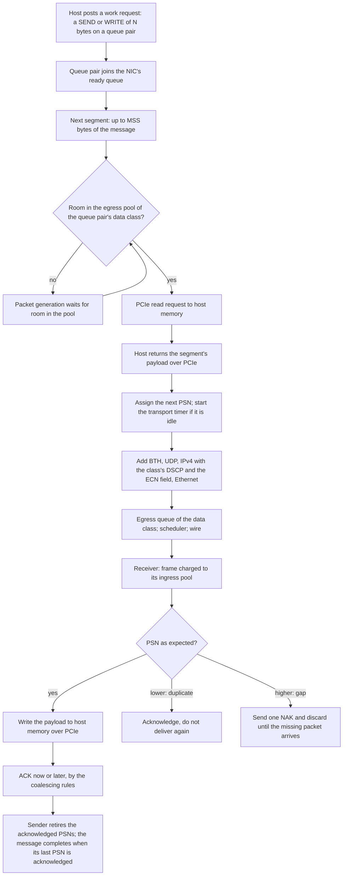

This page explains how the Scala RoCE NIC carries an RDMA message from host memory to the wire and back, acknowledges it, and recovers lost packets.

It follows one message from the moment the host posts it to the moment the sender learns it has arrived. The transmit and receive buffers the data passes through, and PFC, have their own page, [Buffers and PFC](./buffers-and-pfc.md). How ECN marks slow a queue pair down is on [Congestion control](./congestion-control.md). Attribute types and defaults are on [Configuration](./configuration.md).

## Data path at a glance



## Queue pairs and messages

All traffic runs over reliable connected queue pairs (QPs). The application on the host creates a queue pair when it connects to a peer, or posts a transfer without connecting first, in which case the NIC creates the queue pair and the receiving NIC creates its side when the first packet arrives. Each queue pair carries two traffic classes, chosen by the application: one for data packets, one for acknowledgements and negative acknowledgements. The Chakra workload uses class 0 for data and class 1 for control; the Scala RDMA application sets them with its `RdmaDataPacketTC` and `RdmaControlPacketTC` attributes, which default to the same classes.

The host posts each message as a work request, a SEND or a WRITE of a given number of bytes, by ringing the NIC's doorbell over PCIe. The NIC queues the work request on its queue pair at once and puts the queue pair at the tail of its ready queue. If the ready queue was empty, packet generation starts 80 ns later; the same 80 ns passes each time generation restarts.

Two rules shape how messages share the NIC:

1. **One message at a time per queue pair.** A queue pair's packets in flight always belong to one message. Its next message starts only when every packet of the current one has been acknowledged, so consecutive messages on one queue pair are separated by at least a round trip. Several queue pairs are needed to keep messages overlapping.
2. **Ready queue pairs take turns, one packet each.** The NIC serves its ready queue in order: it takes one segment from the queue pair at the head, then moves that queue pair to the tail if it has more of the message to send. Within a message there is no limit on the number of packets outstanding, that is, given a PSN and not yet acknowledged. A queue pair sends as fast as the egress pool of its data class lets the NIC fetch its payload ([Egress buffer](./buffers-and-pfc.md#egress-buffer)) and, while the queue pair is congested, as fast as its allowed rate lets the port send its packets ([Congestion control](./congestion-control.md)).

## Segmentation

A message of N bytes is sent as `ceil(N ÷ MSS)` packets, each carrying at most `MSS` bytes of payload; a message of 0 bytes is sent as one packet. Every packet gets its own packet sequence number (PSN). The last packet of each message carries the solicited-event flag, which makes the receiver acknowledge it at once ([Acknowledgements](#acknowledgements)).

For each segment, the NIC first reserves the packet's full size on the wire, the segment plus 58 bytes of headers, in the egress pool of the queue pair's data class. If the pool has no room, packet generation stops until the pool has room again; it restarts at the latest when transmission drains that pool to half its size or less. Only with the space reserved does the NIC fetch the segment's payload.

## Fetching the payload over PCIe

The NIC and its host are joined by a PCIe link with a protocol stack at each end. For each segment:

1. **Read request.** The NIC sends one PCIe read request to host memory for the segment. The request itself occupies `ReadRequestSize` bytes on the NIC-to-host direction of the link; it is one request per segment, whatever the segment's size.
2. **Completion.** The host answers at once with the segment's payload. Host memory latency is not modeled: what the fetch costs is the time the request and the payload take on the link.
3. **Hand-off.** When the last of the payload arrives, the segment passes to the transport layer, which numbers it and sends it on ([Packets on the wire](#packets-on-the-wire)).

Received data travels the other way: each in-order packet's payload, without its headers, is written to host memory as a PCIe write ([Receiving a packet](#receiving-a-packet)).

**Link rate.** Each end of the link transmits at its own `LaneBps` × `LaneCount`, and the two directions run independently: the NIC side's lanes carry the NIC-to-host direction, the read requests and the received data, and the host side's lanes carry the host-to-NIC direction, the payload the NIC sends. The defaults, 31.52 Gbps per lane on 16 lanes at both ends, give 504.32 Gbps in each direction; 31.52 Gbps is the PCIe 5.0 lane rate. The lane rate alone sets the generation the link represents: the `PCIeGen3.0` container that holds these attributes in the configuration does not. PCIe moves data in transfers of at most 512 bytes of payload, and each transfer adds 34 bytes of PCIe protocol overhead on the link.

**Buffers.** Each end of the link has transaction-layer buffers for transfer headers and for payload, on its transmit side and its receive side, sized by `RXHeaderBufferSize`, `TXHeaderBufferSize`, `RXDataBufferSize`, and `TXDataBufferSize`. A transfer waits in its transmit buffer until it can go on the link, and is sent only when the receiving end has buffer space for it. On the NIC side, received data is released from the NIC's receive buffer as soon as its write is accepted into the PCIe transmit buffer ([Receive buffer](./buffers-and-pfc.md#receive-buffer)), so the PCIe buffers set how much received data can wait for the link outside the NIC's receive pools.

### Worked example: PCIe and network payload rates

At the defaults, `MSS` 4096 B, `ReadRequestSize` 64 B, 16 lanes of 31.52 Gbps, and a 400 Gbps network port:

```text
PCIe link, each direction        16 × 31.52 Gbps                 = 504.32 Gbps
read request on the link         64 B + 34 B overhead            =     98 B
segment payload on the link      4096 B ÷ 512 B = 8 transfers
                                 8 × (512 B + 34 B)              =  4,368 B
PCIe payload rate                504.32 Gbps × 4096 ÷ 4368       = 472.9 Gbps
network payload rate             400 Gbps × 4096 ÷ 4154          = 394.4 Gbps
```

The 4,154 bytes are the data packet's size on the wire ([Packets on the wire](#packets-on-the-wire)). Both directions of the PCIe link carry payload faster than the network port can, so at the defaults the network port, not the PCIe link, limits a transfer. When the NIC sends and receives at full rate together, the NIC-to-host direction carries the received data and the read requests for the data being sent: 504.32 Gbps × 4096 ÷ (4,368 + 98) = 462.5 Gbps of received payload, still above the network's 394.4 Gbps.

With 7.88 Gbps lanes, the PCIe 3.0 rate, the same 16 lanes carry 126.08 Gbps, or 126.08 × 4096 ÷ 4368 = 118.2 Gbps of payload. The PCIe link then limits every transfer to well below the network rate, and received data backs up into the NIC's receive pools, where it can trigger PFC ([PFC](./buffers-and-pfc.md#pfc)).

## Packets on the wire

When a segment's payload arrives from the host, the transport layer gives it the queue pair's next PSN, starts the queue pair's transport timer if it is not running ([Retransmission timer](#retransmission-timer)), and adds the RoCEv2 base transport header (BTH) and a UDP header. The IP layer adds an IPv4 header whose DSCP is the data class times 8 and whose ECN field is ECT(0) when `EnableECN` is `true` and Not-ECT when it is `false`. The packet then waits in the egress queue of its traffic class until the scheduler sends it ([Transmit scheduling](./buffers-and-pfc.md#transmit-scheduling)); the network port adds a 14-byte Ethernet header and a 4-byte frame check sequence.

The port sends each frame at `DataRate`, or a data packet at its queue pair's allowed rate while congestion control has slowed the queue pair down. The interframe gap is zero, and a frame reaches the rack switch the link's `Delay` after its serialization ends. When serialization ends, the packet's egress reservation is released.

| Packet | What it carries | Size on the wire |
| --- | --- | --- |
| Data | Payload of up to `MSS` bytes, BTH 12 B, UDP 8 B, IPv4 20 B, Ethernet header 14 B, FCS 4 B | Payload + 58 B |
| ACK or NAK | 64 B payload, acknowledgement extended transport header 4 B, BTH 12 B, UDP 8 B, IPv4 20 B, Ethernet 18 B | 126 B |
| CNP | 64 B payload, BTH 12 B, UDP 8 B, IPv4 20 B, Ethernet 18 B | 122 B |
| PFC frame | 34 B of addresses, type, opcode, class-enable vector, and eight pause times; 46 B of data; FCS 4 B | 84 B |

The packets carry no invariant CRC, and the 20 bytes of preamble and interframe gap that a physical link spends on each frame are not modeled. `MSS` + 58 bytes must be smaller than the link MTU, the global `Mtu` of the configuration (4,184 bytes on the platform), or the simulation does not start ([Configuration rules that stop a simulation](./configuration.md#configuration-rules-that-stop-a-simulation)).

### Worked example: packet sizes at MSS 4096

```text
data packet    4096 + 12 + 8 + 20 + 14 + 4         = 4,154 B   on the wire
               4,154 B × 8 ÷ 400 Gbps              = 83.08 ns  at the default DataRate
               4,154 − 14 − 4                      = 4,136 B   charged to the receiver's ingress pool
ACK            64 + 4 + 12 + 8 + 20 + 18           =   126 B
CNP            64 + 12 + 8 + 20 + 18               =   122 B
PFC frame      34 + 46 + 4                         =    84 B
```

A data packet's egress reservation is its full 4,154 bytes; the receiver charges its ingress pool the packet without the Ethernet header and FCS. With the largest `MSS` the platform's 4,184-byte `Mtu` allows, 4,125 bytes, a data packet is 4,183 bytes on the wire.

## Receiving a packet

A received frame is first charged to the ingress pool of its traffic class, or dropped if the pool cannot hold it ([Receive buffer](./buffers-and-pfc.md#receive-buffer)). The NIC then finds the packet's queue pair from the destination queue pair number in its BTH; a packet that matches no queue pair is discarded and counted. If the packet's IP ECN field is CE, the NIC sends a congestion notification packet back to the sender ([Congestion control](./congestion-control.md#congestion-notification)). A data packet's PSN is then compared with the PSN the queue pair expects next:

| PSN of the arriving data packet | What the receiver does |
| --- | --- |
| Equal to the expected PSN | Accepts it, advances the expected PSN, writes the payload to host memory over PCIe, and applies the acknowledgement rules |
| Lower than expected: a duplicate | Counts it as a duplicate and applies the acknowledgement rules, so a duplicate can draw an ACK, but does not write it to host memory again |
| Higher than expected: a gap | Sends one NAK naming the expected PSN and discards the packet. Until the expected packet arrives, every later packet that is out of order is discarded without another NAK |

The receiver keeps no reorder buffer: a packet that arrives after a gap is always discarded, and the sender resends it ([Loss recovery](#loss-recovery)).

When the packet that completes a message arrives in order, the NIC writes it to host memory and tells the host that the message has arrived.

## Acknowledgements

Acknowledgements are cumulative. An ACK names the highest PSN the receiver has received in order, and the sender retires every outstanding PSN up to it. ACKs and NAKs are sent on the queue pair's control class through the normal egress queues, so PFC can pause them like data; they are Not-ECT, so switches do not mark them.

With `AckCoalescingEnabled` `false`, the receiver sends an ACK for every in-order or duplicate data packet.

With `AckCoalescingEnabled` `true`, the default, the receiver holds acknowledgements back:

1. **Count.** A data packet that arrives while fewer than `AckThreshold` packets are waiting for an acknowledgement is held, and the count goes up by one. The next packet after `AckThreshold` held packets sends an ACK at once and resets the count. So with a threshold of T, an ACK goes out on every (T + 1)-th packet.
2. **Last packet of a message.** A packet with the solicited-event flag, which is the last packet of every message, is acknowledged at once, whatever the count.
3. **Timer.** When a packet is held and the queue pair's acknowledgement timer is not running, the timer starts with `AckDelay`. Each ACK sent by the count or by the solicited-event flag also restarts it. When it expires with packets still held, it sends an ACK for them. Later packets do not extend it.

The timer matters only when packets arrive slowly: a message's last packet is always acknowledged at once, and at line rate the count sends an ACK long before `AckDelay` ends.

### Worked example: ACK cadence at the defaults

`AckCoalescingEnabled` `true`, `AckThreshold` 16, `AckDelay` 1 ms, `MSS` 4096 B, and a 400 Gbps link:

```text
1 MiB WRITE              1,048,576 B ÷ 4,096 B             = 256 packets
ACK by count             every 16 + 1 = 17th packet: packets 17, 34, ..., 255   = 15 ACKs
ACK by the last packet   packet 256 carries the solicited-event flag             =  1 ACK
total                                                                            = 16 ACKs
reverse traffic          16 × 126 B                         = 2,016 B
time between data packets at 400 Gbps                       = 83.08 ns
time for 17 packets      17 × 83.08 ns                      = 1.41 µs
```

The 1 ms timer never sends an ACK during the transfer: an ACK goes out every 1.41 µs, and each one restarts the timer with no packets held. A message of 17 packets or fewer is acknowledged once, by its last packet.

## Loss recovery

The NIC recovers lost packets by going back to the first missing one (go-back-N):

1. **NAK.** A receiver that sees a gap sends one NAK naming the PSN it expects, and discards the out-of-order packet and every later one until that PSN arrives.
2. **Retire.** The sender treats the NAK as an acknowledgement of every PSN below the one it names, and retires them.
3. **Rewind.** The sender rewinds the queue pair to the named PSN. Payload already fetched over PCIe for later PSNs is discarded and counted ([Records the transport writes](#records-the-transport-writes)), and every byte from the named PSN on is fetched from host memory again and resent with the same PSNs.

A NAK also cancels any acknowledgement the receiver was holding for coalescing. If the NAK or the first retransmitted packet is lost, the receiver sends no further NAK, so recovery waits for the sender's transport timer.

An ACK or NAK that names a PSN the queue pair has not sent yet is discarded and counted.

## Retransmission timer

Each queue pair has one transport timer, with the interval `RetransmitTimeout` (64 ms by default). The timer watches the queue pair's window: its outstanding PSNs, those given to packets and not yet acknowledged.

- **Start.** The timer starts when a PSN is added to an empty window: when the first packet of a message, or the first packet resent after a rewind, gets its PSN. That happens when its payload arrives from the host, before the packet waits in the egress queue.
- **Restart.** An ACK that retires at least one PSN restarts the timer while PSNs remain outstanding.
- **Stop.** The timer stops when the window empties, because every PSN has been acknowledged or a rewind has taken them all back. A NAK does not restart the timer; its rewind normally empties the window, and the timer starts again with the first resent packet.
- **Expiry.** The sender rewinds to the oldest outstanding PSN and resends the whole window from there, fetching the payload from host memory again.

There is no retry limit and no backoff: the interval stays `RetransmitTimeout`, and the queue pair retries until its packets are acknowledged. `RetransmitTimeout` takes any time value.

### Worked example: a lost last packet

A 1 MiB WRITE at the defaults, 256 packets, in which packet 256 is lost:

1. Packets 1 to 255 arrive in order. The ACK sent on packet 255 by the count retires packets 1 to 255. Packet 256 is still outstanding, so the sender's transport timer restarts with 64 ms.
2. No later packet arrives on this queue pair, so the receiver sees no gap and sends no NAK. Its acknowledgement timer finds no held packets.
3. 64 ms after that ACK reached the sender, the timer expires. The sender rewinds to packet 256, fetches its payload again, and resends it.
4. The resent packet carries the solicited-event flag, so the receiver acknowledges it at once, and the WRITE completes.

The loss of the last packet delays the message by about `RetransmitTimeout`. A packet lost from the middle of a message is recovered by the NAK in about one round trip instead, because the packets behind it reveal the gap.

## Completion

The sender's work request completes when an ACK retires the last PSN of its message: the NIC reports the completion to the host, and the queue pair's next message becomes eligible to send.

## Records the transport writes

With the defaults, a simulation writes one `roce-transport-stats` row for each Scala RoCE NIC every `NDStatsReportInterval`. `NDStatsReportInterval` is a global simulation parameter, not an attribute of this model: a `double` in seconds (default `0.001`) in the configuration's `SimulationParameters`, changed with `PATCH /api/v1/configurations/{config_id}/parameters`, where the global `EnableRoceTransportStats` (default `true`) also turns the record off. Columns that start with `ivl_` count the interval; the matching columns without the prefix count the whole simulation so far. [Simulation output files](../../simulation-output-files.md) lists every column.

| Columns | What they hold on this NIC |
| --- | --- |
| `time_utc`, `sim_time_sec` | When the row was written |
| `component_name`, `node_id` | The component and node the row describes |
| `num_pkts_sent`, `num_verb_pkts_sent`, `num_non_verb_pkts_sent` | Packets sent: all of them, data packets, and control packets (ACKs, NAKs, CNPs, and connection packets) |
| `num_conn_pkts_sent`, `num_conn_pkts_recvd` | Connection packets sent and received |
| `rdma_write_cnt` | Data packets sent, retransmissions included |
| `num_writes_recvd` | Data packets received |
| `num_acks_sent`, `num_acks_recvd`, `num_nacks_sent`, `num_nacks_recvd` | ACKs and NAKs sent and received |
| `num_cnp_sent`, `num_cnp_recvd` | Congestion notification packets sent and received ([Congestion control](./congestion-control.md#what-congestion-control-records)) |
| `num_seq_out_of_order` | Gaps detected by this NIC as a receiver: one for each NAK it sends |
| `num_duplicate` | Duplicate data packets received |
| `num_wqe_created`, `num_wqe_completed` | Work requests posted to this NIC, and work requests completed by an acknowledgement of their last packet |
| `num_rtx` | Retransmission episodes: one for each NAK received and for each transport timer expiry. Each episode resends the whole window from the PSN it rewinds to |
| `num_rto` | Transport timer expiries |
| `max_calc_rtt_usec`, `avg_calc_rtt_usec`, and their `ivl_` columns with `ivl_min_calc_rtt_usec` | Round-trip time the sender measures on each acknowledgement, in µs: the greatest and the mean, and the least in the interval |
| `num_rx_drops` | Received packets the transport discarded, the sum of the four reasons below |
| `num_rx_drops_no_qp_data`, `num_rx_drops_no_qp_ctrl` | Data and control packets that matched no queue pair, for example a late retransmission after its queue pair was closed |
| `num_rx_drops_after_nak` | Packets discarded behind a gap: the packet that drew the NAK and every out-of-order packet after it until the gap fills |
| `num_rx_drops_ghost_ack` | ACKs and NAKs discarded because they name a PSN the queue pair has not sent |
| `num_tx_payload_discards` | Payload fetched from the host and then discarded, before it was numbered, because a rewind or a closed queue pair made it stale |

The record's columns for atomic operations, selective acknowledgements, and the reorder buffer stay 0: the model has none of them. A packet dropped because its ingress pool was full is not a transport discard; it is counted in `nd-stats` `rx_drops` ([Records the buffers and PFC write](./buffers-and-pfc.md#records-the-buffers-and-pfc-write)).
