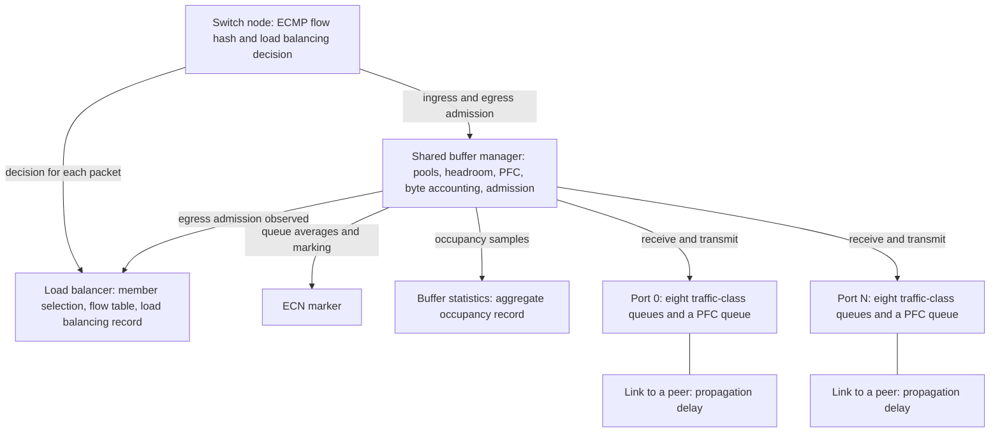

The Scala Switch models a shared-buffer data center Ethernet switch with PFC, ECN, ECMP hashing, and flowlet load balancing for Clos fabrics.

Model version 3.7.0 is the version these pages describe.

## What this model simulates

The Scala Switch is a generic shared-memory Ethernet switch with IEEE 802.3 interfaces. A simulation configuration can place it as a Rack (ToR), Fabric, or Spine switch in a Clos topology. Rather than modeling a specific vendor ASIC, it models the mechanisms those ASICs share: a single shared packet buffer, per-traffic-class flow control, congestion marking, and multi-path forwarding.

The results you reason about with it are buffer occupancy, PFC pause and resume behavior, ECN marking, packet drops, and how traffic spreads across equal-cost paths.

Simulations on the platform carry IPv4 traffic.

The platform counts a switch's bandwidth as the sum of its port speeds, each full-duplex port once, assuming a non-blocking switch. `SwitchingCapacity` is compared with that sum to show whether the switch is oversubscribed; it does not limit what the switch forwards.

## Features

- **Priority Flow Control (PFC), IEEE 802.1Qbb.** Per-traffic-class pause and resume. Each port pauses its upstream sender when a lossless arrival would take its own occupancy in a buffer pool past the Xoff threshold, and absorbs in-flight traffic in per-port headroom. It resumes the sender when a lossless packet that arrived on that port leaves the switch while the port's headroom is empty and its occupancy is at or below the Xon threshold. A pause frame requests 65535 quanta, and the switch re-sends it every half pause time while the port stays paused.
- **Explicit Congestion Notification (ECN), RFC 3168.** RED-style marking: packets carrying ECT(0) or ECT(1) are marked CE with a probability that rises between two thresholds on an exponentially weighted moving average of egress queue occupancy.
- **Shared buffer management.** One switch-wide buffer divided into as many as eight pools, with eight traffic classes mapped onto them, separate ingress and egress accounting, and a choice of dynamic or fixed egress queue limits for lossy classes.
- **Lossless and lossy traffic classes.** A class with PFC enabled pauses its upstream sender when the port's occupancy in the class's pool passes Xoff, and is never dropped at egress. [Sizing a lossless class](./shared-buffer.md#sizing-a-lossless-class) gives the conditions under which it is not dropped at ingress either. A class without PFC is bounded by egress queue limits and pool capacity and is dropped when it exceeds them.
- **Traffic classes from DSCP, RFC 2474.** Eight classes, numbered 0 to 7, taken from the packet's DSCP field divided by 8.
- **Bandwidth-delay product (BDP) queue sizing.** Egress queue limits can be set as a multiple of the fabric's bandwidth-delay product.
- **Equal-cost multi-path (ECMP) forwarding.** Flow-based path selection over equal-cost routes, with six hash methods. The default, `crc32WithSalt`, salts the hash per switch, which de-correlates the choices of adjacent tiers in a fabric.
- **Dynamic load balancing (flowlet switching).** With `LoadBalancingMethod` set to `flowlet`, the switch moves a flow to the member of its equal-cost set with the least egress occupancy when the flow sends nothing for `Gap` or longer, and by default prefers members that PFC is not pausing.
- **Statistics.** Per-port packet and byte counters, PFC and ECN counters, aggregate buffer occupancy per pool, and a load balancing record for each member of each equal-cost set. [Records a simulation writes](./packet-handling.md#records-a-simulation-writes) lists them.

## Architecture

The switch is assembled from a few cooperating components. The switch node hands every admission decision to the shared buffer manager, which owns the buffer and drives the ports.

| Component | Responsibility | Configured by |
| --- | --- | --- |
| Switch node | Computes the ECMP flow hash for each packet, asks the load balancer which equal-cost member to use, and hands every ingress and egress admission decision to the shared buffer manager. | [Switch](./configuration.md#switch) |
| Load balancer | Selects the member of an equal-cost set. With `none` it leaves the member as the flow hash modulo the set size and records what was assigned to each member; with `flowlet` it keeps a flow table and moves flows at gaps. | [Switch](./configuration.md#switch), [Load balancing flowlet](./configuration.md#load-balancing-flowlet) |
| Shared buffer manager | Owns the switch-wide packet buffer. Divides it into pools, reserves headroom, accounts for every byte entering and leaving, sends and honors PFC frames, and admits or drops every packet. | [Shared buffer manager](./configuration.md#shared-buffer-manager) |
| ECN marker | Keeps a moving average of each egress queue's occupancy and marks ECN-capable packets as they start transmitting. | [ECN handler](./configuration.md#ecn-handler) |
| Buffer statistics | Samples ingress, egress, and shared-buffer occupancy per pool and writes the aggregate buffer record. | `BufferStatsReportInterval` in [Shared buffer manager](./configuration.md#shared-buffer-manager) |
| Port | One per connected port. Receives frames, hands them to the switch for admission, and transmits with a strict-priority scheduler over eight per-class queues plus a dedicated PFC control queue. | [Network interfaces](./configuration.md#network-interfaces) |
| Link | Carries frames between the port and its peer with the configured propagation delay. | [Network interfaces](./configuration.md#network-interfaces) |

## How to read these pages

Read them in this order:

1. [Packet handling](./packet-handling.md): how a packet is classified, admitted, queued, scheduled, ECN-marked, paused by PFC, and steered across equal-cost paths, and what a simulation records.
2. [Shared buffer manager](./shared-buffer.md): how the buffer is divided into pools and limits at startup, how every byte is accounted for at run time, and how to size a lossless class, with a worked example of the defaults.
3. [Configuration](./configuration.md): every attribute a simulation configuration can set, with its type and default, how to change attributes through the platform API, and the configuration rules that stop a simulation.
