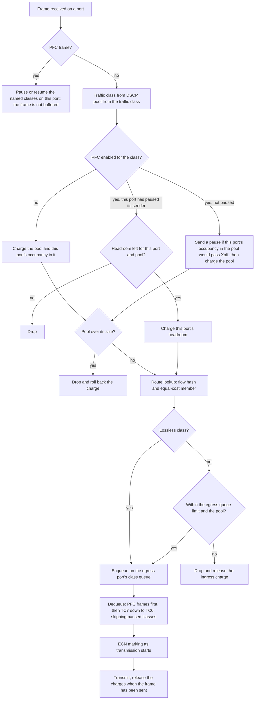
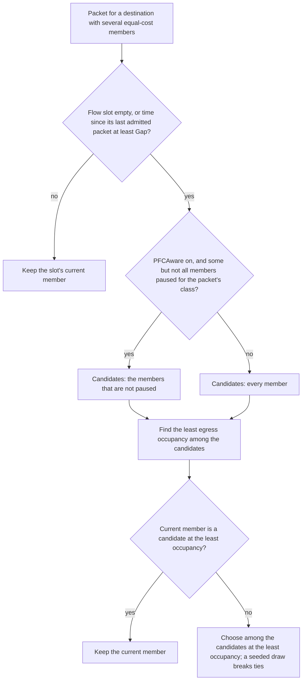

This page explains how the Scala Switch classifies, admits, queues, schedules, and marks packets, applies PFC, and chooses among equal-cost paths.

It follows a packet from the port it arrives on to the port it leaves from. The shared buffer that every admission decision draws on has its own page, [Shared buffer manager](./shared-buffer.md), with the formulas and a worked example. Attribute types and defaults are on [Configuration](./configuration.md).

## Packet path at a glance

## Classification

Every packet that is not a PFC frame gets a traffic class from its DSCP field: the DSCP value divided by 8, rounded down. DSCP 0 to 7 is TC0, DSCP 8 to 15 is TC1, and so on through DSCP 56 to 63, which is TC7. `TrafficClassPoolMapping` then gives the buffer pool the class uses, and `EnablePFC` says whether the class is lossless. Which classes carry traffic depends on the DSCP values the endpoints in the simulation assign.

## Ingress admission

A frame received on a port takes this path:

1. **PFC frames are handled first.** A PFC frame pauses or resumes the named traffic classes on the port it arrived on (see [Receiving a pause](#receiving-a-pause)). It is never buffered or forwarded.
2. **Classification**, as above.
3. **Lossless class, port already paused.** If this port has already sent a pause for the packet's pool, the packet is charged to the port's headroom for that pool instead of to the pool. If the headroom would be exceeded, the packet is dropped.
4. **Lossless class, port not paused.** If this port's occupancy in the pool, with the arriving packet added, would be greater than `StaticPoolXoffThreshold`, the switch sends a PFC pause frame. The packet is still admitted, charged to the pool, and counted in the port's ingress occupancy.
5. **Lossy class.** The packet is charged to the pool and counted in the port's ingress occupancy, with no flow-control check. Lossy bytes count in the same ingress occupancy that a lossless class in the same pool compares with its Xoff threshold.
6. **Pool capacity.** If the pool's total occupancy is now greater than the pool's size, the packet is dropped and its charge rolled back. This applies to every packet charged to the pool, lossless or lossy; a packet charged to headroom is not checked against the pool.
7. **Tagging.** An admitted packet carries a switch tag with its traffic class, pool, ingress port, and byte count, which the later stages use to release the ingress charge.

The bytes charged are the packet's size as received, without its Ethernet header; a packet shorter than 46 bytes is charged 46. A drop at ingress counts as a receive drop on the arriving port in the device statistics.

## Egress admission

After the route lookup picks an egress port (see [ECMP path selection](#ecmp-path-selection)), the packet is offered to that port's queue for its traffic class:

1. **Lossless classes are admitted with no limit check.** PFC has already bounded what could enter the switch on each ingress port.
2. **Lossy classes are checked against two bounds:** the egress queue limit for the egress port and pool, and the pool's remaining egress capacity. The packet is dropped if either would be exceeded. The egress queue is per egress port and pool, so every class mapped to a pool shares one queue limit on each port. [Stage 4 of the buffer setup](./shared-buffer.md#stage-4-set-egress-queue-limits) gives the three forms the limit can take.
3. **An egress drop releases the ingress charge** too, and counts as a transmit drop on the egress port in the device statistics.

An admitted packet is charged to the egress pool and the port's egress queue, the ECN marker updates its average for that queue, and the load balancer records which port the packet was admitted to.

`PlaneBDP` sets a fixed egress cap, and the base of the ECN thresholds, only when `LossyAlpha` is `0` and `QueueDropThresholdEnable` is `true`; see [Stage 4](./shared-buffer.md#stage-4-set-egress-queue-limits).

## Egress scheduling and transmission

Each port picks the next frame to transmit in this order:

1. **PFC control frames first**, from a dedicated queue ahead of all data, so pause and resume signaling never waits behind queued data; it waits at most for the frame already being transmitted.
2. **Strict priority across traffic classes, TC7 down to TC0**, skipping any class the peer has paused with a PFC frame.

The per-class queues have no fixed length of their own; admission is the only bound on them. When a frame starts transmitting, the ECN marker decides whether to mark the packet (see [ECN marking](#ecn-marking)), the Ethernet header is added, and the frame takes its serialization time on the link. The interframe gap is zero. The packet's ingress and egress charges are released when its serialization completes, which is also when a paused port can meet its resume condition.

## PFC pause and resume

PFC operates per port and per pool. Each port polices only its own ingress occupancy in a pool, and pauses only its own upstream sender.

### Sending a pause

When a lossless arrival would take the port's occupancy in a pool above `StaticPoolXoffThreshold`, the switch sends one PFC frame for each lossless traffic class mapped to that pool. Each frame requests 65535 quanta. From then on, arrivals of those classes on this port are charged to the port's headroom for the pool. While the port stays paused, the switch re-sends the pause every half pause time, so the sender's pause does not run out while the port is still paused.

The pause time is the time to send 512 bits for each quantum at the port's data rate, plus the link's propagation delay. At the defaults, 400 Gbps and 500 ns, a 65535-quanta pause lasts 83.9 µs plus 0.5 µs, about 84.4 µs, and the switch re-sends it about every 42.2 µs.

### Resuming

Each time a lossless packet that arrived on the port finishes leaving the switch, its bytes are released: first from the port's headroom for that pool, then from the port's ingress occupancy in the pool. At that moment the switch checks the resume condition: when the headroom is empty and the occupancy is at or below `StaticPoolXonThreshold`, it stops re-sending the pause and sends a resume frame (quanta 0). The gap between the two thresholds, 400 KB at the defaults, keeps the port from cycling between pause and resume; [the release example](./shared-buffer.md#example-continued-how-the-sender-is-released) shows it at work.

### Receiving a pause

A PFC frame received from the peer pauses the named traffic classes on that port. The pause lasts the time computed from the frame's quanta, the port's data rate, and the link's propagation delay. A fresh pause frame restarts the timer with its full duration. The scheduler skips a paused class. A resume frame, or the end of the pause time, returns the class to normal and restarts transmission at once.

## ECN marking

The ECN marker follows the RED approach, per egress port and pool:

- **Average.** Each time a packet is admitted to an egress queue, the marker updates that queue's moving average with the queue's occupancy after the packet is counted: `meanQlen = (1 - EwmaWeight) × meanQlen + EwmaWeight × currQlen`. The average changes only at admission, so a draining queue keeps its last average until the next packet arrives.
- **Thresholds.** The lower and upper byte thresholds are `MinThreshold` and `MaxThreshold` times the egress queue's static limit for the pool, fixed when the switch starts. The table below gives that limit.
- **Marking.** When a packet starts transmitting, and its IP header carries ECT(0) or ECT(1), the marker compares the queue's average with the two thresholds. Below the lower threshold nothing is marked. At or above the upper threshold every such packet is marked CE. In between, a packet is marked with probability `MaxMarkProbability × (average - lower) / (upper - lower)`.
- **Lossless classes are marked too**, against the same thresholds, although no egress limit applies to them.

| Setting | Static limit the thresholds are fractions of |
| --- | --- |
| `LossyAlpha` greater than `0` (the default is `1.0`) | The whole pool |
| `LossyAlpha` = `0`, `QueueDropThresholdEnable` = `false` | The pool divided by the switch's connected ports |
| `LossyAlpha` = `0`, `QueueDropThresholdEnable` = `true` | `QueueDropThreshold × PlaneBDP` |

At the defaults the band is therefore a fraction of the whole pool, so marking starts only at deep queues. The [worked example](./shared-buffer.md#worked-example-the-default-configuration) computes the default thresholds next to the pool sizes.

With `EnableEcn` `false`, no packet is marked. Marks are counted per port and traffic class in the `ecn-pfc-stats` record ([Records a simulation writes](#records-a-simulation-writes)).

## Lossless and lossy classes at a glance

| | Lossless class (`EnablePFC` 1 for the class) | Lossy class (`EnablePFC` 0 for the class) |
| --- | --- | --- |
| Ingress flow control | Pauses the upstream sender above Xoff; headroom absorbs in-flight bytes | None; never paused |
| Ingress drops | When the port's headroom or the whole pool is exhausted | When the whole pool is exhausted |
| Egress limit | None; admitted unconditionally | Egress queue limit and pool capacity |
| Egress overflow | Not applicable | Dropped |
| ECN | Marked against the static limit's band | Marked against the static limit's band |

## ECMP path selection

A member is one of the equal-cost paths as the switch sees it: the egress port that path starts on. An equal-cost set is the list of members for a destination; destinations whose routes start on the same list of ports share one set. When a destination has several equal-cost routes, path selection makes two decisions:

| Decision | What it settles | Set by |
| --- | --- | --- |
| Flow identity | Which packets count as one flow | `EcmpHashMethod` |
| Member selection | Which member of the equal-cost set a flow uses | `LoadBalancingMethod` |

### Flow identity

`EcmpHashMethod` turns a packet's headers into a 16-bit flow hash. TCP and UDP packets are hashed. Packets of any other IP protocol are not hashed: they all share a single flow identity and travel together.

| Method | What it computes |
| --- | --- |
| `crc32WithSalt` (default) | CRC-32 over the protocol number, the source and destination ports, and the source and destination addresses, seeded with a per-switch salt and passed through a non-linear finalizer with the salt |
| `crc32` | The same CRC-32, with no salt and no finalizer |
| `hashWithSalt` | An XOR fold of the source and destination addresses and ports, with the per-switch salt added before the fold |
| `hash` | The same XOR fold, with no salt |
| `dpr` | A destination index rather than a hash: the low 9 bits of (destination address − 1), so every flow to one destination uses the same member |
| `dprWithFallback` | As `dpr`, except that when that value is not smaller than the number of equal-cost members, the switch falls back to an unsalted CRC hash of the packet's headers |

The salt is derived from the switch's node identifier, so it is the same on every run. The choice of method decides whether a multi-tier fabric polarizes: `crc32WithSalt` de-correlates adjacent ECMP tiers by mixing the per-switch salt through a non-linear finalizer; `hashWithSalt` de-correlates them only partially; `crc32`, `hash`, `dpr`, and `dprWithFallback` do not de-correlate at all. Without de-correlation, a switch re-hashes the flows it receives exactly as the switch before it did, so they crowd onto a fraction of its paths.

### Member selection

With `LoadBalancingMethod` at its default, `none`, the member is the flow hash modulo the number of members, so every packet of a flow takes the same member. With `flowlet`, the switch moves flows between members as the next section describes. The two settings compose: `EcmpHashMethod` still decides what a flow is, and `LoadBalancingMethod` decides which member it uses.

## Dynamic load balancing (flowlet)

With `LoadBalancingMethod` set to `flowlet`, the switch keeps a flow table and selects a flow's member again whenever the flow has sent nothing for at least `Gap`. The attributes of the method are `Gap` and `PFCAware`, in the `LoadBalancingFlowlet` component; the switch reads them only when the method is `flowlet`.

### When a member is selected

For each packet, the switch looks up the flow's slot in the flow table. It selects a member when the slot is empty, or when the time since the slot's last admitted packet is at least `Gap`. Otherwise the packet takes the slot's current member. With `Gap` at 0 s, the switch selects a member for every packet.

The time that counts is that of the last packet admitted to an egress queue. A packet dropped at egress admission leaves the slot's member and time as they were.

### Which member is selected

With `PFCAware` `true`, the default, the candidates are the members whose egress port PFC has not paused for the packet's traffic class; a paused member is a candidate only when every member is paused. With `PFCAware` `false`, every member is a candidate.

Among the candidates, the switch looks for the least egress occupancy: the bytes a member's egress port holds in its egress queues, summed over all pools and including the packet it is transmitting. If the current member is a candidate at that minimum, the flow stays where it is. Otherwise the switch chooses among the candidates at the minimum, breaking a tie with a draw from a generator seeded from the simulation's seed, the run number, and the switch's node identifier, so the same configuration and seed make the same choices.

The PFC preference acts only when a member is selected: a flow inside its gap stays on its member even after PFC pauses that member.

### The flow table

Each equal-cost set gets 512 flow slots; distinct flows that share a slot move together. Only the first 128 sets a switch sees get slots; later sets use hash modulo without a message, and the interval record shows `flow_table_slots` 0 for them.

### Constraints

- `flowlet` cannot be combined with `EcmpHashMethod` `dpr` or `dprWithFallback`: the run stops before it starts and names the two attributes. [Configuration rules that stop a simulation](./configuration.md#configuration-rules-that-stop-a-simulation) lists every such rule.
- A move keeps a flow's packets in order only when the gap is at least the difference in latency between the old path and the new path. Queueing changes that difference, so check the transport's out-of-order and retransmit counts on the intended workload and adjust `Gap`.

### What is recorded

The load balancing interval record is written by default, with `none` as well as `flowlet`. Each row states what was assigned to one member of one equal-cost set in the interval. Rows are spaced by `LoadBalancingStatsReportInterval`, and a last row is written when the simulation ends. Columns that start with `ivl_` count the interval; the matching columns without the prefix count the whole simulation so far.

| Columns | What they hold |
| --- | --- |
| `time_utc`, `sim_time_sec` | When the row was written |
| `component_name`, `component_type`, `node_id`, `tier`, `subtier` | The switch |
| `ifid` | The member: the egress port the row describes |
| `ecmp_group_id`, `ecmp_group_ifids`, `group_size`, `group_formed_ns` | The equal-cost set: the switch's own index for it, its members, their number, and when the switch first saw the set |
| `flow_table_slots` | The set's flow slots: 512 under `flowlet`, 0 with `none` or for a set past the 128th |
| `bytes`, `ivl_bytes`, `packets`, `ivl_packets` | Bytes and packets admitted to the member |
| `assignments`, `ivl_assignments` | Flows assigned to the member when their slot was empty |
| `movements_in`, `ivl_movements_in`, `movements_out`, `ivl_movements_out` | Flows moved to and away from the member |
| `ivl_share` | The member's share of the set's bytes in the interval |
| `paused_skips`, `ivl_paused_skips`, `paused_selections`, `ivl_paused_selections` | Decisions that skipped the member because PFC had paused it, and decisions that selected it while paused |

## Records a simulation writes

With the defaults, a simulation writes these records for every Scala Switch. Each file is named after the record, for example `{simulation-name}-nd-stats-{shard-index}.csv`, and [Simulation output files](../../simulation-output-files.md) lists the columns of `nd-stats`, `ecn-pfc-stats`, and `scala-switch-agg-buff-stats`.

| Record | One row for | What a row holds | Spacing |
| --- | --- | --- | --- |
| `nd-stats` | Each switch port, each interval | Packets sent and received, cumulative; bytes sent and received, cumulative and in the interval; send and receive rates; link utilization; transmit and receive drops, which include the egress and ingress admission drops | `NDStatsReportInterval` (see below) |
| `ecn-pfc-stats` | Each switch port and traffic class, each interval | PFC pause and resume frames sent and received, time paused, and packets ECN-marked | `NDStatsReportInterval` (see below) |
| `scala-switch-agg-buff-stats` | Each switch and pool, each interval, for egress queues and ingress occupancy on uplink and downlink ports, and for the shared buffer as a whole | The pool's size, the interval's sample count, and the least, greatest, and mean bytes held, also as a share of the pool | `BufferStatsReportInterval` |
| `scala-switch-load-balancing-stats` | Each member of each equal-cost set, each interval, plus a last row at the end | Bytes, packets, and flows assigned to the member; PFC-driven skips and selections; the set's members and flow-table slots ([What is recorded](#what-is-recorded) lists the columns) | `LoadBalancingStatsReportInterval` |

`NDStatsReportInterval` is a global simulation parameter, not an attribute of this model: a `double` in seconds (default `0.001`) in the configuration's `SimulationParameters`, changed with `PATCH /api/v1/configurations/{config_id}/parameters`.

Setting `EnableLoadBalancingStats` to `false` stops the load balancing record.
