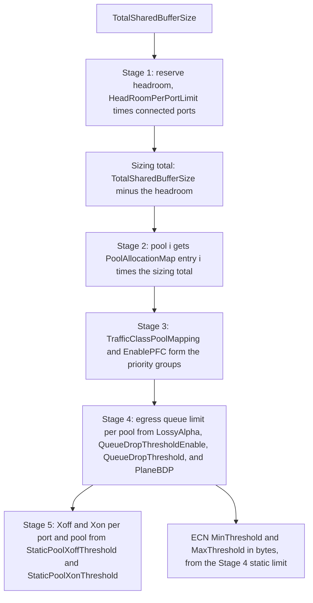

The shared buffer manager divides the Scala Switch's packet buffer into pools, sets its PFC and egress limits, and accounts for every byte in transit.

This page covers the shared buffer manager. [Packet handling](./packet-handling.md) follows a packet through the rest of the switch, and [Configuration](./configuration.md#shared-buffer-manager) lists each attribute's type and default.

## Overview

The Scala Switch models one switch-wide packet buffer that every port draws from. There is no per-port private memory: all ports compete for the same bytes, which is why buffer configuration has a large effect on simulated congestion, latency, and drops.

The shared buffer manager owns that buffer. When the switch starts, it reserves headroom, divides the rest into pools, assigns each traffic class to a pool, and derives the thresholds that govern flow control and drops. During the simulation it accounts for every byte entering and leaving the switch, sends PFC pause and resume frames for lossless classes, and drops lossy packets that exceed their limits.

Two behaviors are worth knowing before anything else:

- **Lossless and lossy classes are handled differently.** A class with PFC enabled is protected by flow control: the switch pauses the upstream sender instead of dropping. A class without PFC is held to egress limits and dropped when it exceeds them. [Sizing a lossless class](#sizing-a-lossless-class) gives the conditions under which a lossless class does not drop.
- **Ingress and egress are accounted separately.** The switch counts buffer occupancy twice, once as packets arrive and once as they queue for transmission, each against the same pool size. A packet in transit through the switch is counted in both until it leaves.

## Key concepts

| Term | Meaning |
| --- | --- |
| Traffic class (TC) | One of eight priority levels, TC0 to TC7, taken from the packet's DSCP field divided by 8. |
| Pool | A byte allocation carved out of the shared buffer. There are at most eight, numbered 0 to 7. Every traffic class is assigned to one pool, and a pool can hold several classes. |
| Priority group | The lossless (PFC-enabled) traffic classes assigned to one pool. A pause sent for a pool pauses every class in its priority group. |
| Headroom | Bytes reserved per port, before any pool is sized, to absorb traffic already in flight when the port pauses its sender. |
| Ingress occupancy | The bytes a port has brought into a pool and not yet released, lossless and lossy alike. The Xoff and Xon thresholds are compared with it. |
| Xoff threshold | A port's ingress occupancy in one pool above which the switch sends a PFC pause frame to the upstream sender. |
| Xon threshold | A port's ingress occupancy in one pool at or below which the switch sends a PFC resume frame, checked each time a lossless packet that arrived on the port leaves the switch with the port's headroom empty. |
| Egress queue limit | The most a port may hold queued for transmission out of one pool. Applies to lossy classes only. |
| BDP | Bandwidth-delay product: the bytes in flight on a path at full rate, a natural unit for sizing queues. |
| Connected ports | The switch's ports that have a link in the topology. `NumUpLinks` and `NumDownLinks` are advisory and do not set this count. |

## How the buffer is initialized

Allocation happens once, when the switch starts, before any traffic flows. It runs in five stages, each using the output of the one before, so a change to an early attribute shifts every value after it.

The stages below, the worked example and the sizing recipe describe the switch with `UETPolicyEnabled` at its default, `false`. With it set to `true`, Stages 2 to 4 work differently; see [Buffer under the UET policy](#buffer-under-the-uet-policy).



### Stage 1: reserve headroom

Headroom is set aside first:

```text
total headroom = HeadRoomPerPortLimit × connected ports
sizing total   = TotalSharedBufferSize − total headroom
```

A partly connected switch therefore reserves less headroom and leaves more for the pools. Each port also gets a headroom limit of `HeadRoomPerPortLimit` in every pool that carries a lossless class; that limit is what absorbs in-flight traffic after the port pauses its sender. Headroom is tracked apart from the pools: a byte charged to headroom is not charged to any pool. If the total headroom is larger than `TotalSharedBufferSize`, the simulation stops.

### Stage 2: size the pools

Each non-zero entry of `PoolAllocationMap` creates one pool:

```text
pool i = PoolAllocationMap[i] × sizing total
```

An entry of `0` creates no pool. The pools are then adjusted so they sum to the sizing total exactly: any difference, from rounding or from entries that do not sum to 1, goes to the last pool with a non-zero entry. A sum above 1 can stop the run ([Configuration rules that stop a simulation](./configuration.md#configuration-rules-that-stop-a-simulation)).

The fractions apply to the sizing total, not to `TotalSharedBufferSize`, because headroom has already been removed. So the pool sizes the aggregate buffer record reports are smaller than `PoolAllocationMap` × `TotalSharedBufferSize`.

### Stage 3: map traffic classes to pools

`TrafficClassPoolMapping` assigns each of the eight traffic classes to a pool, and `EnablePFC` declares which classes are lossless. Together they form the priority groups: for each pool, the lossless classes that use it. A pause covers the pool's whole priority group.

Several classes can share one pool, and lossless and lossy classes can share one. They then compete for the same bytes under different rules: the lossless class under flow control, the lossy class under its egress limit. Map each PFC-enabled class to the pool with its own number, as the default mapping does; PFC behaves as these pages describe only with that mapping ([PFC traffic classes and pools](./configuration.md#pfc-traffic-classes-and-pools)).

### Stage 4: set egress queue limits

The egress queue limit bounds how much one port may hold queued for transmission out of one pool. It applies to lossy classes only; lossless classes are admitted to egress without a limit check, because flow control has already bounded what could enter the switch. There are three forms:

| `LossyAlpha` | `QueueDropThresholdEnable` | Egress queue limit |
| --- | --- | --- |
| Greater than 0 (default `1.0`) | Not read | `LossyAlpha` × the bytes the pool has free at egress, recomputed for each packet |
| `0` | `false` | Pool size ÷ connected ports: a fixed, equal share per port |
| `0` | `true` | `QueueDropThreshold × PlaneBDP`: a fixed cap, independent of pool size and port count |

The dynamic form adapts to load, and it limits itself. A queue's own bytes reduce the free space its limit is computed from, so one busy queue levels off at about `LossyAlpha ÷ (1 + LossyAlpha)` of its pool: half the pool at the default `1.0`. When N queues share a pool equally, each levels off near `LossyAlpha × pool ÷ (1 + LossyAlpha × N)`. Lower values of `LossyAlpha` leave more of the pool free for other ports. The two fixed forms give a known queue depth, at the cost of leaving space unused when traffic is uneven.

With any `LossyAlpha` greater than `0`, including the default `1.0`, `QueueDropThresholdEnable`, `QueueDropThreshold`, and `PlaneBDP` have no effect. `PlaneBDP` is the fabric's bandwidth-delay product: the longest-path round-trip time multiplied by the slower of the sending and receiving NIC speeds, for example 300 KB for a 6 µs base round-trip time at 400 Gbps.

#### How a pool is shared across its ports

A pool is not handed out to ports as private slices. Every port that carries traffic for a pool draws from the one allocation, and each lossy packet is checked against two bounds: the port's own egress queue limit, and the pool total. The packet is admitted only if both allow it. Which bound binds depends on the form:

| Egress limit form | Per-port limit | Summed over N ports | Which bound binds |
| --- | --- | --- | --- |
| `LossyAlpha` = `0`, `QueueDropThresholdEnable` = `false` | Pool size ÷ N | Exactly the pool | The per-port limit. An even partition: every port has a fixed, equal share, and a quiet port's share stays idle. |
| `LossyAlpha` greater than `0` (default) | `LossyAlpha` × the pool's free bytes | More than the pool | The pool total and the shrinking free space. Ports compete with no fixed share. |
| `LossyAlpha` = `0`, `QueueDropThresholdEnable` = `true` | `QueueDropThreshold × PlaneBDP` | Unrelated to the pool | Either. Check `N × QueueDropThreshold × PlaneBDP` against each pool: where it exceeds the pool, the pool total limits busy ports first. |

#### What the static egress limit feeds

Stage 4 also fixes, for each pool, a static egress limit that the ECN marker reads once at startup; `MinThreshold` and `MaxThreshold` are fractions of it. At the default `LossyAlpha` it is the whole pool, so the marking band sits at 20% to 80% of the entire pool. [ECN marking](./packet-handling.md#ecn-marking) gives the limit for each setting.

Lossless classes are ECN-marked against the same band, so `LossyAlpha` shapes congestion marking even on a switch where nothing is subject to an egress drop.

The PFC thresholds are not derived from this limit. They are fixed byte values, the same for every port and pool, and they govern ingress occupancy rather than egress queue depth.

### Stage 5: set PFC thresholds

Pause and resume thresholds apply to every port and pool alike:

```text
Xoff = StaticPoolXoffThreshold    (default 700KB)
Xon  = StaticPoolXonThreshold     (default 300KB)
```

They are compared with each port's own ingress occupancy in each pool, not with the pool's total. Each port pauses its own upstream sender, based on how much of the pool that port alone has brought in. Every byte a port has brought into the pool counts, lossy bytes included, so lossy traffic in a pool brings forward the pause of a lossless class in the same pool.

**Sizing the gap between them.** `Xoff − Xon` is the hysteresis band: how far a paused port must drain before its sender is released. The defaults give a 400 KB band. If the two are equal, a port resumes as soon as one packet drains and pauses again on the next arrival, as [the release example](#example-continued-how-the-sender-is-released) shows; any band wider than one packet avoids that single-packet cycle. Too wide a band keeps the sender paused longer than it needs to be.

Either threshold can be moved to resize the band. Lowering `StaticPoolXonThreshold` widens it without changing when a port pauses. Raising `StaticPoolXoffThreshold` widens it but also lets each port hold more before pausing, so check the result against the pool ([Sizing a lossless class](#sizing-a-lossless-class), condition 2).

## Worked example: the default configuration

A switch with 128 connected ports, for example 64 uplinks and 64 downlinks, running every attribute at its default. The run-time examples further down use packets of 4,000 bytes as the buffer counts them (the packet without its Ethernet header).

**Stage 1: headroom.**

```text
TotalSharedBufferSize                  256,000,000 B   (256MB)
headroom: 256,000 B × 128 ports       − 32,768,000 B
sizing total                           223,232,000 B
```

**Stage 2: pools.**

```text
pool 0   0.9 × 223,232,000             200,908,800 B
pool 1   0.1 × 223,232,000              22,323,200 B
total                                  223,232,000 B
```

**Stage 3: classes and priority groups.**

| Traffic class | Pool | PFC | Role in the default mapping |
| --- | --- | --- | --- |
| TC0 | 0 | Enabled | Lossless, the priority group of pool 0. Shares pool 0 with the lossy classes TC2 to TC7. |
| TC1 | 1 | Enabled | Lossless, the priority group of pool 1. Has pool 1 to itself. |
| TC2 to TC7 | 0 | Disabled | Lossy. Share pool 0 with TC0. |

Which classes carry traffic depends on the DSCP values the endpoints in the simulation assign.

**Stage 4: egress limits and ECN thresholds.** `LossyAlpha` is `1.0`, so the lossy egress limits are dynamic, and the static limit the ECN thresholds are taken from is the whole pool:

| Pool | Pool size | ECN `MinThreshold` (0.2) | ECN `MaxThreshold` (0.8) |
| --- | --- | --- | --- |
| 0 | 200,908,800 B | 40,181,760 B | 160,727,040 B |
| 1 | 22,323,200 B | 4,464,640 B | 17,858,560 B |

Marking therefore starts only at deep queues. With only lossy traffic in pool 0 and one busy egress port, that port's queue levels off near half the pool, about 100 MB, so its average can pass `MinThreshold` but does not reach `MaxThreshold`.

**Stage 5: PFC thresholds.** Every port pauses its upstream sender when its own occupancy in a lossless pool, with the arriving packet, would be above 700,000 B. Each port has a further 256,000 B of headroom in each of the two lossless pools for traffic already in flight. The resume point is 300,000 B, a 400,000 B band.

Check the thresholds against the pools. With 4,000-byte packets, a port holds at most 704,000 B in a pool when it pauses: 700,000 B plus the packet that triggers the pause.

- Pool 0: 128 × 704,000 B = 90,112,000 B, about 45% of its 200,908,800 B, which fits when only TC0 is in it. Every port can be paused while more than half of pool 0 is free.
- Pool 1: 22,323,200 B holds the pause points of 31 ports. If more than 31 ports send TC1 at once toward congested egress ports, pool 1 can fill before they have all paused, and TC1 packets are dropped at ingress.

### The same switch with fixed egress limits

Setting `LossyAlpha` to `0` changes Stage 4 only; headroom, pools, and PFC thresholds stay as above. Each of the 128 ports has its own egress queue per pool, so the figure that matters is what the per-port limits sum to against the pool:

| Configuration | Per-port limit, pool 0 | Per-port limit, pool 1 | Summed over 128 ports |
| --- | --- | --- | --- |
| `LossyAlpha` = `1.0` (default) | `LossyAlpha` × pool 0's free bytes | `LossyAlpha` × pool 1's free bytes | More than each pool; the pool total binds |
| `LossyAlpha` = `0`, `QueueDropThresholdEnable` = `false` | 1,569,600 B | 174,400 B | Exactly each pool |
| `LossyAlpha` = `0`, `QueueDropThresholdEnable` = `true` | 1,500,000 B | 1,500,000 B | 192,000,000 B: 96% of pool 0, 860% of pool 1 |

The even split divides each pool exactly: 200,908,800 ÷ 128 and 22,323,200 ÷ 128 both come out whole. The fixed cap is the same 5 × 300,000 B = 1,500,000 B in every pool. Summed over 128 ports it sits just inside pool 0 but is more than eight times pool 1. Pool 1 holds only 14 full caps, so once more than 14 ports are busy in pool 1, the pool total rather than the cap limits them.

Each row moves the ECN band with it:

| Configuration | ECN band, pool 0 | ECN band, pool 1 |
| --- | --- | --- |
| `LossyAlpha` = `1.0` (default) | 40,181,760 to 160,727,040 B | 4,464,640 to 17,858,560 B |
| `LossyAlpha` = `0`, `QueueDropThresholdEnable` = `false` | 313,920 to 1,255,680 B | 34,880 to 139,520 B |
| `LossyAlpha` = `0`, `QueueDropThresholdEnable` = `true` | 300,000 to 1,200,000 B | 300,000 to 1,200,000 B |

## Run-time accounting

| Event | Accounting effect |
| --- | --- |
| Ingress, lossless class, port not paused | Charge the pool and the port's ingress occupancy; send a pause if the occupancy, with the packet, is above Xoff. |
| Ingress, lossless class, port paused | Charge the port's headroom for the pool; drop the packet if the headroom would be exceeded. |
| Ingress, lossy class | Charge the pool and the port's ingress occupancy; no flow control. |
| Ingress, pool now above its size | Drop a packet charged to the pool and roll back its charge, whatever its class. |
| Egress, lossless class | Charge the egress pool and the port's egress queue, with no limit check; update the ECN average. |
| Egress, lossy class within both bounds | The same charges. |
| Egress, lossy class over the egress queue limit or the pool | Drop the packet and release its ingress charge. |
| Transmission completes | Release the ingress and egress charges. A lossless release empties headroom first, then the port's occupancy; if the port is paused, its headroom is empty, and its occupancy is at or below Xon, send a resume. |

[Packet handling](./packet-handling.md#ingress-admission) gives these steps in packet order. The examples below follow one port through a pause and a resume.

### Example: when a pause frame is sent

The Xoff threshold is compared with one port's own occupancy in one pool. Take the defaults: Xoff 700,000 B, Xon 300,000 B, and 256,000 B of headroom per port in each lossless pool, with TC0 lossless in pool 0. One port receives a burst of 4,000-byte TC0 packets, no other traffic arrives on it, and its packets' egress is congested, so nothing is draining yet. To show where each limit sits, the table follows the counters as if the sender kept sending after the pause.

| Packet | Port's occupancy in pool 0 | Port's headroom, pool 0 | What happens |
| --- | --- | --- | --- |
| 1 to 174 | Rising to 696,000 B | 0 B | Admitted and charged to the pool. |
| 175 | 700,000 B | 0 B | 696,000 + 4,000 is not greater than 700,000: no pause yet. |
| 176 | 704,000 B | 0 B | 700,000 + 4,000 is greater than 700,000: **pause sent**. The packet is still admitted. |
| 177 to 240 | Stays 704,000 B | Rising to 256,000 B | The port is paused. These 64 packets are charged to headroom, not to the pool. |
| 241 | Stays 704,000 B | 256,000 B | 256,000 + 4,000 is greater than 256,000: **dropped**. |

Three things this shows:

- **The packet that triggers the pause is not dropped.** The check runs before the packet is charged, so the pause is sent and the packet admitted anyway. The port's occupancy settles just above the threshold.
- **Headroom absorbs what is already in flight.** A sender that stops before the port has received another 256,000 B never reaches packet 241. Drops begin only once headroom is exhausted, which is the signal that `HeadRoomPerPortLimit` is too small for the link.
- **The switch holds the pause until the port resumes.** While the port stays paused, the switch re-sends the pause every half pause time, about every 42.2 µs at the defaults, so the sender's pause does not expire early.

### Example continued: how the sender is released

At the moment of the pause the port holds 704,000 B in pool 0 and, by packet 240, another 256,000 B in headroom. Now the egress drains, and the port's packets start leaving the switch. A port resumes only when a lossless packet that arrived on it leaves the switch with its headroom empty and its occupancy in the pool at or below Xon. Released bytes go to headroom first:

| Departure | Port's headroom, pool 0 | Port's occupancy in pool 0 | What happens |
| --- | --- | --- | --- |
| 1 to 64 | 256,000 B down to 0 B | Stays 704,000 B | Headroom is given back first; the occupancy is untouched. Still paused. |
| 65 to 164 | 0 B | 704,000 B down to 304,000 B | Headroom is empty, so the occupancy drains. Still above Xon. |
| 165 | 0 B | 300,000 B | Headroom empty and the occupancy at Xon: **resume sent**. |

On resume the switch stops re-sending the pause, returns the port to normal, and sends the resume frame to the pool's priority group. The next packet that takes the port's occupancy above 700,000 B pauses it again.

Two things set the timing:

- **Headroom is returned before the occupancy.** The reserve is restored first so it is ready for the next pause, which is why the first 64 departures bring the port no closer to resuming. Only the 101 departures after them count toward Xon.
- **The hysteresis band sets the drain distance.** Here the port sheds 404,000 B below the occupancy it paused at, 101 packets, before its sender is released.

Contrast that with `StaticPoolXonThreshold` equal to `StaticPoolXoffThreshold`, both 700,000 B. The port still pauses at 704,000 B and headroom still empties over 64 departures, but departure 65 takes the occupancy to exactly 700,000 B, which already meets the resume condition. The port resumes on departure 65, and the next arriving packet takes it straight back above the threshold and pauses it again. The link alternates between pause and resume frames instead of moving data. Keeping the two thresholds apart prevents that, which is why the defaults are 400,000 B apart.

### Why the pool total is not what pauses a port

Each port pauses on its own ingress occupancy, so the pool total never sends a pause: in the worked example every port can be paused while more than half of pool 0 is free. The pool total is still enforced, as a separate check with a different outcome:

| Condition | Compared with | Result |
| --- | --- | --- |
| A port's occupancy in a pool, with the packet, is above Xoff | `StaticPoolXoffThreshold`, per port and pool | Pause sent; packet still admitted |
| A paused port's headroom would be exceeded | `HeadRoomPerPortLimit`, per port and pool | Packet dropped |
| A pool's occupancy is above its size | The pool's size, switch-wide | Packet dropped, lossless or lossy |

A lossless class is therefore not immune to drops. Flow control protects it from the first condition, but the pool can still be exhausted by the ports and classes that share it. Raising `StaticPoolXoffThreshold` lets each port hold more before pausing, which brings the third condition closer, so size the two together.

### Where the bytes sit

| Level | Bound by |
| --- | --- |
| Pool | Its share of the sizing total |
| Port, per pool, ingress | The Xoff threshold, then the port's headroom limit |
| Port, per pool, egress | The egress queue limit (lossy classes only) |
| Port, per traffic class | No limit of its own; egress admission bounds it. Eight transmit queues per port, plus a separate queue for PFC frames |

## Sizing a lossless class

A lossless class is admitted to egress without a limit check, so it can be dropped only at ingress: when its port is paused and its headroom is full, or when its pool is full. Three conditions close those two paths.

**1. Headroom covers what arrives after a pause.** When a port sends a pause, the sender does not stop at once, and everything that arrives in the meantime is charged to headroom. As guidance, size `HeadRoomPerPortLimit` to at least:

```text
2 × link rate × one-way propagation delay ÷ 8  +  2 × MTU
```

The first term is the bytes on the wire while the pause travels to the sender and the sender's last bytes travel back; the second is a frame in progress at each end, where MTU is the largest frame the link carries. At the defaults, 400 Gbps and 500 ns, the first term is 50,000 B; with frames of about 4,000 B the total is about 58,000 B, inside the default 256,000 B. If headroom is smaller than what arrives after a pause, the port drops packets each time it pauses, however much of the pool is free; drops that coincide with pause frames point here.

**2. The pool holds what every port brings in before it pauses.** A port accumulates as much as the Xoff threshold in a pool, and the packet that triggers the pause is admitted on top. The pool needs:

```text
pool size  ≥  connected ports × (StaticPoolXoffThreshold + largest packet)
```

Headroom is not part of this figure: it is reserved separately, and paused traffic is charged there rather than to the pool. If the pool is smaller, it can fill before enough ports have paused to stop the inflow, and packets are dropped on arrival even though the class is lossless; drops that track pool occupancy rather than pause frames point here. In the worked example pool 0 meets this condition and pool 1 does not.

**3. The class has a pool of its own.** Lossy classes have no flow control: nothing pauses them, and they can grow until the pool is full. Their bytes count toward the same ingress occupancy that the lossless class's Xoff threshold is compared with, so they bring its pause forward. They can also fill the pool that the lossless class's arrivals are charged to before the port pauses; once the pool is full, every class sharing it drops on arrival.

When three things hold, the model has no ingress path left that drops a packet of a lossless class, and the sender stays paused instead: the class has a pool of its own; connected ports × (`StaticPoolXoffThreshold` + largest packet) fits within that pool; and `HeadRoomPerPortLimit` holds everything that arrives after a pause. These conditions assume each PFC-enabled class is mapped to the pool with its own number ([PFC traffic classes and pools](./configuration.md#pfc-traffic-classes-and-pools)).

In the default mapping, TC1 has pool 1 to itself, but TC0 shares pool 0 with the lossy classes TC2 to TC7. Their bytes count toward TC0's Xoff threshold, and they can fill the pool that TC0's arrivals are charged to before the port pauses. On the 128-port switch of the worked example, pool 1 is smaller than condition 2 asks: it needs at least 128 × 704,000 B = 90,112,000 B. Either change meets it:

- Raise pool 1's `PoolAllocationMap` entry to at least 0.404 and lower pool 0's so the entries still sum to 1, for example `[0.59, 0.41, 0, 0, 0, 0, 0, 0]`.
- Lower `StaticPoolXoffThreshold` to at most 170,400 B, with `StaticPoolXonThreshold` lowered below it.

## Buffer under the UET policy

With `UETPolicyEnabled` set to `true`, Stage 1 still reserves headroom and Stage 5 still sets the PFC thresholds, but the switch does not use `PoolAllocationMap` or `TrafficClassPoolMapping`:

- **Pools.** The sizing total is split into three pools in the ratio 1.5 : 1 : 1. Pool 0 gets 1.5/3.5 of it, pool 1 gets 1/3.5, and pool 2 gets the rest.
- **Traffic classes.** A packet's class comes from its DSCP codepoint, not from the DSCP value divided by 8. Control packets are TC2, trimmed packets (including those trimmed on the last hop) are TC1, and every other packet is TC0. Each class uses the pool with its own number.
- **Egress queue limits.** Each egress queue has a fixed limit, so `LossyAlpha` is not used. The limit is `PlaneBDP` when packet trimming is on and `QueueDropThreshold` × `PlaneBDP` when it is off. A retransmission marked with the trimmable-retransmit codepoint may use 1.5 times that limit.
- **PFC.** `EnablePFC` still applies to the classes it enables, but packet trimming cannot be combined with PFC.

## Configuration rules

The rules that stop a simulation at startup, and the settings the switch does not check, are listed once, in [Configuration rules that stop a simulation](./configuration.md#configuration-rules-that-stop-a-simulation).
