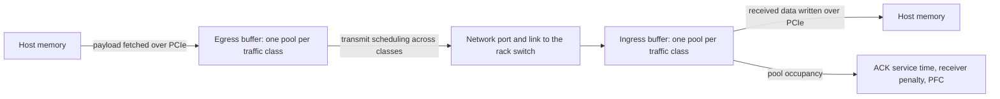
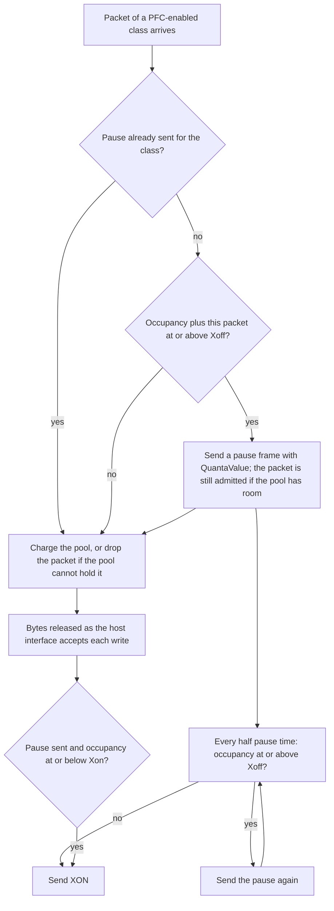

The Scala UET NIC holds the packets it sends and receives in per-class buffer pools, schedules transmission across classes, and sends and honors PFC.

This page covers the NIC's transmit and receive buffers, its priority flow control, and the PCIe link to its host that drains the receive buffer. [Transport](./transport.md) follows a message through the rest of the NIC, [Congestion control](./congestion-control.md) explains the receiver penalty the receive buffer drives, and [Configuration](./configuration.md#ingressbuffermanager) lists each attribute's type and default.

## Overview

The NIC has two buffers, each divided into pools, one pool per traffic class:

- **The egress buffer** holds what the NIC sends. Space for each data packet is reserved before it goes to the wire, and released when the packet has been serialized onto the link, so, with the prefetch buffer off, the default, the egress pools bound the data the NIC has fetched and not yet sent. Its size is the `EgressBufferManager` `TotalBufferSize`, 256 KB by default.
- **The ingress buffer** holds what the NIC has received and not yet handed on: data until its write to host memory is accepted by the PCIe link, control packets until the NIC has processed them. Its size is the `IngressBufferManager` `TotalBufferSize`, 4 MB by default.



Three behaviors are worth knowing before anything else:

- **The egress buffer never drops data.** When the next data packet cannot reserve space, the NIC stops generating data until the pool drains, so a full transmit pool holds the sender back rather than losing data. The data class needs a transmit pool large enough for one packet ([Egress buffer](#egress-buffer)).
- **The ingress buffer drops what does not fit.** A received packet whose pool cannot hold it is dropped. PFC, when enabled for a class, pauses the rack switch before that happens, provided the pool's headroom absorbs what is already on its way ([Sizing the headroom](#sizing-the-headroom)).
- **At the default PCIe settings, the ingress buffer stays nearly empty.** The PCIe link writes received data to the host faster than the 400 Gbps network link delivers it, so the receive pools never back up far enough for the receiver penalty or PFC to engage ([PCIe host interface](#pcie-host-interface)).

## Key concepts

| Term | Meaning |
| --- | --- |
| Traffic class | One of eight priority levels, 0 to 7. The class selects the pool a packet uses in each buffer; it is not written into the packet ([Traffic classes](#traffic-classes)). |
| Pool | The bytes of one buffer set aside for one traffic class. The buffer's `PoolAllocationVector` sets which classes have one and how large each is ([Buffer pools](#buffer-pools)). |
| Egress reservation | The space a data packet holds in its egress pool: its full size on the wire, from before it goes to the wire until it has been serialized. |
| Ingress occupancy | The bytes a receive pool holds. For the data class, the received data waiting for the PCIe link to the host. |
| Xoff threshold | The fraction of a receive pool at which the NIC sends a PFC pause frame to the rack switch. |
| Xon threshold | The fraction of a receive pool at or below which the NIC sends a PFC resume (XON) frame. |
| Headroom | The part of a receive pool above the Xoff threshold, which absorbs what arrives after a pause is sent. |
| Pause time | The time a pause frame stops the receiver of the frame: 512 bit times per quantum at the link rate, plus the link's propagation delay. |

## Traffic classes

With the applications' default traffic classes, data uses class 0 and control class 1. Control means ACKs, NACKs, base-RTT probes, and trimmed packets. Data retransmissions are data. A packet uses the same class in the egress buffer of the NIC that sends it and in the ingress buffer of the NIC that receives it, except a data packet that a switch has trimmed, which the receiving NIC charges to the control class.

The class decides only which pool a packet uses inside the NIC. The codepoint a packet carries on the wire is set by its role, separately from its class ([Packet marking](./transport.md#packet-marking)).

Each buffer's `PoolAllocationVector` must give classes 0 and 1 a non-zero share: an ingress or egress `PoolAllocationVector` with fewer than two non-zero entries stops the simulation at start ([Configuration rules that stop a simulation](./configuration.md#configuration-rules-that-stop-a-simulation)).

With the default `StrictPriority` egress scheduling, the higher class goes first, so the NIC's ACKs and NACKs leave ahead of its own waiting data ([Transmit scheduling](#transmit-scheduling)).

## Buffer pools

Each buffer is divided into pools when the simulation starts, in the same way for both. The non-zero entries of the buffer's `PoolAllocationVector` come first: they start at class 0 and run without a `0` between them. `[0.9, 0.1, 0, 0, 0, 0, 0, 0]` and `[0.5, 0.3, 0.2, 0, 0, 0, 0, 0]` follow this rule; `[0, 0.5, 0.5, 0, 0, 0, 0, 0]` does not. With the entries in that shape, each class from 0 through the last non-zero entry gets a pool:

```text
pool for class c = PoolAllocationVector[c] × TotalBufferSize
```

The classes after the last non-zero entry have no pool in that buffer. The buffer's other per-class lists, such as `PFCEnableVector` and `WRRQueueWeights`, use the same index. The pools are sized independently: entries that sum to less than 1 leave the rest of the buffer unused, and entries that sum to more than 1 give pools that together exceed `TotalBufferSize`. The two buffers have their own `PoolAllocationVector`, so a class can have a different share of each.

Every byte is accounted for in the pool of the packet's traffic class. PFC frames are not charged to any pool.

## Egress buffer

Each data packet reserves its size on the wire in the egress pool of its class: its payload plus 106 bytes, 4,202 bytes for a full packet at the default `RdmaDataMSS` ([Packets on the wire](./transport.md#packets-on-the-wire)). When the reservation is made depends on the prefetch buffer ([Prefetch buffer](./transport.md#prefetch-buffer)):

- **`PrefetchBufferEnable` `false` (default):** when the payload fetch over PCIe is issued, before the payload has arrived from the host.
- **`PrefetchBufferEnable` `true`:** when a prefetched payload is committed to the wire.

The reservation is released when the packet's serialization onto the link ends. ACKs, NACKs, and probes reserve their own size in the control class's pool in the same way, from when they are sent to the port until they have been serialized.

- **When the pool has room,** the data packet goes ahead: its payload is fetched, or it is committed to the wire.
- **When the pool has no room,** the NIC stops generating data packets. Generation restarts at the latest when that pool drains to half its size or less.
- **Data is never dropped here.** A congested or paused class holds the sender back through its pool rather than losing data.

The egress pool of the data class must hold at least one full data packet, `RdmaDataMSS` + 106 bytes (4,202 bytes at the default `RdmaDataMSS`). If it cannot, the NIC stops sending data to every destination. The default pool, 230,400 bytes, meets this. The egress pool of the control class must hold at least one ACK, 78 bytes; the default pool, 25,600 bytes, meets this.

Without the prefetch buffer, the egress pool of the data class is therefore the most data the NIC has fetched from the host and not yet sent: 54 full packets at the defaults ([Worked example: the default configuration](#worked-example-the-default-configuration)). A larger pool lets more data wait in the NIC, for example while PFC pauses the class; a smaller one makes the NIC fetch closer to the moment it sends.

## Transmit scheduling

Each time the network port can send, it takes the next frame in this order:

1. **PFC frames first,** from a dedicated queue ahead of all traffic classes. This queue is never paused and is not charged to a pool, so a pause or resume frame waits only for the frame already being transmitted and for any PFC frames queued ahead of it.
2. **One traffic class,** chosen by the `EgressBufferManager` `QueueSchedulingType` among the classes that have an egress pool, skipping any class whose queue is empty and any class the rack switch has paused with PFC ([Receiving a pause](#receiving-a-pause)).

| `QueueSchedulingType` | Which class sends next |
| --- | --- |
| `StrictPriority` (default) | The highest-numbered class with a packet waiting. |
| `RoundRobin` | One packet from each class in turn, starting after the class served last. |
| `WeightedRoundRobin` | At most `WRRQueueWeights[c]` packets from class c, then the next class's turn; give classes 0 and 1 a weight of at least 1 each. Turns start at the highest-numbered class and continue from class 0 upward, wrapping around; a class with nothing to send, or paused, gives up its turn. |

With the default `StrictPriority` and the default classes, ACKs and NACKs are sent ahead of waiting data. `WRRQueueWeights` applies only with `WeightedRoundRobin`: with the default egress weights `[1, 5, 0, 0, 0, 0, 0, 0]`, class 1 sends at most five packets for each packet of class 0. Since class 1 holds only control packets by default, data is still sent whenever no control packet is waiting.

## Receive buffer

Each packet the NIC receives is charged to the ingress pool of its traffic class at its size without the Ethernet header and frame check sequence: 4,184 bytes for a full data packet at the default `RdmaDataMSS`. A packet that arrives when its pool cannot hold it is dropped and counted in the `nd-stats` `rx_drops` column ([Records](#records)).

How long a packet stays charged depends on what it is:

- **Data** stays charged until the NIC has handed it to the host interface, that is, until the PCIe transmit buffer accepts the write of its payload to host memory ([Receiving a packet](./transport.md#receiving-a-packet)).
- **ACKs, NACKs, probes, and trimmed packets** are released as soon as the NIC has processed them.
- **PFC frames** are never charged.

The occupancy of the data class's pool is therefore the received data the NIC holds for the host. It grows only when the network delivers faster than the PCIe link can write, and at the default PCIe settings it stays near empty ([Worked example: PCIe and network rates](#worked-example-pcie-and-network-rates)). Three things read it:

- **The ACK service time.** The receiver holds each ACK for the time its data-pool backlog, plus the packet, takes to drain at its NIC side's PCIe rate, and reports that time in the ACK so the sender's RTT sample leaves it out ([Acknowledgements](./transport.md#acknowledgements)).
- **The receiver penalty.** Above `ReceiverCongestionLowThreshold` percent of the pool, the receiver's ACKs tell its senders to shrink their windows ([Receiver penalty](./congestion-control.md#receiver-penalty)).
- **PFC.** At the Xoff threshold, the NIC pauses the rack switch, for the classes PFC is enabled on ([PFC](#pfc)).

Received data packets are written to the host in the order they arrive. The ingress `QueueSchedulingType` and `WRRQueueWeights` don't change that order. The order in which traffic classes leave the NIC is set by the egress buffer's scheduling ([Transmit scheduling](#transmit-scheduling)).

## PFC

The NIC takes part in priority flow control in both directions: it pauses the rack switch when a receive pool fills, and it holds a class's transmission when the switch pauses it. `PFCEnableVector` governs only the first, and it is all `0` by default, so a default NIC never sends a pause frame. It always honors the pause frames it receives. PFC is per traffic class, and its thresholds are fractions of each class's own receive pool.



The NIC's own pauses depend on its receive pool filling, and that happens only when its PCIe link to the host writes received data more slowly than the network delivers it. At the default PCIe settings it does not, so even with `PFCEnableVector` enabled, a NIC at the default PCIe settings does not send PFC. With a slower host link, the same backlog raises the receiver penalty first, at 25% of the data pool by default, well below the 80% Xoff threshold ([Worked example: PCIe and network rates](#worked-example-pcie-and-network-rates)).

### Sending a pause

For each traffic class whose `PFCEnableVector` entry is `1`, the NIC checks every packet of that class it receives. When no pause is outstanding for the class and the pool's occupancy, with the arriving packet added, is at or above the class's Xoff threshold, the NIC sends one PFC pause frame for the class, requesting `QuantaValue[c]` quanta. The frame goes out through the dedicated queue ahead of all traffic. The arriving packet is still admitted if the pool has room for it.

The thresholds are fractions of the class's receive pool, not of `TotalBufferSize`:

```text
Xoff for class c = PfcStaticXoffThreshold[c] × pool for class c
Xon  for class c = PfcXonResumeThreshold[c]  × pool for class c
```

The pause time the frame requests, and the refresh interval below, come from the NIC's own settings:

```text
pause time = 512 × QuantaValue[c] ÷ link rate  +  Delay
```

where the link rate is the rate the NIC's link runs at, its `DataRate` or the rack switch's downlink `DataRate` if that is lower, and `Delay` is the NIC's own `TransmissionMedium` `Delay`, the propagation delay of its link ([TransmissionMedium](./configuration.md#transmissionmedium)).

### Resuming

Once it has sent a pause for a class, the NIC resumes the switch in one of two ways, whichever comes first:

1. **At the refresh.** Every half pause time after a pause frame, the NIC checks the class's pool. If occupancy is still at or above Xoff, it sends the pause again and checks again half a pause time later. Otherwise it sends XON (a frame with quanta 0), even if occupancy is still above Xon.
2. **On a release at or below Xon.** Each time received bytes of the class are released, the NIC checks occupancy. When it is at or below Xon, it sends XON at once and stops refreshing.

Under sustained load, then, the switch is resumed at the first refresh that finds occupancy below Xoff, and Xon decides how soon before that a draining pool resumes it. With Xon at or above Xoff, the pool meets the resume condition as soon as it drains back to about the level that set off the pause, so the NIC resumes the switch almost at once and the next arrival at Xoff can pause it again.

### Receiving a pause

A PFC frame received from the rack switch pauses or resumes the traffic class it names, for every class, whatever `PFCEnableVector` says. A frame with a non-zero quanta holds that class's transmission for the time the frame asks for, computed at the NIC's link rate, plus the link's `Delay`; a fresh pause frame restarts that time in full. A frame with quanta 0, or the end of the pause time, resumes the class and restarts transmission at once.

While a class is paused, the scheduler skips it and its packets wait in its egress queue. Its egress pool keeps filling as packets already reserved join the queue, and data generation stops once the next packet cannot be reserved ([Egress buffer](#egress-buffer)). A received PFC frame is consumed by the NIC and never charged to a pool. How the rack switch decides to pause its ports is on [Shared buffer manager](../scala-switch/shared-buffer.md).

### Sizing the headroom

After the NIC sends a pause, the switch keeps sending until the pause reaches it, and what is already on the link still arrives. All of it is charged to the receive pool above Xoff, so the headroom, `(1 − PfcStaticXoffThreshold[c]) × pool`, has to hold it or packets of the class are dropped. `rx_drops` that coincide with pause frames point to too little headroom.

At the defaults, if PFC is enabled on class 0, its headroom is large next to the link:

```text
class 0 headroom          3,600,000 B − 2,880,000 B          = 720,000 B
in full data packets      720,000 B ÷ 4,184 B                = 172.1 packets
in arrival time           172.1 packets × 84.04 ns per packet = 14.5 µs at 400 Gbps
```

That is 14.5 µs of line-rate arrivals, against a round trip of 0.2 µs over the default 100 ns link.

## PCIe host interface

The NIC and its host are joined by a PCIe link, with a protocol stack at each end: lanes, and transaction-layer buffers on the NIC side and on the host side ([Host interface](./configuration.md#host-interface)). The link carries the NIC's payload fetches for the data it sends ([Fetching the payload over PCIe](./transport.md#fetching-the-payload-over-pcie)) and the writes that deliver received data to host memory.

**Link rate.** Each direction runs at the sending side's `LaneCount` × `LaneBps`, and the two directions run independently. The NIC side's lanes carry the NIC-to-host direction: the read requests for payload the NIC sends, and the writes of the data it receives. The host side's lanes carry the host-to-NIC direction: the payload the NIC fetches. The defaults, 31.52 Gbps per lane on 16 lanes at both ends, give 504.32 Gbps in each direction; 31.52 Gbps is the PCIe 5.0 lane rate. The lane rate alone sets the generation the link represents: the `PCIeGen3.0` container that holds these attributes in the configuration does not.

**Transfers.** PCIe moves data in transfers of at most 512 bytes of payload, and each transfer adds 34 bytes of PCIe protocol overhead on the link. The host answers each read and accepts each write at once: host memory latency is not modeled, and the PCIe link has no propagation delay, so what a transfer costs is its time on the link.

**Buffers.** Each end of the link has transaction-layer buffers for transfer headers and for payload, on its transmit side and its receive side, sized by `RXHeaderBufferSize`, `TXHeaderBufferSize`, `RXDataBufferSize`, and `TXDataBufferSize`. A transfer waits in its transmit buffer until it can go on the link, and is sent only when the receiving end has buffer space for it. On the NIC side, received data is released from the NIC's ingress pool as soon as its write is accepted into the PCIe transmit buffer ([Receive buffer](#receive-buffer)), so the PCIe buffers set how much received data can wait for the link outside the NIC's ingress pools.

### Worked example: PCIe and network rates

At the defaults, `RdmaDataMSS` 4096, 16 lanes of 31.52 Gbps, and a 400 Gbps network link:

```text
PCIe link, each direction         16 × 31.52 Gbps                     = 504.32 Gbps
4,096 B payload on the link       4,096 B ÷ 512 B = 8 transfers
                                  8 × (512 B + 34 B)                  =  4,368 B
time on the link                  4,368 B × 8 ÷ 504.32 Gbps           =  69.29 ns
PCIe payload rate                 504.32 Gbps × 4,096 ÷ 4,368         =  472.9 Gbps
network payload rate              400 Gbps × 4,096 ÷ 4,202            =  389.9 Gbps
```

The 4,202 bytes are the data packet's size on the wire ([Packets on the wire](./transport.md#packets-on-the-wire)). Both directions of the PCIe link carry payload faster than the network link can, so at the defaults the network link, not PCIe, limits a transfer. On the receive side, each packet's write is on the PCIe link for 69.29 ns, while the next packet takes 84.04 ns to arrive on the network link. Arrivals can never exceed the NIC's own link rate, so at the defaults the ingress data pool holds at most about one packet, even when many senders converge on the NIC.

With fewer NIC-side lanes, the NIC-to-host direction can fall behind the network:

```text
needed to keep up with received data   4,368 B × 8 ÷ 84.04 ns    = 415.8 Gbps
14 lanes × 31.52 Gbps                                             = 441.28 Gbps
13 lanes × 31.52 Gbps                                             = 409.76 Gbps
```

With 14 lanes or more at 31.52 Gbps, the NIC-to-host direction keeps up with full-rate receiving, even while the NIC sends at full rate too and its read requests share that direction. With about 13 lanes or fewer, data received at full rate backs up into the ingress data pool, and its effects follow in order of occupancy:

1. **The ACK service time grows,** with the backlog the receiver reports in each ACK.
2. **The receiver penalty starts** at 25% of the pool, `ReceiverCongestionLowThreshold`, and slows the receiver's senders ([Receiver penalty](./congestion-control.md#receiver-penalty)).
3. **PFC pauses the rack switch** at 80% of the pool, if PFC is enabled for the class.
4. **Packets are dropped** when the pool cannot hold them.

Fewer host-side lanes slow the payload fetch instead, which limits how fast the NIC sends.

## Worked example: the default configuration

A NIC with every attribute at its default: link rate 400 Gbps, `Delay` 100 ns, `RdmaDataMSS` 4096.

**Egress pools.**

```text
EgressBufferManager TotalBufferSize          256,000 B   (256KB)
class 0   0.9 × 256,000 B                    230,400 B   = 54 data packets of 4,202 B (54 × 4,202 = 226,908)
class 1   0.1 × 256,000 B                     25,600 B   = 328 ACKs of 78 B
restart point for class 0, half the pool     115,200 B
```

Class 0 carries data and class 1 carries ACKs, NACKs, and probes. As many as 54 full-size data packets can be fetched and waiting to be sent at once. That is 54 × 84.04 ns = 4.54 µs of sending on the network link, against about 70.8 ns for one payload fetch at the default PCIe settings (a 64-byte read request plus 34 bytes of overhead on the NIC-to-host direction, 1.55 ns, then the 4,368-byte completion on the host-to-NIC direction, 69.29 ns), so at the defaults the egress pool does not limit how fast one NIC sends.

**Ingress pools.** Class 0 holds received data and class 1 received control packets.

| Class | Pool | Receiver penalty starts (25%) | Penalty full (75%) | Xoff (0.8) | Xon (0.4) | Headroom above Xoff |
| --- | --- | --- | --- | --- | --- | --- |
| 0 | 0.9 × 4,000,000 = 3,600,000 B, 860 data packets | 900,000 B, 215 packets | 2,700,000 B, 645 packets | 2,880,000 B, 688 packets | 1,440,000 B, 344 packets | 720,000 B, 172 packets |
| 1 | 0.1 × 4,000,000 = 400,000 B | Not applied | Not applied | 320,000 B | 160,000 B | 80,000 B |

Packet counts are full data packets of 4,184 bytes, rounded down. The receiver penalty reads only the data class's pool. PFC is enabled on no class by default; the Xoff and Xon columns apply once `PFCEnableVector` enables a class.

**Pause time,** for a pause the NIC requests with the default `QuantaValue`:

```text
65,535 quanta × 512 bits ÷ 400 Gbps        = 83.885 µs
+ Delay                                    =  0.100 µs
pause time                                 = 83.985 µs
refresh interval, half the pause time      = 41.99 µs
```

**When a pause would be sent.** With PFC enabled on class 0, a received data packet is charged 4,184 B, so the NIC pauses the switch on the first class-0 packet that arrives with the pool holding 2,880,000 − 4,184 = 2,875,816 B or more. The switch is resumed at the first refresh, every 41.99 µs, that finds the pool below 2,880,000 B, or as soon as the pool drains to 1,440,000 B, whichever comes first. At the default PCIe settings the pool never gets near either point.

## Records

These records show the buffers and PFC ([Records](./records.md)):

| Record | One row for | What it shows here |
| --- | --- | --- |
| `nd-stats` | The NIC's network port, each `NDStatsReportInterval` | Frames and bytes sent and received, PFC frames included, with bytes counting the Ethernet header. `rx_drops` counts the packets dropped because their receive pool was full ([nd-stats](./records.md#nd-stats)). |
| `ecn-pfc-stats` | The NIC's port and each traffic class with an ingress pool, classes 0 and 1 by default, each `NDStatsReportInterval` | `pfcxoff_tx` and `pfcxon_tx` count the pause and XON frames the NIC sends; `pfcxoff_rx` and `pfcxon_rx` the frames it receives from the rack switch. A row whose counters are all 0 is skipped, so with PFC off on the NIC, its rows appear only once it has received a pause ([ecn-pfc-stats](./records.md#ecn-pfc-stats)). |
| `net-buff-stats` | Each pool of each buffer, each `NetworkBufferStatsReportingInterval` | Written only with `EnableBufferStats` set to `true` on the NIC and the global `EnableNetworkBufferStatsReporting` (default `false`) also set to `true`. The buffers are `RX_TC0_BUFFER` and `RX_TC1_BUFFER` for the ingress pools and `TX_TC0_BUFFER` and `TX_TC1_BUFFER` for the egress pools, with `buffer_max_size_B` the pool size. Ingress occupancy is the bytes charged as above; egress occupancy is the reservations ([net-buff-stats](./records.md#net-buff-stats)). |

`nd-stats` and `ecn-pfc-stats` are written by default. `NDStatsReportInterval` and `NetworkBufferStatsReportingInterval` (each a `double` in seconds, default `0.001`) and `EnableNetworkBufferStatsReporting` (a `bool`, default `false`) are global simulation parameters, not attributes of this model. They sit in the configuration's `SimulationParameters` and are changed with `PATCH /api/v1/configurations/{config_id}/parameters`.
