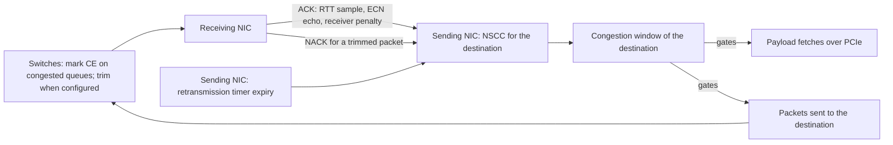

The Scala UET NIC limits the data it has in flight to each destination with NSCC, a congestion window driven by delay, ECN marks, trims, and timeouts.

This page follows the congestion signals a sending NIC receives and how they move its window. The NIC's congestion control is NSCC (Network Signal-based Congestion Control), from section 3.6.13 of the UET 1.0 specification. [Transport](./transport.md) explains the packets, ACKs, and NACKs that carry the signals, [Buffers and PFC](./buffers-and-pfc.md) the receive buffer behind the receiver penalty, and [Configuration](./configuration.md#scalauetcongestioncontrol) every attribute's type and default.

## Overview

NSCC is window-based. It caps the bytes the NIC has in flight to each destination, and there is no pacing and no sending rate: a packet that fits in the window is sent as soon as the transmit scheduler reaches it. The window moves on three signals, all of which reach the sender from the network or the receiver:

1. **ACKs.** Each ACK for a data packet usually gives the sender a round-trip time (RTT) sample, and carries the receiver's ECN echo, set when the acknowledged packet arrived marked Congestion Experienced (CE), and the receiver penalty, set by the receiving NIC when its own receive buffer backs up.
2. **Trim NACKs.** A NACK for a data packet that a switch trimmed to its headers.
3. **Timer expiry.** A packet whose retransmission timer expires before it is acknowledged ([Retransmission timer](./transport.md#retransmission-timer)).

The NIC sends every packet ECN-capable, as ECT(1), and never marks a packet itself. Switches mark packets CE when their queues build ([ECN marking](../scala-switch/packet-handling.md#ecn-marking)), and trim them when trimming is configured ([Packet trimmer](../scala-switch/configuration.md#packet-trimmer)).



Three behaviors are worth knowing before anything else:

- **The window starts at its maximum.** There is no slow start: a new destination may have a full maximum window in flight at once, limited by the egress buffer and the PCIe fetch rather than by the window ([Egress buffer](./buffers-and-pfc.md#egress-buffer)).
- **Delay alone does not shrink the window on an ACK.** Of the per-ACK routines, only multiplicative decrease shrinks the window, and it runs only on ECN-marked ACKs. Without ECN marks, a delay above the target shrinks the window only through [Quick Adapt](#quick-adapt).
- **The receiver penalty is the receiving NIC's setting.** It is computed from the receiving NIC's own receive buffer and thresholds, and applied by the sender ([Receiver penalty](#receiver-penalty)).

## Key concepts

| Term | Meaning |
| --- | --- |
| Nominal packet | The IP datagram of a data packet: its payload plus 88 bytes of headers, 4,184 bytes for a full packet at the default `RdmaDataMSS` of 4096. It is the unit the window counts in, and the unit of `MaxCongestionWindow`. The 18 bytes of Ethernet header and frame check sequence are not counted. |
| Congestion window | The most bytes the NIC may have in flight to one destination, counted in nominal packet sizes. It is a byte count, not a whole number of packets. |
| Bytes in flight | Nominal bytes of the packets sent to the destination that have not yet been acknowledged, NACKed, or timed out. |
| Base RTT | NSCC's estimate of the path's RTT without queueing. It starts at `InitialBaseRTT` and can only fall. |
| BDP | Bandwidth-delay product: the NIC's link rate times `InitialBaseRTT`, in bytes. 300,000 bytes at the defaults. |
| Max window | The ceiling of the congestion window: 1.5 × BDP by default. The window also starts there. |
| Target queue delay | The queueing delay NSCC aims for: `InitialBaseRTT` by default. |
| Queueing delay sample | How far one ACK's RTT sample lies above the base RTT, or, once a measurement has lowered the base, above that measured RTT. Never below 0. |
| Average queueing delay | A moving average of the samples, with `DelayAlpha` as the weight of the newest one. |
| ECN echo | A flag in each ACK, set when the data packet that asked for the ACK arrived CE-marked. |
| Receiver penalty | A value from 0 to 127 in each ACK, computed by the receiving NIC from how full its receive buffer for data is. |

## The congestion window

NSCC keeps one congestion window per destination. With `PDCGroupsEnabled` set to `true`, the default, every packet delivery context (PDC) from the NIC to one destination address belongs to one PDC group, and the group has one window, one base RTT, and one Quick Adapt state; with `false`, each PDC has its own ([PDC groups and the transmit scheduler](./transport.md#pdc-groups-and-the-transmit-scheduler)). A group's window lasts as long as the group, which lives while any PDC to or from the destination is open: once none is, the next message to it starts a new window at the max window, with a base RTT of `InitialBaseRTT`.

The window gates two things:

- **The wire.** A packet, new or retransmitted, is sent only if the bytes in flight to its destination plus its own nominal size fit in the window.
- **The payload fetch.** A new segment's payload is fetched from the host only while the bytes fetched for the destination and not yet acknowledged are at most the window. Without the prefetch buffer, the default, the fetch is also the commitment to send, so both tests apply when the fetch is issued ([Prefetch buffer](./transport.md#prefetch-buffer)).

The window starts at the max window, and there is no slow start. The max window comes from the BDP, or from `MaxCongestionWindow` when `OverrideUetSpecMaxCWind` is `true`:

```text
BDP          = link rate × InitialBaseRTT ÷ 8
max window   = 1.5 × BDP                                  (OverrideUetSpecMaxCWind false, the default)
max window   = MaxCongestionWindow × nominal packet       (OverrideUetSpecMaxCWind true)
```

The link rate is the rate the NIC's link runs at: its `DataRate`, or the rack switch's downlink `DataRate` if that is lower ([UplinkNetworkInterface](./configuration.md#uplinknetworkinterface)), counted in whole Gbps. Whatever moves it, the window never goes above the max window and never below one nominal packet.

## Base RTT

The base RTT starts at `InitialBaseRTT`. Every RTT sample the NIC takes is offered to it: the samples from ACKs and from NACKs, and the one from the small base-RTT probe each message sends after its first ACK, which measures a round trip with no data packet to serialize and no receiver backlog ([Acknowledgements](./transport.md#acknowledgements)).

**How a sample is taken.** An RTT sample runs from the moment the data packet finished serializing onto the NIC's link to the moment its ACK arrives, less the PCIe service time the receiver reports in the ACK. For a retransmitted packet, the sample runs from the end of that retransmission's serialization, so the time the packet waited for its timeout is not part of it. The sender's own queueing and serialization are therefore not part of it, and a backlog at the receiver's host interface is reported and taken out. An ACK gives a sample when it acknowledges a packet sent once, or the first retransmission of a packet; other ACKs give none.

**How the base RTT changes.** A measured RTT lowers the base RTT only when it is more than about 1 µs below the current base, and the base becomes that RTT plus about 1 µs. The base RTT never rises. When it drops:

- The max window is derived again from the new base, as 1.5 × link rate × base RTT ÷ 8, and a window above it is lowered to it. `OverrideUetSpecMaxCWind` no longer applies from then on.
- Quick Adapt's observation window, one base RTT plus the target, shortens with it.
- Multiplicative decreases, at most one per base RTT, may come closer together.
- The target queue delay and the gains of the increase routines keep the values they took from `InitialBaseRTT`. The Quick Adapt threshold is set by `QuickAdaptThreshold` alone and does not change.
- Queueing delay samples are measured against the RTT that lowered the base: a sample is how far an RTT lies above that measured RTT.

**Choosing `InitialBaseRTT`.** It sets the BDP, the max window, and the default target, so it works best close to the path's unloaded RTT:

- **Above the unloaded RTT,** by more than about 1 µs, the first samples lower the base RTT, and the max window shrinks to match the measured path. The target and the gains keep their larger `InitialBaseRTT` values.
- **Below the unloaded RTT,** no sample ever lowers the base RTT, so the part of every RTT above `InitialBaseRTT` reads as queueing delay on every ACK, even on an idle path. The max window, sized from `InitialBaseRTT`, can then be smaller than the bytes needed to keep the link busy over the real round trip.

## Target queue delay

The target is the queueing delay NSCC tries to hold. It is set once, when a destination's window is created, and does not follow a lower measured base RTT.

| `TrimmingEnabled` | `OverrideSpecTargetQueueDelay` | Target queue delay |
| --- | --- | --- |
| `false` (default) | `false` (default) | `InitialBaseRTT` |
| `true` | `false` | 0.75 × `InitialBaseRTT` |
| Either | `true` | `TargetQueueDelay` |

`TrimmingEnabled` is the NIC's own attribute, in its `ScalaUETPdsManager` ([ScalaUETPdsManager](./configuration.md#scalauetpdsmanager)). The default `TargetQueueDelay`, 4,500 ns, equals the target trimming gives at the default `InitialBaseRTT`; it has no effect unless `OverrideSpecTargetQueueDelay` is `true`.

`TargetQueueDelayMargin` is not a band around the target. It is the test for entering fast increase: only ACKs whose delay sample is below the margin count toward it ([How the window responds to each ACK](#how-the-window-responds-to-each-ack)).

## How the window responds to each ACK

Each ACK for a data packet is processed in this order:

1. **Receiver penalty.** If the ACK carries a non-zero penalty, the window is capped and reduced, and the ACK is marked receiver-limited ([Receiver penalty](#receiver-penalty)). This step runs for every ACK of data; the rest run only for an ACK that gives an RTT sample.
2. **Queueing delay.** The ACK's delay sample is computed and folded into the average:

   ```text
   average = DelayAlpha × sample + (1 − DelayAlpha) × average
   ```

3. **Quick Adapt.** If Quick Adapt fires on this ACK, or the ACK is ECN-marked while Quick Adapt is ignoring marks, processing stops here ([Quick Adapt](#quick-adapt)).
4. **One routine,** chosen by the ACK's ECN echo and by whether its delay sample is below the target:

   | ECN echo | Delay sample | Receiver-limited | Routine |
   | --- | --- | --- | --- |
   | Not set | At or above the target | No | Fair increase |
   | Not set | Below the target | No | Proportional increase, or fast increase once it is engaged |
   | Set | At or above the target | Either | Multiplicative decrease |
   | Set | Below the target | Either | None |
   | Not set | Either | Yes | None |

5. **Bounds.** The window is kept between one nominal packet and the max window.

The routines:

- **Proportional increase** grows the window by more the further the delay sample is below the target. `AlphaMultiplier` scales it.
- **Fast increase** takes over from proportional increase once ACKs whose delay samples are below `TargetQueueDelayMargin` have acknowledged more than a window's worth of bytes, counted since the last sample between the margin and the target. It then grows the window faster than proportional increase, scaled by `FastIncreaseMultiplier`, without passing the max window. It ends at the first ACK whose delay sample is below the target but at or above the margin, or at the first ECN-marked ACK whose sample is at or above the target.
- **Fair increase** grows the window steadily, by an amount that does not depend on how far the delay is above the target. `FairIncreaseMultiplier` scales it.
- **Multiplicative decrease** shrinks the window, but only when the *average* queueing delay is above the target, and at most once per base RTT:

  ```text
  window = window × max(1 − Gamma × (average − target) ÷ average, MaxMultiplicativeDecreaseJump)
  ```

  `Gamma` sets how deep a cut is for a given excess of average delay over the target. `MaxMultiplicativeDecreaseJump` is the smallest fraction of the window one decrease keeps: at the default 0.5, one decrease at most halves the window. The result is never below one nominal packet.
- **Additive term.** After the routines, NSCC adds a small additive increase scaled by `EtaMultiplier`. A larger value raises the window faster.

`ReferenceNetworkRTT` and `ReferenceNetworkLinkSpeed` define a reference BDP that normalizes the proportional and fair increases and the additive term: those gains grow with the ratio of the NIC's own BDP, from its link rate and `InitialBaseRTT`, to the reference BDP, so a larger reference makes the NIC's increases smaller. At the defaults the two BDPs are equal. The reference does not change the target, the max window, or multiplicative decrease.

The table has one consequence worth stating: an unmarked ACK whose delay is above the target takes fair increase, so the window keeps growing while delay builds, until another signal shrinks it. The window shrinks only on an ECN-marked ACK while the average delay is above the target, on a trim NACK or a timer expiry ([Loss reactions](#loss-reactions)), through Quick Adapt, through the receiver penalty, or when a lower base RTT lowers the max window.

## Quick Adapt

Quick Adapt cuts a destination's window in one step when the window has clearly outrun what the path delivers. It works in observation windows, each one base RTT plus the target queue delay long, 12 µs at the defaults. A destination's first observation window opens with its first ACK or trim NACK, so a new destination cannot Quick Adapt before that first window has ended.

When the first ACK or trim NACK after the end of an observation window arrives, Quick Adapt checks two conditions:

1. **A trigger is present:** a trim NACK has arrived since Quick Adapt last fired, or this is a trim NACK, or, with `TrimmingEnabled` set to `false`, the average queueing delay is above `QuickAdaptThreshold`.
2. **Too few bytes were delivered:** the bytes acknowledged during the observation window are below the max window ÷ 2^`QuickAdaptGate`.

If both hold, Quick Adapt fires:

- The window is set to the bytes acknowledged during the observation window, and to at least one nominal packet.
- Until as many bytes as were in flight at that moment have been acknowledged or trimmed, ECN-marked ACKs and trim NACKs leave the window alone, so the signals of packets sent before the cut do not cut it again.
- The firing is counted in `num_quick_adapt`.

Either way, a new observation window starts. With `TrimmingEnabled` set to `true`, only trims trigger Quick Adapt: the delay trigger is off, and `QuickAdaptThreshold` is not used. The default threshold, 24 µs, is four times the default target; it does not change when `InitialBaseRTT` does. With `DisableQuickAdapt` set to `true`, Quick Adapt never runs.

## Loss reactions

**Trim NACK.** When a NACK arrives for a packet that a switch trimmed, and the packet is still in flight:

1. The NACK's RTT sample, under the same rule as an ACK's, is offered to the base RTT, and `InitialBaseRTT` is folded into the average queueing delay as one sample.
2. A Quick Adapt trigger is set, and Quick Adapt checks its conditions with this NACK.
3. If Quick Adapt did not fire, and is not ignoring trim NACKs, the window shrinks by the trimmed packet's nominal size, to no less than one nominal packet.

The packet is then queued for retransmission ([Trimmed packets and NACKs](./transport.md#trimmed-packets-and-nacks)).

**Timer expiry.** When a packet's retransmission timer expires while it is still in flight, the window shrinks by the packet's nominal size, to no less than one nominal packet. Quick Adapt does not run on a timer expiry.

A gap the receiver reports in its selective acknowledgements is not a loss signal and does not change the window ([Selective acknowledgements](./transport.md#selective-acknowledgements)).

Trim NACKs exist only where switches trim. The NIC's `TrimmingEnabled` only marks data packets as trimmable; trimming itself is done by switches with trimming turned on, which requires the switch's UET policy and PFC off on every traffic class ([Packet trimmer](../scala-switch/configuration.md#packet-trimmer)). With the default `UseDistinctDSCPForRetransmits` (`true`), retransmissions are marked trimmable even with `TrimmingEnabled` set to `false`, so a trimming switch can trim them ([Packet marking](./transport.md#packet-marking)). Conversely, with `TrimmingEnabled` set to `true` and no switch trimming, Quick Adapt has no trigger left: its delay trigger is off, and no trim NACK arrives.

## Receiver penalty

The receiver penalty lets a receiving NIC whose host interface falls behind hold its senders back. It is computed by the **receiving** NIC, from its own receive buffer and its own attributes, and applied by the sender.

**At the receiving NIC.** For each ACK it sends, the NIC takes the occupancy of its receive pool for the data class, as a percentage of that pool, and turns it into a penalty from 0 to 127:

```text
occupancy below ReceiverCongestionLowThreshold            penalty 0
occupancy at or above ReceiverCongestionHighThreshold     penalty 127
in between                                                127 × (occupancy − Low) ÷ (High − Low)
```

Each ACK carries the penalty and the receiving NIC's `RestoreCWindEnable`.

**At the sender.** Each ACK of data with a penalty above 0:

- saves the window as it stood when the penalty began, once;
- caps the window at the bytes still in flight, and reduces it by a share of the bytes the ACK acknowledges that grows with the penalty, to no less than one nominal packet;
- blocks proportional and fair increase for that ACK.

When an ACK arrives with a penalty of 0 and the receiving NIC's restore flag set, the saved window is restored. With `RestoreCWindEnable` `false` on the receiver, the default, the window instead grows back through the ordinary routines.

So a NIC's own `ReceiverCongestionLowThreshold`, `ReceiverCongestionHighThreshold`, and `RestoreCWindEnable` shape what its peers send to it; a sender's own values play no part in its sending.

**When it is active.** The receive pool for data holds only what is waiting for the PCIe link to the host ([Receive buffer](./buffers-and-pfc.md#receive-buffer)). At the default PCIe settings the host interface drains received data faster than the 400 Gbps link fills it, so the pool stays near empty and the penalty stays 0 in a default run. It comes into play when a receiving NIC's host interface is slower than its network arrivals, for example with fewer PCIe lanes ([Worked example: PCIe and network rates](./buffers-and-pfc.md#worked-example-pcie-and-network-rates)).

## Turning congestion control off

Two attributes take NSCC out of the picture, in different ways:

- **`PassThrough` set to `true`** stops the window from gating anything: neither sending nor fetching waits for it. NSCC still computes the window and the records still show it moving, but it has no effect. Sending is then bounded by the egress buffer and the PCIe fetch ([Buffers and PFC](./buffers-and-pfc.md)).
- **`NSCCEnable` set to `false`** turns off NSCC's routines, Quick Adapt, and the loss reactions, so delay, ECN marks, trims, and timeouts no longer move the window. The window starts at the max window, which still follows a lower measured base RTT, and it still limits sending. With NSCC off, `num_quick_adapt` stays 0, and the averaged queueing delay is not computed, so its columns read 0 while RTT samples are still recorded.

| `NSCCEnable` | `PassThrough` | What limits sending to a destination |
| --- | --- | --- |
| `true` (default) | `false` (default) | The NSCC window |
| `true` | `true` | The egress buffer and PCIe; the window is computed and recorded but not enforced |
| `false` | `false` | The window, which starts at the max window and which delay, ECN marks, trims, and timeouts no longer move |
| `false` | `true` | The egress buffer and PCIe; the window is recorded but not enforced, and delay, ECN marks, trims, and timeouts no longer move it |

## How each attribute shapes the window

All but the last row sit in the `ScalaUETCongestionControl` component and apply to every destination's window on the NIC. [ScalaUETCongestionControl](./configuration.md#scalauetcongestioncontrol) gives each attribute's type and accepted values.

| Attribute | Default | Role |
| --- | --- | --- |
| `PassThrough` | `false` | With `true`, the window no longer limits sending or fetching; NSCC still computes and records it. |
| `NSCCEnable` | `true` | With `false`, NSCC's routines, Quick Adapt, and the loss reactions are off, so delay, ECN marks, trims, and timeouts no longer move the window, which starts at the max window. |
| `InitialBaseRTT` | `6us` | Starting base RTT. Sets the BDP and the max window, the default target, and the normalization of the increase gains. A lower measured RTT replaces it as the base RTT. The max window, Quick Adapt's observation window, the spacing of multiplicative decreases, and the reference for queueing delay samples then follow the measured value, while the target and the increase gains keep their `InitialBaseRTT` values. |
| `ReferenceNetworkRTT` | `6us` | With `ReferenceNetworkLinkSpeed`, the reference BDP that normalizes the proportional and fair increases and the additive term. A larger reference makes those increases smaller. |
| `ReferenceNetworkLinkSpeed` | `400Gbps` | The link speed of the reference BDP. Typically the NIC's link rate; NICs of different speeds can share one reference to scale their gains relative to each other. |
| `OverrideSpecTargetQueueDelay` | `false` | With `true`, the target is `TargetQueueDelay` instead of the value from `InitialBaseRTT` and `TrimmingEnabled`. |
| `TargetQueueDelay` | `4500ns` | The target, used only with `OverrideSpecTargetQueueDelay` set to `true`. |
| `TargetQueueDelayMargin` | `1us` | Delay below which ACKs count toward entering fast increase. Not a band around the target. |
| `DisableQuickAdapt` | `false` | With `true`, Quick Adapt never runs. |
| `QuickAdaptGate` | `3` | Quick Adapt fires only when the bytes acknowledged in an observation window are below the max window ÷ 2^`QuickAdaptGate`. A larger gate lets it fire only after a deeper fall in delivered bytes. |
| `QuickAdaptThreshold` | `24us` | With `TrimmingEnabled` set to `false`, the average queueing delay above which Quick Adapt is triggered. Not used with `TrimmingEnabled` set to `true`. |
| `OverrideUetSpecMaxCWind` | `false` | With `true`, the max window, and so the starting window, is `MaxCongestionWindow` nominal packets, until a lower measured base RTT derives it again. |
| `MaxCongestionWindow` | `107` | The max window in nominal packets, used only with `OverrideUetSpecMaxCWind` set to `true`. |
| `ReceiverCongestionLowThreshold` | `25.0` | Read at the receiving NIC: the occupancy of its receive pool for data, in percent, at which it starts to penalize its senders. |
| `ReceiverCongestionHighThreshold` | `75.0` | Read at the receiving NIC: the occupancy, in percent, at which the penalty is full, 127. |
| `RestoreCWindEnable` | `false` | Read at the receiving NIC: with `true`, its ACKs tell senders to restore the window they saved when the penalty began, once the penalty is back to 0. |
| `MaxMultiplicativeDecreaseJump` | `0.5` | The smallest fraction of the window one multiplicative decrease keeps. |
| `AlphaMultiplier` | `4.0` | Scales proportional increase. Higher values give larger increases. |
| `FairIncreaseMultiplier` | `5.0` | Scales fair increase. Higher values give larger increases. |
| `FastIncreaseMultiplier` | `1.0` | Scales fast increase. Higher values give larger increases while it lasts. |
| `EtaMultiplier` | `0.15` | Scales the small additive increase applied after the routines. Higher values raise the window faster. |
| `Gamma` | `0.8` | Depth of a multiplicative decrease for a given excess of average delay over the target. Higher values cut deeper. |
| `DelayAlpha` | `0.25` | Weight of the newest delay sample in the average queueing delay. Higher values make the average follow the samples faster. |
| `TrimmingEnabled` (`ScalaUETPdsManager`) | `false` | With `true`, the default target is 0.75 × `InitialBaseRTT`, Quick Adapt's delay trigger is off, and data packets are marked trimmable ([Packet marking](./transport.md#packet-marking)). |

## Worked example: the defaults

A NIC with every attribute at its default: link rate 400 Gbps, `RdmaDataMSS` 4096, `InitialBaseRTT` 6 µs, and the receive buffer's default pools.

**Window sizes.**

```text
nominal packet          4,096 B payload + 44 B (semantic) + 16 B (PDS) + 8 B (UDP) + 20 B (IPv4)  =   4,184 B
BDP                     400 Gbps × 6 µs ÷ 8                                                       = 300,000 B
max window              1.5 × 300,000 B                                                           = 450,000 B
                        450,000 B ÷ 4,184 B                                                       = 107.55 nominal packets
starting window         the max window                                                            = 450,000 B
```

The default `MaxCongestionWindow`, 107, is that packet count rounded down. With `OverrideUetSpecMaxCWind` set to `true`, the max window is 107 × 4,184 B = 447,688 B, slightly below the derived 450,000 B.

**Target and Quick Adapt.**

```text
target, TrimmingEnabled false     InitialBaseRTT                     = 6 µs
target, TrimmingEnabled true      0.75 × 6 µs                        = 4.5 µs
Quick Adapt delay threshold       QuickAdaptThreshold, trimming off  = 24 µs
observation window                6 µs base RTT + 6 µs target        = 12 µs   (10.5 µs with trimming)
Quick Adapt byte threshold        450,000 B ÷ 2^3                    = 56,250 B, about 13.4 nominal packets
```

With trimming off, Quick Adapt fires on the first ACK or trim NACK after a 12 µs observation window in which fewer than 56,250 bytes were acknowledged, if the average queueing delay is then above 24 µs or a trim NACK has arrived.

**Receiver penalty band**, on a receiving NIC whose receive pool for data is the default 0.9 × 4,000,000 B = 3,600,000 B:

```text
penalty starts    25% of 3,600,000 B    =   900,000 B
penalty full      75% of 3,600,000 B    = 2,700,000 B
```

## Records

The default `uet-transport-stats` record has one row per UET NIC per `NDStatsReportInterval`, and each row combines every destination on the NIC. These columns show congestion control ([uet-transport-stats](./records.md#uet-transport-stats)):

| Columns | What they show |
| --- | --- |
| `*_calc_rtt_usec` | RTT samples in µs: the minimum, maximum, and mean, sampled on each data ACK that gives an RTT sample |
| `*_calc_avg_q_delay_usec` | The average queueing delay in µs, sampled on the same ACKs |
| `*_rcvr_cwnd_pen` | The receiver penalty the ACKs carried, 0 to 127, sampled on the same ACKs |
| `*_cwnd_bytes` | The congestion window in bytes, sampled each time a data packet is first sent |
| `num_quick_adapt`, `ivl_num_quick_adapt` | Quick Adapt firings, cumulative and in the interval |
| `m_marked_pkts_sent` | ACKs this NIC sent with the ECN echo set, as a receiver |
| `m_marked_pkts_rcvd` | Data ACKs with the ECN echo set that this NIC received and took an RTT sample from, as a sender |

With `TriggerLoggingOnRttEnable` or `TriggerLoggingOnCWindPen` set to `true`, the UET Monitor starts logging a PDC's packets when an RTT on it reaches `TriggerLoggingOnRttThreshold`, or when a receiver penalty reaches `TriggerLoggingOnCWindPenThreshold`, and its per-packet rows carry the RTT, the congestion window, and the receiver penalty ([uet-monitor](./records.md#uet-monitor)). At the default PCIe settings the penalty stays 0, so a penalty trigger with a threshold above 0 does not fire in a default run.
