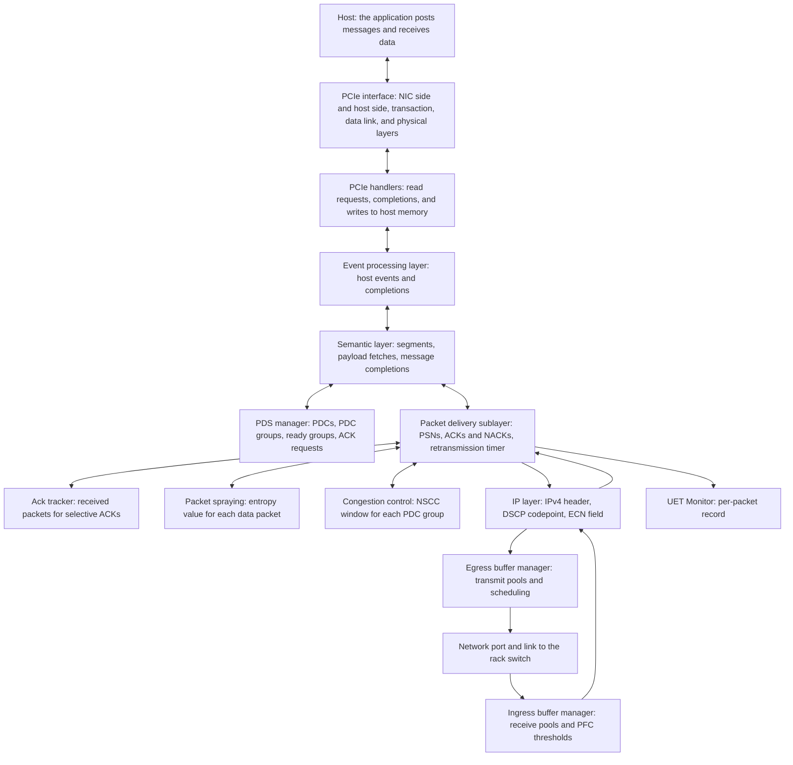

The Scala UET NIC models an Ultra Ethernet Transport (UET) network interface card with packet spraying, NSCC congestion control, and a PCIe host link.

Model version 4.6.0 is the version these pages describe.

## What this model simulates

The Scala UET NIC is a generic UET NIC. A simulation configuration places one on a server, where it serves that one host: it fetches the data the host's application sends from host memory over a PCIe link, carries it across one Ethernet port to the rack switch as UET packets over IPv4 and UDP, and writes the data it receives back to host memory. Rather than modeling a specific vendor's adapter, it models the mechanisms of the UET transport: packet delivery contexts with packet sequence numbers, cumulative and selective acknowledgements, retransmission, packet spraying across equal-cost paths, congestion control driven by queueing delay and ECN marks, and per-traffic-class buffers with priority flow control.

The workloads that run over it on the platform are the [Chakra workload](../chakra-workload/index.md) and the Scala RDMA application.

The results you reason about with it are message completion times, acknowledgements, trim NACKs and retransmissions, how packet spraying spreads a destination's packets across equal-cost paths, the congestion window and round-trip times that congestion control works from, receive-buffer drops, and how much of the network link and the PCIe link a workload uses.

Simulations on the platform carry IPv4 traffic.

### What is and is not modeled

- **One-way message transfers.** The host posts each message as a one-way transfer of its bytes to a peer, as an RDMA WRITE does. RDMA read and atomic operations are not modeled ([Messages and packet delivery contexts](./transport.md#messages-and-packet-delivery-contexts)).
- **Reliable unordered delivery only.** Every data packet is a reliable unordered delivery (RUD) request: the receiver writes each new packet to host memory as it arrives, in order or not, and nothing is reordered. `DefaultDeliveryMethod` offers no other delivery mode ([Receiving a packet](./transport.md#receiving-a-packet)).
- **Selective acknowledgements retire packets but never trigger a retransmission.** A lost packet is recovered by a trim NACK or by the retransmission timer; there is no fast retransmit from a gap in the selective acknowledgements ([Selective acknowledgements](./transport.md#selective-acknowledgements)).
- **NACKs only for trimmed packets.** The receiver sends a NACK only for a data packet that a switch has trimmed. A gap in the sequence draws no NACK ([Trimmed packets and NACKs](./transport.md#trimmed-packets-and-nacks)).
- **Retransmission without a retry limit.** A packet is retransmitted until it is acknowledged; the NIC never gives up on it ([Retransmission timer](./transport.md#retransmission-timer)).
- **A congestion window, with no rate pacing.** Congestion control limits the bytes each PDC group has in flight; it does not pace packets at a rate ([The congestion window](./congestion-control.md#the-congestion-window)).
- **Wire framing.** Packets carry Ethernet, IPv4, UDP, and the UET headers. The preamble and interframe gap a physical link spends on each frame are not modeled ([Packets on the wire](./transport.md#packets-on-the-wire)).
- **Host memory.** The host answers each PCIe read at once; host memory latency is not modeled ([Fetching the payload over PCIe](./transport.md#fetching-the-payload-over-pcie)).

## Features

- **UET 1.0 packet delivery sublayer (PDS), reliable unordered delivery.** Messages are cut into packets of at most `RdmaDataMSS` bytes and carried over packet delivery contexts (PDCs), each with its own packet sequence numbers. The receiver writes packets to host memory as they arrive and acknowledges them with cumulative and selective acknowledgements; the sender recovers lost packets from trim NACKs and a per-packet retransmission timer. [Transport](./transport.md) explains it.
- **Packet spraying.** Each data packet's UDP source port carries an entropy value, which the switches' default ECMP hash includes, so varying it spreads a destination's packets across equal-cost paths. `PacketSprayingType` selects `None` (one value for each PDC group), `Default Packet Spraying` (a round robin over a range of ports, the default), or `Recycled Entropy Packet Spraying` (REPS, which reuses the values that acknowledgements report as uncongested). [Multipath](./multipath.md) explains them.
- **Network Signal-based Congestion Control (NSCC), UET 1.0 section 3.6.13.** Each PDC group keeps a congestion window in bytes. NSCC adjusts it as ACKs arrive, from the queueing delay above the measured base round-trip time and from ECN marks, cuts it sharply with Quick Adapt when little data is getting through, and reduces it on trims and timeouts. A receiving NIC whose receive buffer backs up can also hold its senders back with a penalty carried in its ACKs. [Congestion control](./congestion-control.md) explains the window and each attribute's role.
- **Packet trimming marks.** With `TrimmingEnabled` `true`, data packets carry the trimmable codepoint, so a switch with trimming on cuts a packet it cannot queue down to its headers instead of dropping it. The receiving NIC answers a trimmed packet with a NACK, and the sender queues the packet for retransmission ahead of new data ([Trimmed packets and NACKs](./transport.md#trimmed-packets-and-nacks)). Trimming itself is done by switches ([Packet trimmer](../scala-switch/configuration.md#packet-trimmer)).
- **PDC groups.** With `PDCGroupsEnabled` `true`, the default, the PDCs to one remote address share one congestion window and one load balancer, and take turns in the transmit scheduler as one group ([PDC groups and the transmit scheduler](./transport.md#pdc-groups-and-the-transmit-scheduler)).
- **Explicit Congestion Notification (ECN), RFC 3168.** The NIC sends every packet as ECN-capable, ECT(1), and the switches mark congested packets CE. The receiving NIC echoes the mark in its ACK, and congestion control reacts to it ([How the window responds to each ACK](./congestion-control.md#how-the-window-responds-to-each-ack)).
- **DSCP codepoints by packet role, RFC 2474.** The NIC writes a DSCP codepoint that names each packet's role: no-trim or trimmable data, a trimmable retransmission, or control. Switches write the trimmed codepoints, and a switch under the UET policy takes a packet's traffic class from its codepoint ([Packet marking](./transport.md#packet-marking)).
- **Ingress and egress buffer pools and transmit scheduling.** A receive buffer and a transmit buffer, each divided into per-traffic-class pools. Transmission is scheduled across traffic classes by strict priority, round robin, or weighted round robin, with PFC frames sent ahead of all data. [Buffers and PFC](./buffers-and-pfc.md) explains them.
- **Priority Flow Control (PFC), IEEE 802.1Qbb.** The NIC can pause its rack switch per traffic class when a receive pool passes its Xoff threshold, and resume it with an XON frame. Sending pauses is off by default on this NIC: every entry of `PFCEnableVector` is `0`. The NIC always honors the pause frames it receives by holding that class's transmission ([PFC](./buffers-and-pfc.md#pfc)).
- **PCIe host interface.** Each segment's payload is fetched from host memory with one PCIe read, and received data is written to host memory with PCIe writes. The lane rate, the lane count, and the transaction-layer buffers are configurable on both ends of the link ([PCIe host interface](./buffers-and-pfc.md#pcie-host-interface)).
- **Statistics and the UET Monitor.** Transport counters per NIC, device counters for the network port, and PFC counters per receive traffic class; and, when turned on, buffer occupancy, PDC and message lifecycle events, and the UET Monitor's per-packet record, which can be filtered by NIC, address, or PDC and started by an RTT or receiver-penalty trigger. [Records](./records.md) lists them.

## Architecture

The NIC is assembled from cooperating components. A stack of processing layers turns the host's messages into packets and back, the PDS manager keeps the PDCs and decides which one sends next, the buffer managers own the transmit and receive buffers, and the PCIe interface connects the NIC to its host.

| Component | C++ class | Responsibility | Configured by |
| --- | --- | --- | --- |
| NIC node | `ScalaUETNIC` | Holds the other components, gives each received packet a traffic class from its DSCP codepoint, sends PFC pause and resume frames when receive pools cross their thresholds, and holds a traffic class's transmission while a received pause lasts. | [NIC](./configuration.md#nic) |
| Network port | `ScalaNetDeviceBase` | The NIC's one Ethernet port to its rack switch. Sends frames at the link's rate, the lower of `DataRate` and the rack switch's downlink rate. | [UplinkNetworkInterface](./configuration.md#uplinknetworkinterface) |
| Link | `ScalaChannel` | Carries frames between the port and the rack switch with the NIC's propagation delay. | [TransmissionMedium](./configuration.md#transmissionmedium) |
| Ingress buffer manager | `ScalaUETIngressBufferManager` | Divides the receive buffer into per-class pools, charges each received packet to its pool until the host write is accepted or the packet has been processed, drops packets that do not fit, and applies the PFC thresholds. | [IngressBufferManager](./configuration.md#ingressbuffermanager) |
| Egress buffer manager | `ScalaUETEgressBufferManager` | Divides the transmit buffer into per-class pools, holds each packet's reservation until it has been sent, and schedules transmission across traffic classes. | [EgressBufferManager](./configuration.md#egressbuffermanager) |
| PDS manager | `ScalaUETPdsManager` | Creates and tracks PDCs and PDC groups, keeps the groups that are ready to send, sets the ACK-request flag on outgoing data, and holds the delivery settings: trimming marks, the retransmission timer, the prefetch buffer, and the spraying type. | [ScalaUETPdsManager](./configuration.md#scalauetpdsmanager) |
| Ack tracker | `ScalaAckTracker` | Records, for each PDC, which packets beyond the next expected one have arrived, for the selective acknowledgements. | None |
| Default packet spraying | `ScalaUETPacketSprayDefault` | Under `Default Packet Spraying`, gives each data packet the next entropy value in a round robin. | [DefaultPacketSpraying](./configuration.md#defaultpacketspraying) |
| Recycled entropy packet spraying | `ScalaUETLoadBalancerReps` | Under `Recycled Entropy Packet Spraying`, chooses entropy values from the feedback that ACKs, NACKs, and timeouts give about each path. | [RecycledEntropyPacketSpraying](./configuration.md#recycledentropypacketspraying) |
| Congestion control | `ScalaUETCongestionControl` | Keeps each PDC group's congestion window and runs NSCC on ACKs, NACKs, and timeouts. | [ScalaUETCongestionControl](./configuration.md#scalauetcongestioncontrol) |
| Event processing layer | `EventProcessingLayer` | Receives the host's events, such as a new message or a closed PDC, and passes completions and received data to the host. | None |
| Semantic layer | `SemanticLayer` | Cuts each message into segments of at most `RdmaDataMSS` bytes, requests each segment's payload over PCIe, adds the semantic header, and reports send and receive completions. | [SemanticLayer](./configuration.md#semanticlayer) |
| Packet delivery sublayer | `PacketDeliverySublayer` | Assigns PSNs, adds the PDS and UDP headers with the entropy value, sends ACKs and NACKs and processes those it receives, and runs the retransmission timer. | None |
| IP layer | `UETIpPacketProcessingLayer` | Adds the IPv4 header with the packet's DSCP codepoint and the ECN field, and finds the PDC of each received packet. | None |
| UET Monitor | `ScalaUETMonitor` | Writes the per-packet `uet-monitor` record when it is turned on or one of its triggers fires. | [ScalaUETMonitor](./configuration.md#scalauetmonitor) |
| PCIe interface | `ScalaPCIeDeviceLayer`, `GenericPCIeTransactionLayer`, `GenericPCIeDataLinkLayer`, `GenericPCIePhysicalLayer` | The PCIe link between the NIC and its host, one stack on each end: transaction-layer buffers, link framing, and the lane rate and count. | [Host interface](./configuration.md#host-interface) |
| PCIe handlers | `ScalaUETNICDeviceLayerHandler`, `HostDeviceLayerHandler` | On the NIC side, sends the read requests that fetch payload and the writes that deliver received data; on the host side, answers each read with the requested data at once. | [Host interface](./configuration.md#host-interface) |

## How to read these pages

Read them in this order:

1. [Transport](./transport.md): how a message travels from host memory to the wire and back, from the PCIe fetch through segmentation, packet marking, acknowledgements, trimmed packets, the retransmission timer, PDC groups, and the transmit scheduler, and what the transport records.
2. [Multipath](./multipath.md): how the entropy value in each data packet spreads a destination's packets across equal-cost paths, with the three spraying types and the path feedback REPS uses.
3. [Congestion control](./congestion-control.md): how NSCC sizes and adjusts each PDC group's congestion window from queueing delay, ECN marks, trims, timeouts, and the receiver penalty, with the role of each congestion-control attribute.
4. [Buffers and PFC](./buffers-and-pfc.md): the transmit and receive buffers and their pools, traffic classes, transmit scheduling, how the NIC sends and honors PFC, and the PCIe host interface, with a worked example of the defaults.
5. [Records](./records.md): the records a simulation writes for the NIC, how to get them, and what their columns hold, including the UET Monitor's filters and triggers.
6. [Configuration](./configuration.md): every attribute a simulation configuration can set, with its type and default, how to add the NIC and change attributes through the platform API, and the configuration rules that stop a simulation.
