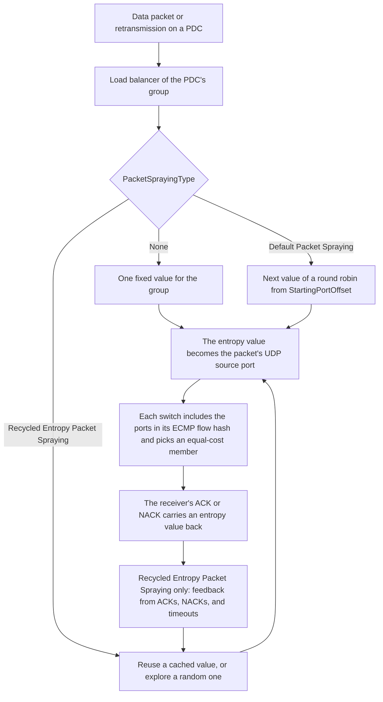

This page explains how the Scala UET NIC spreads the packets it sends to a destination across equal-cost paths by varying each data packet's entropy value.

It covers what the entropy value is, how the switches use it to choose a path, the three spraying types `PacketSprayingType` selects, and how spraying shares its state within a PDC group. How a packet is built, acknowledged, and retransmitted is on [Transport](./transport.md); the attributes are in [ScalaUETPdsManager](./configuration.md#scalauetpdsmanager), [DefaultPacketSpraying](./configuration.md#defaultpacketspraying), and [RecycledEntropyPacketSpraying](./configuration.md#recycledentropypacketspraying) on [Configuration](./configuration.md).

## Overview

A destination reached through a fabric usually has several equal-cost paths, and each switch chooses among them per flow, by hashing the packet's headers ([ECMP path selection](../scala-switch/packet-handling.md#ecmp-path-selection)). The Scala UET NIC varies one field that hash includes, the UDP source port of each data packet, which carries the packet's entropy value. Packets of one message with different entropy values are different flows to the switches, so they can take different paths.

Packets that take different paths can arrive out of order. The receiver writes each one to host memory as it arrives and reports it in its selective acknowledgements, so spraying needs no reordering at the receiver ([Receiving a packet](./transport.md#receiving-a-packet)).



## Entropy and the switch's path choice

Every data packet and every retransmission takes its entropy value from the load balancer of its PDC group ([PDC groups and the transmit scheduler](./transport.md#pdc-groups-and-the-transmit-scheduler)), and the NIC writes it as the packet's UDP source port. A retransmission takes a new value from the load balancer, as a new packet does, so under Default Packet Spraying and Recycled Entropy Packet Spraying it can take a different path from the packet it replaces. ACKs and NACKs carry an entropy value back to the sender in their own UDP source port, which Recycled Entropy Packet Spraying uses as path feedback ([Path feedback](#path-feedback)).

Whether a new entropy value means a new path depends on the switch's `EcmpHashMethod` ([Flow identity](../scala-switch/packet-handling.md#flow-identity)):

| `EcmpHashMethod` | Does the entropy value change the path? |
| --- | --- |
| `crc32WithSalt` (default), `crc32`, `hashWithSalt`, `hash` | Yes. The flow hash includes the UDP source and destination ports, so each entropy value is a flow of its own. |
| `dpr` | No. The member depends only on the destination address, so every packet to one destination takes the same member whatever the entropy value. |
| `dprWithFallback` | Only when the switch falls back to its CRC hash of the packet's headers. |

With the default `crc32WithSalt`, the entropy values a group uses spread its packets across the members of each equal-cost set they meet. Spraying changes nothing where a destination has only one path.

## Spraying types

`PacketSprayingType`, in `ScalaUETPdsManager`, selects how the entropy value is chosen:

| `PacketSprayingType` | Entropy value for each data packet | Uses feedback | Attributes it reads |
| --- | --- | --- | --- |
| `None` | One fixed value for the PDC group | No | None |
| `Default Packet Spraying` (default) | The next value of a round robin over 2^`EntropyMaskBits` ports from `StartingPortOffset` | No | `EntropyMaskBits`, `StartingPortOffset` |
| `Recycled Entropy Packet Spraying` | A cached value that acknowledgements reported uncongested, or a random value | Yes | `REPSBufferSizeMaskBits`, `EntropyValueSetSize`, `FreezingTimeout`, `FailureDetectionRTTMultiplier` |

Each type reads only its own attributes. Under `None`, neither the `DefaultPacketSpraying` nor the `RecycledEntropyPacketSpraying` attributes are used. Under `Default Packet Spraying`, the `RecycledEntropyPacketSpraying` attributes and `FailureDetectionRTTMultiplier` are not used. Under `Recycled Entropy Packet Spraying`, `EntropyMaskBits` and `StartingPortOffset` are not used.

## None

With `None`, a PDC group uses one entropy value for its whole life: the local UDP port of the PDC that created the group, which the application sets. Every packet of the group, retransmissions included, takes the same path through each switch, and feedback is ignored.

- With `PDCGroupsEnabled` `true`, the default, every message to a destination follows that one path while the group lives. A later group to the same destination uses the local port of its own first PDC, so it can take a different path.
- With `PDCGroupsEnabled` `false`, every PDC is a group of its own with its own local port. With the Chakra workload's PDC for each message, the switches can then send different messages on different paths, while each message keeps to one path.

## Default packet spraying

With `Default Packet Spraying`, the group's load balancer steps through a range of ports in a strict round robin, one step for each data packet or retransmission the group sends, with no randomness and no feedback:

```text
entropy value = StartingPortOffset + (step mod 2^EntropyMaskBits)
```

- **`EntropyMaskBits`** sets the number of values, 2^`EntropyMaskBits`, from 0 to 8. At the default of 7 there are 128 values; at 8, 256. At 0 there is one value, `StartingPortOffset`, for every packet: a single path, as with `None`, but on a port you choose.
- **`StartingPortOffset`** is the first port of the range, 0 to 65,535. At the defaults the group uses ports 256 to 383 in turn.
- **The range wraps.** Values are taken modulo 65,536: with `StartingPortOffset` 65,535 and `EntropyMaskBits` 8, the values are 65,535 and then 0 to 254.

The round robin belongs to the group, so the packets of several messages in flight to one destination continue one sequence between them.

## Recycled entropy packet spraying

Recycled Entropy Packet Spraying (REPS) keeps a cache of entropy values that acknowledgements have reported as uncongested, and sends new packets on them again. The cache holds 2^`REPSBufferSizeMaskBits` values: 8 at the default of 3, from 1 at 0 to 65,536 at 16.

For each data packet or retransmission, REPS chooses the entropy value like this, outside freezing and the exploration window that follows it ([Freezing and exploration](#freezing-and-exploration)):

1. **Explore** until the first value has been cached, and whenever the cache is empty: take a random value from 0 to `EntropyValueSetSize` − 1, which is 0 to 65,535 at the default `EntropyValueSetSize` of 65,536. REPS does not use `StartingPortOffset`.
2. **Reuse** otherwise: take the oldest value in the cache and remove it, so a value is sent on once for each time an acknowledgement recycles it.

### Path feedback

Each data ACK, and each NACK for a packet still outstanding, carries an entropy value back that REPS reads, and each retransmission timeout names the entropy value of the packet that timed out. REPS treats them like this:

| Signal | What REPS does with the entropy value |
| --- | --- |
| ACK without the ECN echo | Recycles it: the value is added to the cache |
| ACK with the ECN echo | Discards it |
| NACK for a packet trimmed on the way | Discards it |
| NACK for a packet trimmed on the last hop | Recycles it: another path cannot avoid a trim at the last hop |
| Retransmission timeout | Treats it as a path failure, which starts freezing |
| Early failure detection | Treats it as a path failure, as for a timeout ([Early failure detection](#early-failure-detection)) |

The cache is circular: when it is full, a newly recycled value takes the place of the oldest one. A discarded value is not added to the cache.

### Freezing and exploration

A path failure, from a retransmission timeout or from early failure detection, puts REPS into freezing, unless it is already freezing or in the exploration window that follows freezing.

- **While freezing**, once it has cached a value, REPS does not explore. It reuses cached values as usual, and when the cache is empty it reuses the entries of its cache in turn, rather than trying new values that might lead to the failed path.
- **Freezing ends** with the first value REPS recycles after `FreezingTimeout` has passed since freezing began, normally from an ACK without the ECN echo. So freezing lasts at least `FreezingTimeout`, 100 µs at the default, and continues until such an ACK arrives.
- **The exploration window** opens when freezing ends and lasts for as many packets as one bandwidth-delay product holds: the link rate × `InitialBaseRTT`, divided by the nominal packet size of `RdmaDataMSS` + 88 bytes. In the window, the last packet and every 2^`REPSBufferSizeMaskBits`-th packet before it explore a random value, and the others choose as usual. At the defaults the window is 71 packets, 9 of which explore: the 7th, the 15th, and so on to the 71st ([Worked example: the defaults](#worked-example-the-defaults)).

### Early failure detection

`FailureDetectionRTTMultiplier`, in `ScalaUETPdsManager`, lets REPS detect a failed path before the retransmission timer expires. It applies only under Recycled Entropy Packet Spraying.

After each data packet is sent, the NIC sets a deadline `FailureDetectionRTTMultiplier` × the base RTT later. If the packet is still unacknowledged at the deadline, REPS gets one path failure for the packet's entropy value, which starts freezing. Nothing is retransmitted, and the packet's retransmission timer is unchanged. `0` turns early failure detection off.

The base RTT is the one congestion control keeps: `InitialBaseRTT` until a lower round trip is measured, and then the lower value congestion control adopts ([Base RTT](./congestion-control.md#base-rtt)). At the defaults, the deadline is 3 × 6 µs = 18 µs until a lower base RTT is measured.

The deadline does not tell a failed path from a slow one: when queueing delays a packet's acknowledgement past the deadline, REPS freezes as it would for a failure. A larger multiplier makes freezing from queueing less likely and failure detection slower.

Combining Recycled Entropy Packet Spraying with a Scala Switch whose `LoadBalancingMethod` is `flowlet` draws a warning when the platform checks the configuration; the simulation still runs. With `flowlet`, the switches also move flows between members at gaps ([Dynamic load balancing (flowlet)](../scala-switch/packet-handling.md#dynamic-load-balancing-flowlet)).

## Spraying and PDC groups

The spraying state lives in the load balancer of the PDC group: the round robin's position under Default Packet Spraying, and the cache, freezing, and exploration window under REPS.

- **With `PDCGroupsEnabled` `true`**, the default, one destination has one spraying state, shared by all the messages in flight to it. Under REPS, feedback from any of those messages shapes the values all of them are sent on.
- **A new group starts new spraying state.** Under REPS its cache starts empty, so its first packets explore. With the Chakra workload, a message to a peer with which the NIC has no other message in flight, in either direction, starts a new group ([PDC groups and the transmit scheduler](./transport.md#pdc-groups-and-the-transmit-scheduler)).
- **With `PDCGroupsEnabled` `false`**, each PDC has its own spraying state, so with the Chakra workload every message starts fresh.

REPS's random draws are reproducible: running the same configuration again makes the same choices.

## Worked example: the defaults

The defaults are `PacketSprayingType` `Default Packet Spraying`, `EntropyMaskBits` 7, and `StartingPortOffset` 256, with a 400 Gbps link, `InitialBaseRTT` 6 µs, and `RdmaDataMSS` 4096:

```text
Default Packet Spraying
values                      2^7                                = 128
UDP source ports            256 to 256 + 128 − 1               = 256 to 383
1 MiB message alone         256 packets ÷ 128 values           = each port used twice
```

A 1 MiB message that is the only one in flight to its destination sends 256 packets, so with no retransmissions it uses each of the 128 ports twice. With the default `crc32WithSalt` hash on the switches, each port is a flow of its own at each switch.

With `PacketSprayingType` set to `Recycled Entropy Packet Spraying` and the other defaults:

```text
Recycled Entropy Packet Spraying
cache                       2^3                                = 8 values
exploration range           0 to 65,536 − 1                    = 0 to 65,535
freezing                    at least FreezingTimeout           = 100 µs
early failure detection     3 × 6 µs                           = 18 µs, until a lower base RTT is measured
bandwidth-delay product     400 Gbps × 6 µs ÷ 8                = 300,000 B
nominal packet              4,096 B + 88 B                     = 4,184 B
exploration window          300,000 B ÷ 4,184 B                = 71 packets, rounded down
exploring packets           the 71st and every 8th before it   = 9 packets: 7th, 15th, ..., 71st
```

## Records

- **`uet-monitor`.** With the UET Monitor on, each row for a data packet sent (`direction` `Tx`) or retransmitted (`ReTx`) carries the entropy value the packet was sent with in its `entropy_value` column ([uet-monitor](./records.md#uet-monitor)). It shows the round robin's ports under Default Packet Spraying, and under REPS which values were reused and when exploration drew new ones.
- **`uet-transport-stats`.** `num_out_of_order_events_on_nic` counts the data packets that arrived ahead of the next expected PSN at this NIC as a receiver, and `max_out_of_order_on_flow` is the most such packets one PDC held at once. Both rise when sprayed packets take paths of different delay ([uet-transport-stats](./records.md#uet-transport-stats)).
- **The switch's load balancing record.** `scala-switch-load-balancing-stats` gives the bytes and packets each member of each equal-cost set carried, which shows how evenly the entropy values spread across the paths ([What is recorded](../scala-switch/packet-handling.md#what-is-recorded)).
