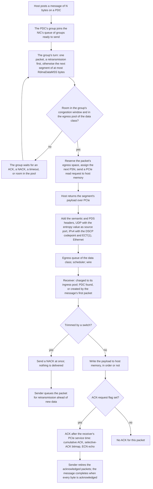

This page explains how the Scala UET NIC carries a message from host memory to the wire and back, acknowledges it, and recovers lost packets.

It follows one message from the moment the host posts it to the moment the sender learns that every byte has arrived. How each data packet's entropy value spreads a destination's packets across paths is on [Multipath](./multipath.md), and how the congestion window limits what is in flight is on [Congestion control](./congestion-control.md). The transmit and receive buffers the data passes through, traffic classes, PFC, and the PCIe link's rates and buffers have their own page, [Buffers and PFC](./buffers-and-pfc.md). Attribute types and defaults are on [Configuration](./configuration.md), and the records are on [Records](./records.md).

## Data path at a glance



## Messages and packet delivery contexts

All data moves over packet delivery contexts (PDCs). A PDC is a one-directional delivery context between two NICs. It has its own packet sequence numbers (PSNs) and its own record of the packets it has sent and not yet seen acknowledged; on the receiving NIC, its other side records the packets that have arrived. Each message is a one-way transfer of its bytes to the peer; there are no read or atomic operations.

The host posts a message by ringing the NIC's doorbell over PCIe with a work request (WQE) for the message's bytes. The [Chakra workload](../chakra-workload/index.md) uses a new PDC for every message: the doorbell creates the sending side of the PDC and queues the message on it in one step, and the workload closes the PDC when the message completes ([Completion](#completion)). On the receiving NIC, the first packet of the message that arrives creates the receiving side of the PDC: until the first ACK gives the sender the receiver's PDC identifier, every data packet carries what the receiving NIC needs to create it.

With the doorbell, the PDC's group joins the back of the NIC's queue of groups that are ready to send ([PDC groups and the transmit scheduler](#pdc-groups-and-the-transmit-scheduler)), and the NIC starts its transmit process 15 ns later. Messages to different peers, and several messages to one peer, are in flight at the same time on their own PDCs.

Each end names a PDC by its own IPv4 address and a PDC number. [Identifying a NIC and a PDC](./records.md#identifying-a-nic-and-a-pdc) shows how the records use those names.

## Segmentation

A message of N bytes is sent as `ceil(N ÷ RdmaDataMSS)` packets: each packet carries `min(RdmaDataMSS, bytes left)` bytes of payload, so every packet but the last of a message carries `RdmaDataMSS` bytes. A message of 0 bytes is sent as one packet with no payload. Each packet takes the PDC's next PSN when its payload fetch is issued, and packets go on the wire in PSN order. A packet's size on the wire is its payload plus 106 bytes of headers ([Packets on the wire](#packets-on-the-wire)).

With the prefetch buffer off, the default, the NIC needs two things before it fetches a segment's payload:

1. **Room in the congestion window.** The segment's packet must fit in the window of the PDC's group, counted at its nominal size, the IP datagram of payload plus 88 bytes ([The congestion window](./congestion-control.md#the-congestion-window)).
2. **Room in the egress pool.** The NIC reserves the packet's full size on the wire in the egress pool of the data class, class 0 with the applications' default traffic classes ([Egress buffer](./buffers-and-pfc.md#egress-buffer)). The reservation lasts until the packet has been sent.

If the window is full, the group waits until an ACK, a NACK, or a timeout frees room. If the egress pool is full, the NIC stops its transmit pass and keeps the group at the head of the queue; it tries again on each ACK, NACK, or timeout, and at the latest when the pool drains to half its size or less. With the prefetch buffer on, the fetch is gated differently ([Prefetch buffer](#prefetch-buffer)).

## Fetching the payload over PCIe

The NIC and its host are joined by a PCIe link with a protocol stack at each end. For each segment:

1. **Reservation.** With the prefetch buffer off, the egress space for the packet is reserved before the fetch ([Segmentation](#segmentation)).
2. **Read request.** The NIC sends one PCIe read request to host memory for the segment, a 64-byte request on the NIC-to-host direction of the link.
3. **Completion.** The host answers at once with the segment's payload. Host memory latency is not modeled: what the fetch costs is the time the request and the payload take on the link. Completions return in the order the requests were sent.
4. **Hand-off.** When the payload arrives, the packet gets its headers and goes to the egress queue of the data class ([Packets on the wire](#packets-on-the-wire)). With the prefetch buffer off, the window was checked when the fetch was issued, so the packet goes straight on.

A retransmission does not read the payload again: the NIC rebuilds the packet from its recorded size, so a retransmission costs no PCIe traffic.

At the default PCIe settings, the fetch of a full 4,096-byte segment takes about 70.8 ns on the link: 1.55 ns for the read request from the NIC to the host and 69.29 ns for the completion from the host to the NIC, less than the 84.04 ns the packet takes on the 400 Gbps wire. [PCIe host interface](./buffers-and-pfc.md#pcie-host-interface) explains the lane rate, the lane count, and the transaction-layer buffers, with the rates they give.

Received data travels the other way: the payload of each received data packet, without its headers, is written to host memory as a PCIe write ([Receiving a packet](#receiving-a-packet)). The packet's receive-pool space is released when the write is accepted into the NIC's PCIe transmit buffer ([Receive buffer](./buffers-and-pfc.md#receive-buffer)).

## Packets on the wire

When a segment's payload arrives from the host, the NIC builds the packet:

1. The **semantic header** (44 bytes) carries the message's details, including the end-of-message flag on its last packet.
2. The **PDS request header** (16 bytes) carries the PSN, the ACK-request flag ([Acknowledgements](#acknowledgements)), and, on a retransmission, the retransmit flag.
3. The **UDP header** (8 bytes) carries the packet's entropy value as its source port ([Multipath](./multipath.md)).
4. The **IPv4 header** (20 bytes) carries the packet's DSCP codepoint ([Packet marking](#packet-marking)), the ECN field set to ECT(1), and a TTL of 255. Every packet the NIC sends, data or control, is ECN-capable in the same way.
5. The packet waits in the egress queue of its traffic class until the scheduler sends it ([Transmit scheduling](./buffers-and-pfc.md#transmit-scheduling)), and the network port adds a 14-byte Ethernet header and a 4-byte frame check sequence.

The port sends each frame at the link's rate, the lower of the NIC's `DataRate` and the rack switch's downlink rate. The interframe gap is zero, and a frame reaches the rack switch the NIC's `Delay` after its serialization ends. When serialization ends, the packet's egress reservation is released, and a data packet's retransmission timer starts ([Retransmission timer](#retransmission-timer)).

| Packet | What it carries | Size on the wire |
| --- | --- | --- |
| Data | Payload of at most `RdmaDataMSS` bytes, semantic header 44 B, PDS request header 16 B, UDP 8 B, IPv4 20 B, Ethernet header and FCS 18 B | Payload + 106 B |
| ACK | PDS acknowledgement with congestion-control fields 32 B, UDP 8 B, IPv4 20 B, Ethernet 18 B | 78 B |
| NACK | PDS NACK 16 B, UDP 8 B, IPv4 20 B, Ethernet 18 B | 62 B |
| Base-RTT probe | PDS control header 16 B, UDP 8 B, IPv4 20 B, Ethernet 18 B | 62 B |
| Trimmed data packet, as the receiver gets it | IPv4, UDP, and PDS request headers 44 B, Ethernet 18 B | 62 B |
| PFC frame | 46 B of data, Ethernet 18 B | 64 B |

The preamble and interframe gap a physical link spends on each frame are not modeled.

### Worked example: packet sizes at the default RdmaDataMSS

At the default `RdmaDataMSS` of 4096 and the default 400 Gbps `DataRate`:

```text
data packet        4,096 + 44 + 16 + 8 + 20 + 18          = 4,202 B   on the wire
                   4,202 B × 8 ÷ 400 Gbps                 = 84.04 ns
nominal packet     4,202 B − 18 B                         = 4,184 B   the IP datagram
peak goodput       400 Gbps × 4,096 ÷ 4,202               = 389.9 Gbps
ACK                32 + 8 + 20 + 18                       =    78 B
NACK, probe        16 + 8 + 20 + 18                       =    62 B
trimmed packet     44 + 18                                =    62 B

1 MiB message      1,048,576 B ÷ 4,096 B                  =   256 packets
                   256 × 4,202 B                          = 1,075,712 B on the wire
                   1,075,712 B × 8 ÷ 400 Gbps             = 21.51 µs
```

The nominal packet, 4,184 bytes, is the unit of the congestion window ([The congestion window](./congestion-control.md#the-congestion-window)) and the size a received data packet is charged to the receiver's ingress pool. The egress reservation is the full 4,202 bytes.

## Packet marking

Each packet's DSCP field carries a codepoint that names its role. The NIC chooses the codepoint from the kind of packet and two attributes of `ScalaUETPdsManager`:

| Packet | Codepoint role |
| --- | --- |
| Data, first transmission | Trimmable with `TrimmingEnabled` `true`; no-trim with `TrimmingEnabled` `false`, the default |
| Data, retransmission | Trimmable retransmission with `UseDistinctDSCPForRetransmits` `true`, the default, whatever `TrimmingEnabled` is; otherwise the same role as a first transmission |
| ACK, NACK, base-RTT probe, and the probe's ACK | Control |

Two more roles are written by switches: trimmed, and trimmed on the last hop, which a switch writes when it trims a packet on a port that faces a NIC ([Trimmed packets and NACKs](#trimmed-packets-and-nacks)).

The codepoint is separate from the traffic class, which selects the NIC's own buffer pool. With the applications' default traffic classes, data uses class 0 and control class 1. Control means ACKs, NACKs, base-RTT probes, and trimmed packets ([Traffic classes](./buffers-and-pfc.md#traffic-classes)).

How a switch treats each role depends on its configuration:

- **Under the UET policy.** With `UETPolicyEnabled` `true`, the Scala Switch takes a packet's traffic class from its codepoint: control packets are TC2, trimmed packets TC1, and every other packet TC0. A packet with the trimmable-retransmission codepoint may use 1.5 times the egress queue limit ([Buffer under the UET policy](../scala-switch/shared-buffer.md#buffer-under-the-uet-policy)).
- **With packet trimming on.** A packet that would be dropped at egress is trimmed instead when its codepoint is trimmable or trimmable retransmission: the switch cuts it down to its headers, re-marks it as trimmed, and offers it again to the port's TC1 queue. A no-trim packet is dropped ([Egress admission](../scala-switch/packet-handling.md#egress-admission)). Switch trimming runs only under the UET policy and with PFC off on every switch traffic class ([Packet trimmer](../scala-switch/configuration.md#packet-trimmer)).
- **Without the UET policy.** The switch takes the traffic class from the DSCP value divided by 8, as for any other traffic ([Classification](../scala-switch/packet-handling.md#classification)).

A switch with `UETPolicyEnabled` `true` requires every NIC in the configuration to be a Scala UET NIC or an MRC NIC; otherwise the simulation stops ([Configuration rules that stop a simulation](./configuration.md#configuration-rules-that-stop-a-simulation)). `TrimmingEnabled` on the NIC only marks packets; the switches trim them. So with the NIC's defaults, a switch with trimming on drops a first transmission it cannot queue but trims a retransmission of it. With `TrimmingEnabled` `true` and trimming off on the switches, trimmable packets are dropped like any other, and the sender recovers them with the retransmission timer.

## Receiving a packet

A received data packet takes this path:

1. **Receive pool.** The packet is charged to the ingress pool of its traffic class at its IP size, 4,184 bytes for a full packet, or dropped if the pool cannot hold it ([Receive buffer](./buffers-and-pfc.md#receive-buffer)).
2. **PDC.** The NIC finds the packet's PDC from the destination PDC identifier in its PDS header. The first packets of a new message carry none, and the NIC creates its side of the PDC from them ([Messages and packet delivery contexts](#messages-and-packet-delivery-contexts)).
3. **Trimmed packet.** A packet that a switch has trimmed is answered with a NACK and goes no further ([Trimmed packets and NACKs](#trimmed-packets-and-nacks)).
4. **Delivery.** The NIC writes each new packet's payload to host memory over PCIe as soon as it arrives, whether it is in order or not. There is no reorder buffer and nothing waits for a gap to fill.
5. **Acknowledgement.** If the packet carries the ACK-request flag, the NIC sends an ACK ([Acknowledgements](#acknowledgements)).

The PDC tracks order as packets arrive. A packet with the next expected PSN advances it, past any packets already received beyond it. A packet with a higher PSN is out of order: the PDC records it for its selective acknowledgements ([Selective acknowledgements](#selective-acknowledgements)) and counts an out-of-order event. A packet with a lower PSN than expected is counted as a duplicate.

When the packet that ends the message has arrived and no gap remains before it, the NIC tells the host that the message has arrived ([Completion](#completion)).

## Acknowledgements

The receiver sends one ACK for each data packet that carries the ACK-request (AR) flag, and none for a packet without it. The sender decides which packets carry the flag, with three attributes of `ScalaUETPdsManager`:

- **`AckRequestEveryNthPacket`**, N. Each PDC counts every data packet it sends, retransmissions included. With `AckRequestFirstPacket` `true`, the 1st, (N + 1)th, (2N + 1)th packets, and so on, carry the flag. With `AckRequestFirstPacket` `false`, the Nth, 2Nth, 3Nth packets, and so on, carry it.
- **`AckRequestFirstPacket`** refers to the first packet the PDC ever sends. With the Chakra workload's PDC for each message, that is the message's first packet.
- **`AckRequestLastPacket`** `true` also sets the flag on the last packet of each message.

At the default N = 1, every data packet carries the flag, so every data packet is acknowledged and the two other attributes change nothing. For a 256-packet message on a new PDC with no retransmissions:

| `AckRequestFirstPacket` | `AckRequestLastPacket` | Packets with the flag, N = 8 | Packets with the flag, N = 1 (the default) |
| --- | --- | --- | --- |
| `true` | `true` | 1, 9, 17, ..., 249, and 256: 33 ACKs | All 256 |
| `true` | `false` | 1, 9, 17, ..., 249: 32 ACKs | All 256 |
| `false` | `true` | 8, 16, ..., 256: 32 ACKs | All 256 |
| `false` | `false` | 8, 16, ..., 256: 32 ACKs | All 256 |

**The ACK is held for the receiver's PCIe service time.** Before it sends an ACK, the receiver waits its estimate of how long the acknowledged packet takes to reach host memory: the bytes waiting in its receive pool for the data class, plus this packet, at its NIC side's `LaneBps` × `LaneCount` ([NIC side](./configuration.md#nic-side)). The ACK carries that service time, so the sender can remove it from its round-trip time sample, and a backlog at the receiver's host interface does not read as queueing in the network. ACKs leave in the order they were generated. NACKs and the ACKs of base-RTT probes are not held.

**What an ACK carries:**

| Field | What it holds |
| --- | --- |
| Cumulative ACK | The highest PSN the receiver has received in order |
| Acknowledged PSN | The PSN of the packet that drew the ACK |
| Selective-ACK bitmap | PSNs received beyond the cumulative ACK ([Selective acknowledgements](#selective-acknowledgements)) |
| ECN echo | Set when the packet that drew the ACK arrived marked CE by a switch |
| Received bytes | How much data the receiver has received on the PDC, which congestion control uses |
| Service time | The receiver's PCIe service time, above |
| Receiver penalty | How much the receiver asks its sender to shrink its window, from the receiver's receive-pool occupancy ([Receiver penalty](./congestion-control.md#receiver-penalty)) |
| Retransmit flag | Copied from the data packet |

The ACK's UDP source port carries an entropy value back to the sender, which Recycled Entropy Packet Spraying reads as path feedback ([Path feedback](./multipath.md#path-feedback)).

On the sender, the cumulative ACK retires every outstanding PSN at or below it, and the bitmap retires each PSN it lists. A retired packet's bytes no longer count as in flight, and the ACKs give the sender its round-trip time samples ([Base RTT](./congestion-control.md#base-rtt)).

**Base-RTT probe.** After the first data ACK of each message on a PDC, the sender sends one small control probe. The receiver answers it with an ACK at once, without the hold, and the round trip of this small packet feeds the base RTT. So each message on a PDC draws one probe and one probe ACK.

### Worked example: ACK cadence at the defaults

`AckRequestEveryNthPacket` 1, `RdmaDataMSS` 4096, 16 PCIe lanes of 31.52 Gbps, and a 400 Gbps link, with an empty receive pool:

```text
1 MiB message              1,048,576 B ÷ 4,096 B              = 256 packets
packets with the AR flag   N = 1: every packet                = 256 ACKs
reverse traffic            256 × 78 B                         = 19,968 B
base-RTT probe             one probe and its ACK: 62 B + 78 B = 140 B
time between data packets  4,202 B × 8 ÷ 400 Gbps             = 84.04 ns
NIC-side PCIe rate         16 × 31.52 Gbps                    = 504.32 Gbps
ACK hold                   4,184 B × 8 ÷ 504.32 Gbps          = 66.4 ns
```

The service time an ACK carries is counted in steps of 128 ns, so a 66.4 ns hold reports a service time of 0, and the sender's round-trip sample includes the 66.4 ns. The hold grows only when data waits in the receiver's receive pool for the PCIe link.

## Selective acknowledgements

Each ACK carries a 64-PSN bitmap of the packets the receiver has received beyond its cumulative ACK. When more packets are out of order than one bitmap covers, successive ACKs report successive blocks of 64 PSNs. The sender retires each packet the bitmap lists, so its bytes no longer count as in flight, and a packet that arrives after a gap is acknowledged without waiting for the gap to fill.

Selective acknowledgements never trigger a retransmission. A gap in the bitmap is not read as a loss, and there is no fast retransmit: a lost packet is recovered by a trim NACK ([Trimmed packets and NACKs](#trimmed-packets-and-nacks)) or by its retransmission timer ([Retransmission timer](#retransmission-timer)).

## Trimmed packets and NACKs

A switch with packet trimming on cuts a trimmable packet that it cannot queue down to its IPv4, UDP, and PDS request headers, 44 bytes and 62 on the wire, marks it as trimmed, and forwards it to the receiver. On the hop to a NIC, it marks it as trimmed on the last hop instead ([Egress admission](../scala-switch/packet-handling.md#egress-admission)).

The receiving NIC recognizes a trimmed packet by its codepoint and:

1. Releases the packet's receive-pool space.
2. Sends a NACK at once, naming the packet's PSN, with the code for trimmed or for trimmed on the last hop. The NACK is not held behind waiting ACKs.
3. Delivers nothing to the host, records nothing for its selective acknowledgements, and sends no ACK, even if the packet carries the ACK-request flag.

When the sender receives the NACK, and the packet is still outstanding, the packet's bytes no longer count as in flight, congestion control reacts to the trim ([Loss reactions](./congestion-control.md#loss-reactions)), and the packet is queued for retransmission ahead of new data. A NACK for a packet that is no longer outstanding, because it has been acknowledged or a timeout has already queued it, does none of this. Under Recycled Entropy Packet Spraying, a NACK for an outstanding packet is also path feedback: a NACK for a packet trimmed on the way discards the entropy value it carries back, and a NACK for a packet trimmed on the last hop recycles it ([Path feedback](./multipath.md#path-feedback)).

These two NACK codes are the only ones the NIC sends. A gap in the sequence draws no NACK.

## Retransmission timer

The retransmission timer is per packet. It starts when the packet's serialization onto the link ends, and runs until the packet is acknowledged. When it expires while the packet is still outstanding:

1. The packet's bytes no longer count as in flight, and congestion control reacts to the loss ([Loss reactions](./congestion-control.md#loss-reactions)).
2. Under Recycled Entropy Packet Spraying, the packet's entropy value is reported as a timeout ([Freezing and exploration](./multipath.md#freezing-and-exploration)).
3. The packet is queued for retransmission ahead of new data, and the transmit process restarts at once.

A timer that expires after its packet has been acknowledged does nothing.

How long the timer runs is set by three attributes of `ScalaUETPdsManager`:

- **`InitialRetransmitTimeout`** sets the scale of the timeout: with `FixedRexmitTimeEnable` `false`, a larger value lengthens the timeouts in proportion.
- **`MaxExponentialRTOBackoffCount`.** Each retransmission of a packet doubles that packet's timeout until it reaches a cap this attribute sets, after which the timeout stays fixed; a larger value lets it grow longer.
- **`FixedRexmitTimeEnable`.** With `true`, every attempt of every packet uses `FixedRexmitTimeout`, with no doubling. With `false`, the default, `FixedRexmitTimeout` is not used.

Every retransmission, whether a timeout or a NACK caused it, takes a new entropy value from the group's spraying ([Multipath](./multipath.md)), carries the retransmit flag, counts toward the ACK-request rule ([Acknowledgements](#acknowledgements)), and is marked as a trimmable retransmission by default ([Packet marking](#packet-marking)). Like a new packet, it needs room in the congestion window and in the egress pool before it is sent.

There is no retry limit: a packet is retransmitted until it is acknowledged.

## PDC groups and the transmit scheduler

With `PDCGroupsEnabled` `true`, the default, every PDC from this NIC to the same remote IPv4 address joins one PDC group. The PDCs of a group share one congestion window ([Congestion control](./congestion-control.md)) and one load balancer, which holds the spraying state ([Multipath](./multipath.md)), and they are scheduled as one group. Each PDC keeps its own PSNs, acknowledgements, and retransmissions. The receiving sides of PDCs from that peer join the same group, but they send no data.

A group lives while any of its PDCs does. With the Chakra workload, which closes each message's PDC when the message is done, a message to a peer with which the NIC has no other message in flight, in either direction, starts a new group: a new congestion window at its initial size ([The congestion window](./congestion-control.md#the-congestion-window)), a base RTT back at `InitialBaseRTT` ([Base RTT](./congestion-control.md#base-rtt)), and new spraying state.

**The transmit scheduler.** The NIC keeps one queue of groups that are ready to send, and serves it in turns:

1. It takes the group at the head of the queue.
2. It sends one packet from one PDC of the group. The PDCs of a group take turns, and the turn passes to the next PDC once the current one has sent.
3. Within a PDC, the oldest waiting retransmission goes first, then a payload already fetched into the prefetch buffer, then a new segment. A PDC does not skip to a later kind while an earlier one is waiting for room.
4. If the group has more to send, it goes back to the tail of the queue, and the next group takes its turn.

A group with no PDC that can send, because its window is full, leaves the queue. An ACK, a NACK, or a timeout brings it back at the head; a new message, or a payload arriving in the prefetch buffer, brings it back at the tail. When the egress pool is full, the scheduler stops with the group at the head and tries again on each ACK, NACK, or timeout, and at the latest when the pool drains to half its size or less.

| `PDCGroupsEnabled` | Congestion window | Turns in the scheduler | Spraying state |
| --- | --- | --- | --- |
| `true` (default) | One window shared by all the messages in flight to a destination | One per destination | One per destination |
| `false` | One window per PDC, so N messages in flight to one destination have N windows | One per PDC | One per PDC, starting fresh with each PDC |

With the Chakra workload, a PDC is one message, so with `PDCGroupsEnabled` `false` every message has its own window, its own turn, and its own spraying state.

## Prefetch buffer

The prefetch buffer changes when the egress space is reserved and when the congestion window is checked:

| | `PrefetchBufferEnable` `false` (default) | `PrefetchBufferEnable` `true` |
| --- | --- | --- |
| Before the fetch | Room in the window, and the packet's full wire size reserved in the egress pool | The packet's wire size reserved in the prefetch buffer; the window is checked only for the bytes fetched |
| When the payload arrives | The packet goes straight to the egress queue | The payload waits in its PDC, in order, until the window has room for it in flight and the egress pool has room for it |
| What the egress pool holds | Packets waiting to be sent, and packets whose payload is still being fetched | Packets waiting to be sent |

With the prefetch buffer on, the window is enforced when the packet is committed to the wire, and the packet's prefetch space is released at that moment. When the prefetch buffer drains to half its size or less, the transmit process starts again.

`PrefetchBufferSize` is in bytes and is used only with `PrefetchBufferEnable` `true`. The prefetch buffer is NIC-wide: every PDC on the NIC shares it, while each PDC group has its own window. With `PrefetchBufferEnable` `true`, `PrefetchBufferSize` must hold at least one full packet on the wire, `RdmaDataMSS` + 106 bytes, which is 4,202 bytes at the default `RdmaDataMSS`; otherwise the simulation stops ([Configuration rules that stop a simulation](./configuration.md#configuration-rules-that-stop-a-simulation)).

```text
default PrefetchBufferSize    262,144 B ÷ 4,202 B                 = 62 full packets
bandwidth-delay product       400 Gbps × InitialBaseRTT 6 µs ÷ 8  = 300,000 B
one group's maximum window    1.5 × 300,000 B                     = 450,000 B
share of that window          262,144 B ÷ 450,000 B               = 0.58
```

So at the defaults, the prefetch buffer holds a little more than half of one group's maximum window ([Worked example: the defaults](./congestion-control.md#worked-example-the-defaults)), and every destination the NIC sends to shares it.

## Completion

A message produces three completions, and the `uet-events` record shows each one as an event ([uet-events](./records.md#uet-events)):

| Event | Where | When |
| --- | --- | --- |
| `SEND_COMPLETE` | Sender | The fetch of the message's last segment has been issued. The data has not yet crossed the PCIe link or the wire. |
| `WQE_COMPLETE` | Sender | ACKs have covered every byte of the message. The NIC reports it to the host, and the Chakra workload then closes the PDC. |
| `RECV_COMPLETE` | Receiver | The packet that ends the message has arrived, and no gap remains before it. |

The message's completion time, as the sender sees it, is therefore the time of its last acknowledgement, not of its last transmission.

## Records

With the defaults, `EnableTransportStats` `true`, a simulation writes one `uet-transport-stats` row for each Scala UET NIC every `NDStatsReportInterval`. Each row combines every PDC on the NIC. Columns that start with `ivl_` count the interval; the matching columns without the prefix count the whole simulation so far. [uet-transport-stats](./records.md#uet-transport-stats) lists every column.

| Columns | What they show on this page |
| --- | --- |
| `total_pkts_sent`, `total_pkts_rcvd` | Data packets, ACKs, and NACKs sent and received; base-RTT probes are not included |
| `write_pkts_sent`, `write_pkts_rcvd` | Data packets sent, retransmissions included, and data packets received, trimmed packets included |
| `ack_pkts_sent`, `ack_pkts_rcvd` | ACKs sent and received, the ACKs of base-RTT probes included |
| `nack_pkts_sent`, `nack_pkts_rcvd` | NACKs sent and received: one for each trimmed packet |
| `num_out_of_order_events_on_nic`, `max_out_of_order_on_flow` | Data packets received ahead of the next expected PSN, and the most out-of-order packets one PDC has held at once |
| `num_dup_events_on_nic` | Duplicate data packets received |
| `probe_sent`, `probe_ack_rcvd` | Base-RTT probes sent and probe ACKs received |
| `num_rto` | Retransmission timer expiries for packets still outstanding |
| `num_rtx` | Data packets retransmitted, after a timeout or a NACK |
| `wqes_created`, `wqes_completed` | Messages posted to this NIC, and messages whose every byte has been acknowledged |

With `EnableEventLogging` `true`, the `uet-events` record adds one row for each PDC and message event: a PDC created or closed, a message posted, and the three completions ([uet-events](./records.md#uet-events)). With the UET Monitor on, the `uet-monitor` record has one row for each packet, with its PSN, its ACK-request flag, its codepoint, and, on ACK rows, the cumulative ACK and the selective-ACK bitmap ([uet-monitor](./records.md#uet-monitor)).
